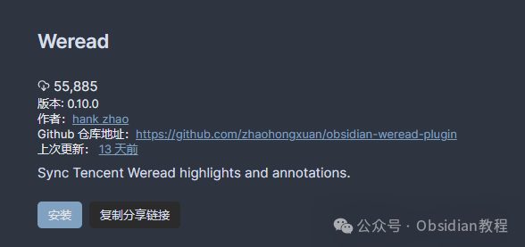
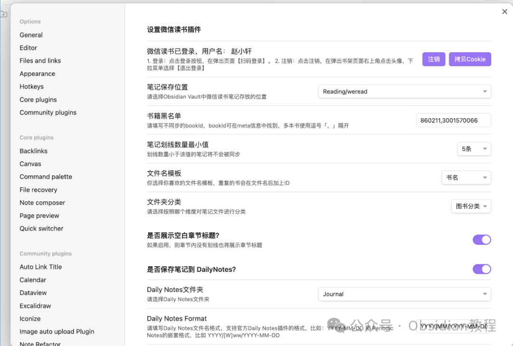

# Obsidian 插件：Weread微信读书插件

Weread，Obsidian微信读书插件，它让Obsidian用户能够将微信读书中的书籍元信息、高亮标注、划线感想、书评等内容同步到Obsidian，并以Markdown格式保存。

### 

1插件概览

### Obsidian微信读书插件允许用户同步微信读书中的书籍元信息（如书籍封面、作者、出版社、ISBN、出版时间等）、高亮划线、读书笔记（包括划线笔记、页面笔记、章节笔记和书籍书评）到Obsidian。

###   

### 这些信息将被转换为Markdown格式并保存在Obsidian指定的文件夹中，为用户提供了一种高效、便捷的阅读笔记管理方式。

###   

### **功能详解**

  

  * **同步书籍元数据：** 包括书籍封面、作者、出版社等信息，使用户在Obsidian中管理阅读材料时能够快速获取书籍概览。
  * **同步高亮划线与笔记：** 将微信读书中的高亮划线和各类笔记同步到Obsidian，方便用户回顾和整理思考。
  * **自定义笔记生成模板：** 用户可以根据自己的需求自定义笔记的生成模板，提高笔记的可读性和实用性。
  * **支持多种文件名格式设置：** 增加了对笔记文件命名的灵活性。
  * **自定义FrontMatter：** 用户可以在笔记的头部yaml文件中增加自定义字段，如标签、阅读状态等，以更好地组织和检索笔记。
  * **支持移动端同步：** 用户可以在手机和平板上使用本插件，实现跨设备的阅读体验和笔记管理。
  * 同步至Daily Notes：将当日的读书笔记同步至Daily Notes中，方便用户日常的学习和复习。

### 2安装方法

#### 通过社区插件浏览器：  

###   

### **1.在线安装**（需要科学上网） ：****

### ****  
****

### 点击“社区插件”下的“浏览”按钮，在左上角的搜索框中搜索“ Weread”，然后点击“安装”按钮。

###   
启用插件：安装成功后，点击“启用”以启用插件。  

**  
****2.离线安装：****  
****因为网络原因很多同学无法直接在线安装obsidian插件，这里我已经把obsidian所有热门插件下载好了**  
只需要关注下方公众号，后台回复：**插件** 即可获取

  

### **设置流程**

  

  * 在Obsidian中打开设置界面，找到“Obsidian Weread Plugin”进入插件设置页面。
  * 点击登录按钮，并在弹出的登录页面中扫码登录微信读书。
  * 设置笔记的保存位置和最小划线数量，以及笔记文件夹的分类方式。

  

### 3使用指南

使用Obsidian微信读书插件时，用户应注意以下几点：  

  * 本插件采用覆盖式更新机制，请避免在同步的文件中直接修改内容。建议使用Block引用的方式，进行外部批注。
  * 初次同步如果笔记数量较多，可能需要较长时间，后续只会更新有变化的部分，速度会显著提升。
  * 长期不使用可能会导致Cookie失效，需要重新登录。

###   

### **已知问题与未来计划**

  
Obsidian微信读书插件目前存在一些已知问题，如Cookie的长期有效性、偶尔的网络连接问题等。开发者计划在未来的版本中解决这些问题，并引入更多功能，如优化文件同步逻辑、支持模板预览功能、导出热门划线等。

### 

4结论

Obsidian微信读书插件为Obsidian用户提供了一个强大的工具，用于同步、管理微信读书中的阅读材料。  
通过本文的介绍，用户应能够充分利用这一插件，提高阅读效率，优化笔记管理。随着插件的不断更新和优化，相信它将成为更多Obsidian用户不可或缺的一部分。  
  
  
1******扫码购买****《 Obsidian实战教程》****从入门到精通， 链接您的每一个思维瞬间。**  

