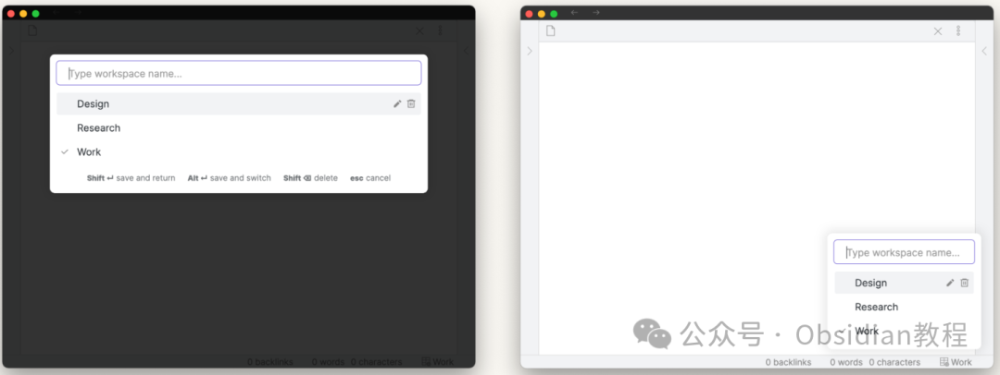
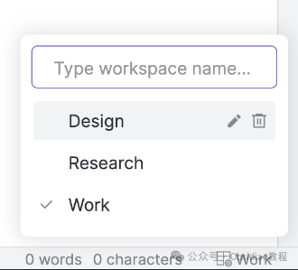
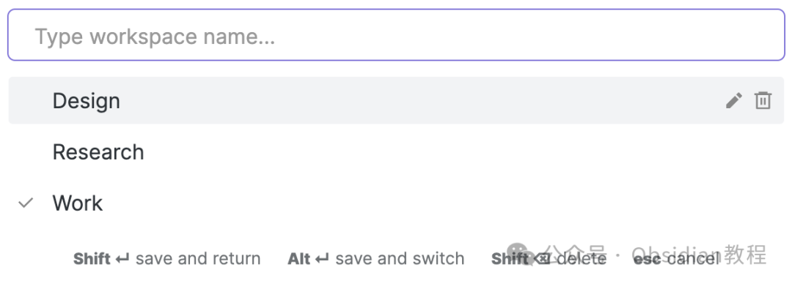
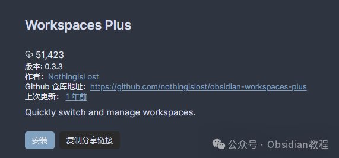

# Obsidian 插件：Workspaces Plus为用户提供强大的工具集。

### **简介**

###   

### "Workspaces Plus"插件为Obsidian软件增加了许多高级功能，使得用户可以更加灵活和高效地管理和使用工作区。

  
通过这个插件，用户可以在状态栏中看到当前活跃的工作区名称，快速切换、重命名、删除或创建新的工作区。  
此外，插件还提供了一系列热键快捷操作和主题定制选项，以及能够使用模板变量覆盖工作区中的页面。

### **主要功能**

  

  * **工作区指示器：** 在状态栏显示当前活跃的工作区，支持点击打开工作区选择菜单，Shift-点击保存工作区。  

  * 工作区选择器：提供切换、删除、重命名和创建新工作区的功能。

  * 工作区切换模态框：通过可分配的热键打开，具有与工作区选择器相同的功能。

  

  * 热键：打开工作区切换模态框，按名称打开特定工作区。

  

  * 插件选项：可切换工作区选择器的键盘快捷键、删除工作区前的确认提示，以及设置切换工作区时总是保存的默认行为。

  * 主题定制选项：允许根据工作区特定的样式添加数据属性。

  

  * 工作区覆盖：可以使用模板变量覆盖工作区中的页面。

  

### **1.在线安装**（需要科学上网） ：****

  
在Obsidian中安装插件是一个简单直接的过程：  

  * 打开Obsidian，点击左下角的“设置”图标。
  * 在设置菜单中，选择“第三方插件”选项。
  * 点击“浏览”按钮，搜索“Workspaces Plus”。
  * 找到插件后，点击“安装”。
  * 安装完成后，切换插件的“启用”开关。

  

### **2.离线安装：****  
****因为网络原因很多同学无法直接在线安装obsidian插件，这里我已经把obsidian所有热门插件下载好了**  
只需要关注下方公众号，后台回复：**插件** 即可获取

### 

###   

**手动安装：** 将main.js、styles.css和manifest.json文件复制到你的仓库的.obsidian/plugins/obsidian-workspaces-plus/目录下。  

### **使用教程**

####   

#### **启用插件**

  
在Obsidian的设置菜单中启用"Workspaces Plus"插件。请注意，要使"Workspaces Plus"正常工作，Obsidian的核心工作区插件必须被激活。

####   

#### **创建工作区**

  

  * 通过工作区选择器或工作区切换模态框输入新工作区的名称。
  * 使用Shift-Enter创建新工作区。

####   

#### **重命名工作区**

**  
**

  * 通过点击选择器或模态框旁工作区名称旁的铅笔图标来重命名工作区。

####   

#### **删除工作区**

  

  * 使用旁边的垃圾桶图标或在菜单中选择工作区时按Shift-Delete来删除工作区。

####   

#### **打开工作区**

**  
**

  * 通过热键或点击状态栏中的工作区图标/名称来打开工作区选择器。
  * 你可以通过鼠标点击或在键盘上使用上/下箭头导航后按Enter来打开工作区。

####   

#### **保存工作区**

  

  * 默认情况下，切换工作区时不会自动保存。
  * 你可以通过Shift-点击工作区图标/名称或在切换菜单中使用Shift-Enter来保存当前活跃的工作区。

####   

#### **覆盖工作区中的页面**

  

  * 在设置中滚动到底部，打开你想要修改的工作区。
  * 在页面ID旁的文本框中输入带有模板变量的字符串。
  * 切换到工作区，页面将使用替换后的变量值加载。

###   

### **额外信息**

####   

#### **紧凑型工作区选择器CSS片段**

  
为了提高界面的紧凑性和效率，你可以添加自定义CSS片段来修改工作区选择器的样式。这对于希望最大化工作区使用空间的用户非常有用。  
"Workspaces Plus"插件为Obsidian用户提供了强大的工具集，以更加灵活和高效的方式管理他们的工作区。  
通过上述教程，你应该能够掌握如何安装和充分利用"Workspaces Plus"插件的所有功能，现在快去试一试吧  
  
  
1******扫码购买****《 Obsidian实战教程》****从入门到精通， 链接您的每一个思维瞬间。**  

