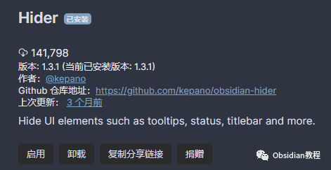
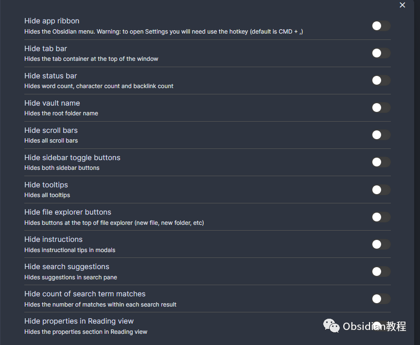
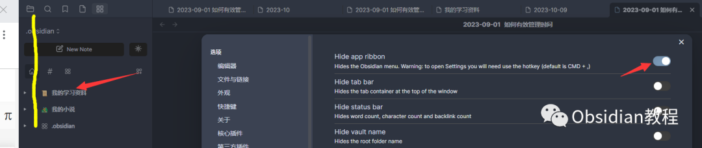
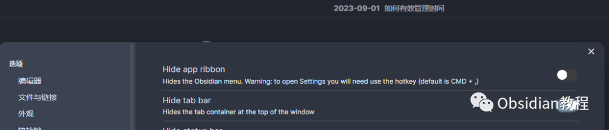
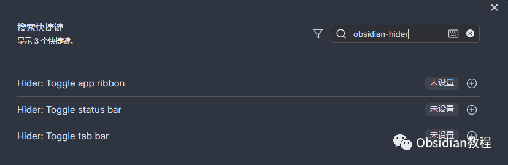

# Obsidian 插件：使用Hider来精简你的用户界面

点击下方公众号，回复关键字：**Obsidian** ，获取Obsidian资料合集。在数字笔记的世界里，Obsidian 是一座功能丰富的城堡，而 Hider 插件则是那个能够让你在这座城堡中找到一片宁静之地的魔法。  
本指南将带你深入了解如何使用 Hider 插件，让你的 Obsidian 界面变得更加简洁，从而提升你的专注力和生产力。

## 

1Hider：你的界面魔法师

  
Hider 插件是为了追求极简和专注的写作者和知识工作者而设计的。它不是简单地隐藏界面元素，而是为你提供了一个更加集中注意力的环境，让你能够沉浸在思考和创作中。

## 

2选择 Hider 的理由

  * 专注于内容：通过隐藏不必要的界面元素，你可以减少视觉干扰，专注于你的写作和笔记。
  * 快捷键操作：Hider 允许你通过热键快速隐藏或显示界面元素，提升你的工作效率。
  * 个性化体验：你可以根据个人喜好和工作流程定制你的界面，使 Obsidian 成为真正属于你的工具。
  * 主题兼容性：即使你使用了自定义 CSS 主题，Hider 也能够与之协同工作，只需适当配置即可。

## 

3安装 Hider：打开极简之门

要使用这个插件，我们首先需要在Obsidian中安装它。安装过程非常简单直接：

### **  
**

### **1.在线安装**（需要科学上网） ：****

  
1.在Obsidian的设置中，找到“第三方插件”选项，点击“社区插件”2.在搜索框中输入“Hider”，找到并安装它。3.安装完成后，激活该插件，在成功安装插件后，我们需要对其进行简单的配置，以符合我们的需求。  

**2.离线安装：****  
****因为网络原因很多同学无法直接在线安装obsidian插件，这里我已经把obsidian所有热门插件下载好了**  
只需要关注下方公众号，后台回复：**插件** 即可获取配置插件：在插件设置中，你会找到各种可隐藏元素的选项，如应用栏、标签栏、状态栏等。  

## 4精简你的界面：Hider 的艺术

  * 应用栏：这是你的工具箱，但当你需要更多空间时，隐藏它只需一键。

  * 标签栏：如果你是单任务工作者，隐藏标签栏可以让你更加专注于当前的笔记。

  * 状态栏：信息太多分散注意力？一键隐藏，享受清爽的写作体验。
  * 其他元素：滚动条、搜索建议、计数、工具提示等，都可以根据需要隐藏，让你的界面变得更加简洁。

## 

5与主题和谐共处：Hider 的技术内幕

如果你热衷于个性化你的 Obsidian 界面，可能已经使用了自定义的 CSS 主题。  
Hider 在技术上是通过在 body 元素上添加特定的类来实现隐藏功能的。例如，当你启用隐藏应用栏时，Hider 会在 body 上添加 .hider-ribbon 类。你可以在自定义 CSS 中利用这些类来确保 Hider 的设置不会被主题覆盖。

## 

6优化你的使用体验

  * 热键绑定：深入热键设置，为你常用的隐藏操作绑定快捷键，让切换变得更加迅速。
  * 定制化设置：不同的工作场景可能需要不同的界面配置。例如，写作时你可能更喜欢隐藏几乎所有元素，而在整理资料时可能需要显示标签栏和状态栏。

Hider 插件它不仅仅是隐藏界面元素那么简单，它是对你工作方式的一种尊重，是对你时间和注意力的一种保护。  
现在，就让我们开始这段极简之旅，释放你的创造力，享受更加专注和高效的笔记体验。  
  
  
1**扫码购买****《 Obsidian实战教程》****从入门到精通， 链接您的每一个思维瞬间。****  
**  
往 期精彩[1.](http://mp.weixin.qq.com/s?__biz=MzkyMDUyMDM2Mg==&mid=2247484437&idx=1&sn=56d072590a221e82421f806bd14f9d01&chksm=c190d7d0f6e75ec6a112fc672ce1daca289b70893334e5c5bbd4d406836c641ef294bbdeace2&scene=21#wechat_redirect)[Obsidian插件：Hover Editor将 Obsidian 的“页面预览”功能提升到一个全新的层次](http://mp.weixin.qq.com/s?__biz=MzkyMDUyMDM2Mg==&mid=2247484530&idx=1&sn=2e5eb91aedf095be338604660c04e678&chksm=c190d7b7f6e75ea119a474a11cbf90c3263a72ba692ed3964730e5a4de8a18e7199807236a63&scene=21#wechat_redirect)[2.Obsidian插件：File Tree Alternative Plugin，高效文件树管理体验](http://mp.weixin.qq.com/s?__biz=MzkyMDUyMDM2Mg==&mid=2247484529&idx=1&sn=9203300a6e1251614ec526a11c1d5433&chksm=c190d7b4f6e75ea2eaa28c8bf93ab22bdffac196d5fa69584233cdabe0a76634095ccd1d2cb3&scene=21#wechat_redirect)  
[3.Obsidian插件：Text Generator，你的 AI 助手](http://mp.weixin.qq.com/s?__biz=MzkyMDUyMDM2Mg==&mid=2247484528&idx=1&sn=a10ef8a8522fa6e670b95ac2ccb97100&chksm=c190d7b5f6e75ea3b9cfb7cd95be9961bb4779b8ce779821fff3432de278ee8e5f841e9f5715&scene=21#wechat_redirect)  

点分享

点点赞

点在看
