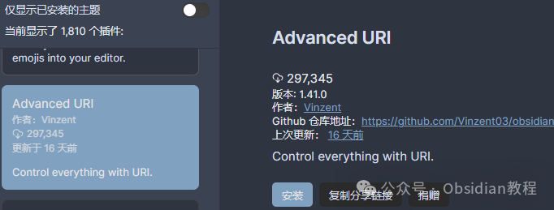

# Obsidian 高手必备：Advanced URI 带你解锁 Obsidian 高效新姿势，效率提升100%！

最近呢，我发现一个能大大提升 Obsidian 效率的神器——Advanced URI 插件。你可能会问，这插件能干啥？  

我告诉你，这玩意儿可不一般，简直是 Obsidian 自动化的法宝。下面就让我详细介绍一下这个插件的强大功能和实用方法吧！😉

  

## **概述**

  

Advanced URI 这个插件简直是懒人福音。它通过一些 URI（统一资源标识符）来控制 Obsidian 的各种功能。

  

什么是 URI？简单来说，就是一串文字，通过点击链接或者输入网址，就能自动执行某些操作。

  

这意味着什么呢？你可以不用动鼠标、不用敲键盘，只要打开这些 URI，就能完成很多操作，是不是很酷？😎

  

### **功能亮点**

**  
**下面咱们来详细看看 Advanced URI 能干啥：  

  * 打开文件：随便点一个链接，就能直接打开指定的笔记文件。
  * 编辑文件：不仅能打开，还能自动编辑文件内容。

  * 创建文件：一键生成新的笔记文件。

  * 打开工作区：直接进入你预设的工作区，省去手动切换的麻烦。

  * 打开书签：快速访问你收藏的页面。

  * 导航到标题/块：直接跳转到笔记中的某个标题或块。

  * 自动搜索和替换：批量处理文件内容，轻松搞定。

  * 调用命令：Obsidian 的命令都能通过 URI 来调用。

  * 编辑和读取前置内容：灵活管理笔记的元数据。

  

这些功能不仅仅是让操作更简单，还能大大提升你的工作效率。接下来，我们通过一些具体的例子来看看怎么使用这些功能。

  

### **实例讲解**

####   

####  1\. 将剪贴板内容追加到今天的日记中

  
有时候，我们会把一些想法或资料复制到剪贴板上，然后想把它们追加到今天的日记中。使用 Advanced URI，这个过程可以一键搞定：

  * 

    
    
    obsidian://advanced-uri?vault=<your-vault>&daily=true&clipboard=true&mode=append

  
这个 URI 会自动将剪贴板上的内容追加到今天的日记里。省时省力，简直完美！👍

####   

#### 2\. 调用命令

  
比如，你想关闭当前工作区的所有标签页，只需要这样做：

  * 

    
    
    obsidian://advanced-uri?vault=<your-vault>&filepath=<your-file>&commandid=workspace%253Aclose

  
通过这个 URI，系统会自动执行关闭所有标签页的命令，完全不用你动手。👋

####   

#### 3\. 打开文件中的某个标题

  
假如你有一个文件，里面有个标题是“目标”，你可以通过以下 URI 直接跳转到这个标题：

  * 

    
    
    obsidian://advanced-uri?vault=<your-vault>&filepath=my-file&heading=Goal

  
这样一来，不管文件有多长，你都能迅速定位到你需要的部分。📌  

### **安装与设置**

  
说了这么多，是不是已经迫不及待想要安装试试了？别急，下面是详细的安装步骤：  

  1. 打开 Obsidian，进入设置页面。
  2. 找到“插件”选项，点击“社区插件”。
  3. 在搜索框中输入“Advanced URI”，找到插件并点击“安装”。
  4. 安装完成后，记得点击“启用”。

  
安装完成后，建议先阅读一下插件的详细文档，了解更多高级用法。这个插件的文档非常全面，确保你能充分发挥它的功能。  

###   
**2.离线安装：**  
很多同学无法直接在线安装obsidian插件，这里我已经把obsidian所有热门插件下载好了  
只需要关注下方公众号，后台回复：插件 即可获取

  
我个人觉得，Advanced URI 插件简直就是为我们这些重度 Obsidian 用户量身定制的。它让笔记管理变得更加高效，尤其是在处理大量文件和频繁操作时，简直就是救命稻草。  
而且，这个插件还能跟其他自动化工具配合使用，进一步提升工作效率。总之，Advanced URI 让你的 Obsidian 使用体验提升了好几个档次，强烈推荐大家试试！😄

> **对obsidian感兴趣的同学，可以链接我微信：hls404 拉你进入“obsidian交流社群”。**

  
**热门推荐**  
**  
**

  * [Obsidian神级插件：Natural Language Dates ，助你高效管理笔记!](http://mp.weixin.qq.com/s?__biz=MzkyMDUyMDM2Mg==&mid=2247485907&idx=1&sn=ab5a21e4c9b9b0329309b5757615e988&chksm=c190da16f6e753009c66ae6da91b7d7ba7c6310ab8f1cb002c17e85d5382ff422548a3181816&scene=21#wechat_redirect)

  * [Obsidian插件：Make.md为你量身打造一个完美的个人系统。](http://mp.weixin.qq.com/s?__biz=MzkyMDUyMDM2Mg==&mid=2247485896&idx=1&sn=a13c9fcd01a0693dafef7a6edce5de8f&chksm=c190da0df6e7531b4890c7b581bf793c4255ea4183c567405b920a407f802ff338b1e86cbb3c&scene=21#wechat_redirect)

  * [Obsidian插件：Editing Toolbar 让笔记编辑变得更加简单和直观](http://mp.weixin.qq.com/s?__biz=MzkyMDUyMDM2Mg==&mid=2247485885&idx=1&sn=fdd0b6299765f6149bd0b6c538716552&chksm=c190da78f6e7536ef9827d3f5cff76054bb7653626368c89f711e79ee8819b6207e1f5d83210&scene=21#wechat_redirect)  

