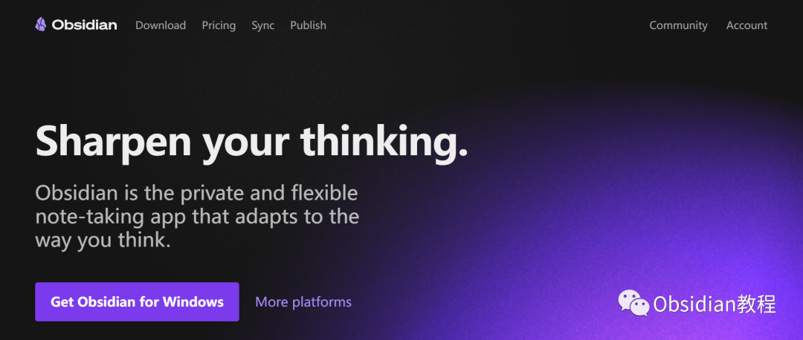
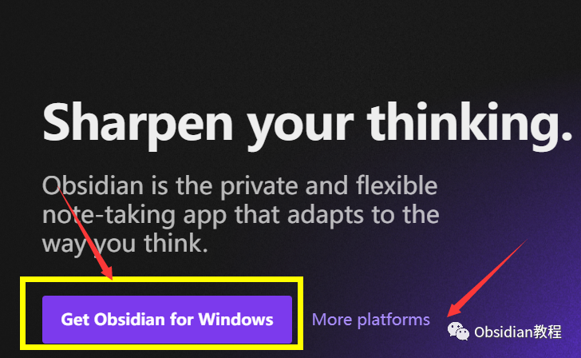
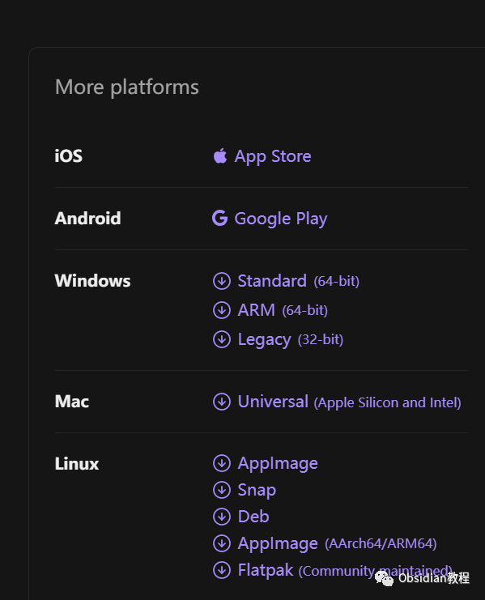
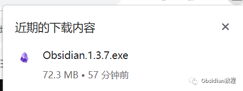
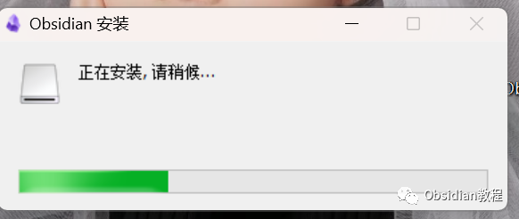
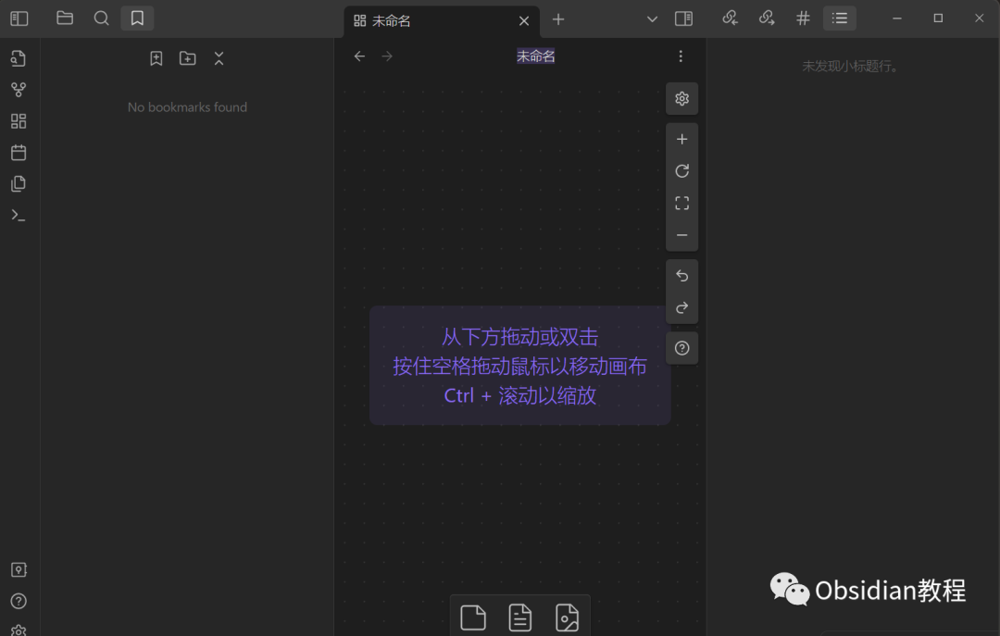

# Obsidian下载与安装保姆级教程

### 点击下方公众号，回复关键字：**Obsidian** ，获取Obsidian资料合集。

### 

###   

### Obsidian，一款知识管理工具。想象一下，所有你的思维、笔记和灵感都能在一个地方相互连接，形成一个井然有序的知识网络。

###   

### 听起来不错，对吧？那么，让我来教你怎么下载和安装它。

  
**这里我已经为大家准备好了安装包，需要的可以 点击下方公众号，回复关键字：****Obsidian** ，**获取Obsidian安装包。******

###   

1\. 访问官方网站

  

首先，打开你的浏览器并访问 https://obsidian.md/。  

####   

#### **2\. 点击“下载”按钮**

####   

#### 在网页中，找到“下载”按钮并点击。通常，这个按钮位置非常显眼。

####   

#### **  
**

#### **3\. 选择你的操作系统**

  
这里是默认Windows下载，Obsidian 支持 Windows、Mac 以及 Linux。根据你的电脑操作系统，点击后面的更多，选择对应的版本进行下载。  

#### **  
**

#### **4\. 安装 Obsidian**

####   

#### 选择好对应的版本后，点击下载，进行安装

  
  
下载完成后，打开安装文件并按照提示操作。大部分时间里，只需要简单地点击几次“下一步”即可完成安装。  
**  
****5\. 打开并开始使用****  
**找到 Obsidian 的图标，点击打开。初次使用可能会有一些简单的提示，按照引导操作，你就可以开始在 Obsidian 中创建你的第一个笔记了。  
  
现在，你已经成功安装了 Obsidian。  
希望你在使用中能真正体会到它的便利，并将它有效地融入你的日常工作与学习中。  
  
  
1点击下方公众号，回复关键字：**Obsidian** ，获取Obsidian资料合集。
