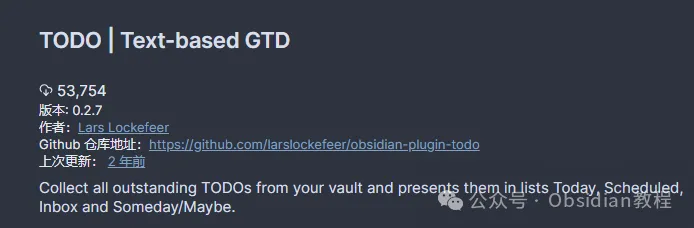
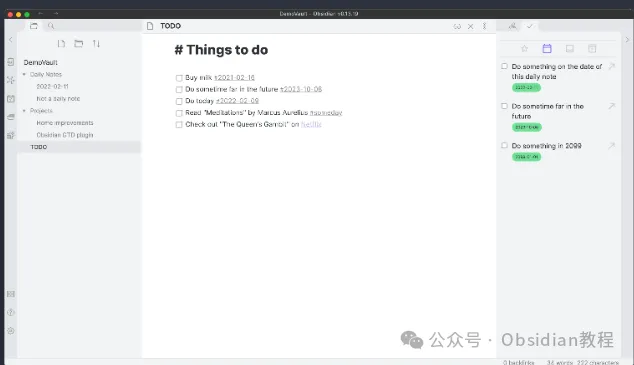
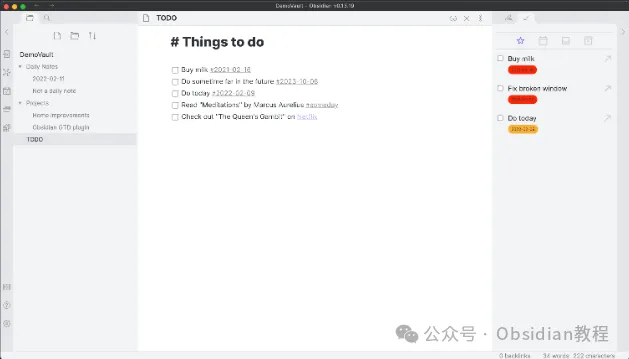
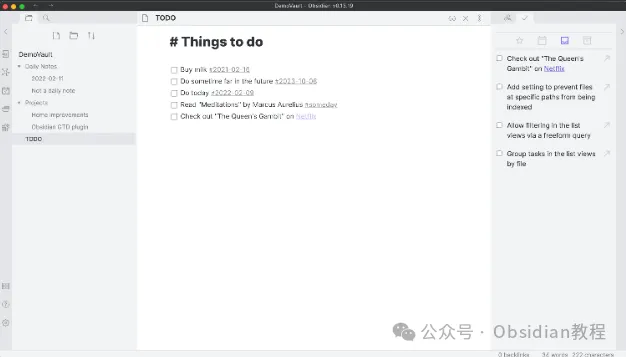

# Obsidian中的高效GTD工具：TODO Plugin详解

嗨，大家好，我是何老师。  
  
今天我们来聊聊Obsidian中用来管理待办事项的一个强大插件——TODO Plugin。

  

如果你是一个GTD（Getting Things Done）方法的践行者，或者只是希望在笔记中更好地管理日常任务和工作流程，那么这个插件绝对能够帮你提升效率。  
  

## **基于文本的GTD方法：为什么选择Obsidian？  
  
**

GTD方法的核心在于把所有待办事项和任务进行分类、整理和分配，并保持一目了然的状态。传统的GTD应用可能是专门的任务管理软件，但Obsidian凭借其强大的笔记管理和插件生态，提供了更多灵活性。而TODO Plugin作为一个专门为文本GTD设计的插件，让Obsidian可以直接变身为任务管理系统。  
  

### **TODO Plugin的特点：打造你的任务管理中枢  
  
**

  1. **聚合所有待办事项：** TODO Plugin可以自动在你的笔记库中搜索所有未完成的待办事项，并将它们汇总在一个统一的视图中展示。这样你就不用担心遗漏某些任务或需要在不同的笔记中来回切换查找了。  
  

  2. **分类视图管理：** 插件提供了“今天”（Today）、“预定”（Scheduled）、“收件箱”（Inbox）和“某天/也许”（Someday/Maybe）四种分类视图，方便你根据任务的重要性和紧急性来进行分配和管理。例如，你可以将近期必须完成的任务放在“今天”视图中，而那些暂时不需要关注的任务放到“某天/也许”列表中。  
  

  3. **任务日期设置与标签支持：** TODO Plugin支持使用标签为任务指定到期日期。比如，添加一个类似#2023-10-15这样的标签，可以将任务自动放入相应的“预定”视图中。如果你还没想好具体的日期，可以使用#someday标签将其标记为某天可能会做的任务，方便日后再做决策。  
  

  4. **快速跳转与任务管理：** 在TODO Plugin的视图中，你不仅可以查看所有待办事项，还能快速跳转到任务所在的笔记位置。这样当你需要回顾任务的详细信息或者补充内容时，点击即可直达。  
  

  5. **与日常笔记集成：** TODO Plugin还与Obsidian的Daily Notes（每日笔记）插件无缝集成。这意味着，如果某个任务没有特定的日期，插件会自动使用日常笔记的日期作为任务的截止时间，使你的任务管理更具逻辑性。  
  

## **安装与配置：快速上手指南  
  
**

### **1\. 在线安装**  
  

在Obsidian的“设置”页面中找到“社区插件”选项，然后点击“浏览插件”按钮，搜索“TODO Plugin”。找到插件后，点击“安装”按钮进行安装。完成安装后，切换“启用”开关，即可开始使用。  
  

### **2\. 离线安装**  
  

对于网络不太稳定的用户，你可以手动下载安装包并将其放入Obsidian的插件目录中。然后在“设置”中手动启用插件。  
  

### **  
很多同学无法直接在线安装obsidian插件，这里我已经把obsidian所有热门插件下载好了**  
只需要关注下方公众号，后台回复：**插件** 即可获取

### **3\. 设置选项**  
  

TODO Plugin提供了多种自定义选项，帮助你根据个人需求来定制任务管理方式：  
  

  * **日期标签格式：** 插件默认使用#%date%作为任务的日期标签，但你可以根据需要自定义格式。例如，可以修改为#due(2023-10-15)的样式来指定到期日期。  
  

  * **日期格式：** 插件使用luxon库来处理日期，因此你可以自定义日期显示方式（如yyyy-MM-dd）。  
  

  * **文件打开方式：** 你可以选择在新叶片中打开任务所在文件，避免替换当前正在处理的内容。  
  

## **使用方法：在Obsidian中实现高效GTD  
  
**

一旦安装并配置完成，你就可以开始在Obsidian中使用TODO Plugin来进行任务管理了。具体的使用方法如下：  
  

  1. **创建待办事项：** 在任何笔记中输入待办事项，前面加上- [ ]（Markdown格式的待办项语法），然后根据需要添加相应的标签。例如，你可以输入- [ ] 完成项目文档 #today，这样任务就会自动出现在“今天”的列表中。  
  

  2. **查看和管理任务：** 在Obsidian中打开TODO Plugin的视图（可以通过命令面板或者插件侧边栏进行操作），在这里你可以看到所有已标记的待办事项，并根据任务类型（如今天、预定、收件箱等）进行筛选。

  
  
  

  3. **任务完成标记与调整：** 当任务完成时，只需要在列表中点击待办项的复选框，任务会被标记为已完成。如果需要重新安排任务时间，可以直接修改标签或者将任务拖动到其他分类视图中。  
  

  4. **整合日常笔记：** 利用TODO Plugin与Daily Notes的集成，可以实现更加自动化的任务管理。那些没有指定日期的任务会自动被分配到对应的日常笔记中，从而保持整个任务管理系统的有序性。  
  

  
  

## **TODO Plugin的未来发展与即将推出的功能  
  
**

TODO Plugin在不断更新，并且开发者计划在未来推出更多实用功能，包括：  
  

  * 从列表视图中跳转到具体文件行：这样可以更加精准地定位到任务在笔记中的具体位置。  
  

  * 任务重新安排功能：允许用户直接在列表视图中调整任务的到期日期。  
  

  * 持久化缓存：通过引入缓存机制，仅在必要时重新索引待办事项，提升性能和反应速度。  
  

  * 多种筛选与排序方式：通过自由形式的标签搜索和排序，让用户能够更高效地筛选出目标任务。  
  
  
  

这些功能将使TODO Plugin成为Obsidian中更加强大和灵活的任务管理工具。  
  

## **使用感受与推荐  
  
**

总体来说，TODO Plugin是一个非常实用的插件，尤其适合那些习惯使用GTD方法的用户。它的自动聚合、分类管理、标签支持以及与日常笔记的深度集成，让Obsidian可以胜任复杂的任务管理需求。

  

无论是个人日常事务，还是复杂的项目管理，它都能够提供良好的支持。未来随着功能的进一步完善，TODO Plugin势必会成为Obsidian中不可或缺的任务管理助手。希望这篇指南能够帮助你更好地利用TODO Plugin，提升你的Obsidian使用体验！

# **Obsidian交流社群来了**

[**我们搞了一个专门分享Obsidian的交流社群：****玩转效率笔记****社群的主要内容包括使用技巧、模板主题和插件等，** 帮助更多人提升效率，实现自我管理的目标。](http://mp.weixin.qq.com/s?__biz=MzkyMDUyMDM2Mg==&mid=2247485997&idx=1&sn=9a528871be62e4c74a1df3807b28f2bd&chksm=c190d9e8f6e750fe9df7a333b666fdd8561fdeb928d1df1f367d2374742efa34727a3f91cbc0&scene=21#wechat_redirect)

  
如果你对Obsidian有热情，这个社群绝对不容错过！
