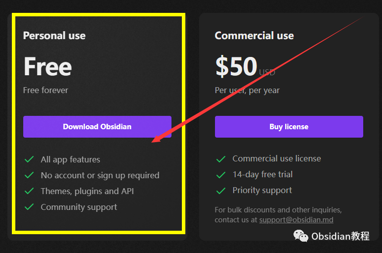
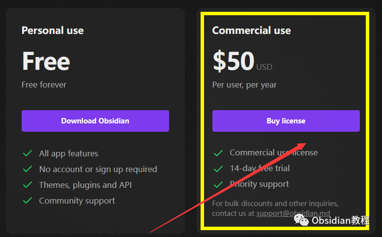
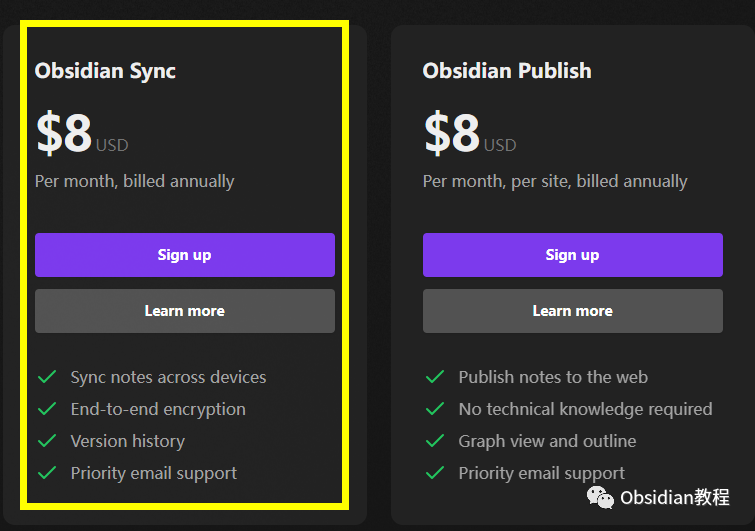
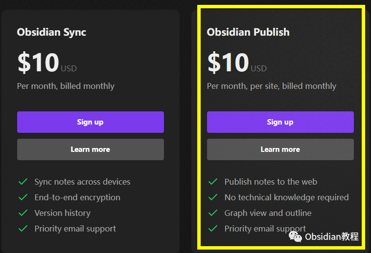
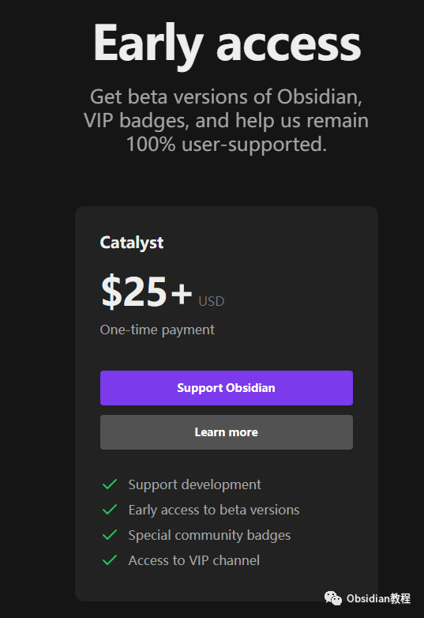

# Obsidian会员

### **点击下方公众号，回复关键字：****Obsidian** ，**获取Obsidian资料合集。**

  
Obsidian 是一款知识管理工具，但它的核心功能是完全免费的。  
不过，Obsidian 也提供了额外的增值服务，这就涉及到会员和收费问题。接下来，我们简单梳理一下各种会员的区别及其相关费用。  

####   

1\. 免费版本

  
  

首先，Obsidian 的基础版本是完全免费的。你不需要为创建、编辑和链接你的笔记支付任何费用。  
**包括：**  
  

  * 所有应用程序功能
  * 无需帐户或注册
  * 主题、插件和 API
  * 社区支持

  
  

####   

2\. Obsidian 商业版本

  
  
Obsidian 的商业许可主要是为那些希望在商业环境中使用 Obsidian 的组织或个人提供的。这不仅确保了合法使用，还为商业用户提供了一些特定的优势。

  
1.费用：Obsidian商业版本 是一个付费会员，主要是用于商业用途，需要按年收费，费用**每年50美元/年/人。**  
2.特点：  

  * **商业使用许可：** 这意味着你已经获得了使用 Obsidian 在商业环境中的授权。这是对于想在商业环境或组织内使用 Obsidian 的用户来说是必需的。
  * **试用：** 购买Obsidian商业用途后，可以14天免费使用
  * **云同步：** 可以将你的笔记同步到 Obsidian 云中，确保你在任何设备上都可以访问。
  * **更多插件：** 得到额外的、专为 VIP 设计的插件和主题。
  * **优先支持：** 在遇到问题时，会更快得到官方的回应和解决方案。

  
  
  

3\. Obsidian 附加组件

  
Obsidian 的附加组件 **Obsidian Sync** 和 **Obsidian Publish。****  
**他们的收费方式都分为按月计费和按年计费  
****按月收费：10美元/月******按年收费：8美元/月**

###   

### **1\. Obsidian Sync**

**  
**

  * **功能 ：**Obsidian Sync 是一个同步服务，使你可以在不同的设备之间同步你的笔记。它不仅同步文本，还同步你的插件、主题和设置，确保无论在哪里，Obsidian 的体验都是一致的。  

  * **安全性：** 考虑到隐私和安全，Obsidian Sync 提供端到端加密。这意味着，即使是 Obsidian 的服务器，也无法读取你的笔记内容。
  * **为何使用：** 如果你在多个设备上使用 Obsidian，例如桌面电脑、笔记本和平板，那么 Obsidian Sync 就是一个非常有用的工具，确保你的笔记始终是最新的，并且在各个设备之间保持一致。

  

###   

### **2.Obsidian Publish**

###   

  * ### **功能 ：**Obsidian Publish 允许你将笔记公开发布到互联网上，这样其他人就可以轻松地浏览和阅读。你可以选择哪些笔记要发布，哪些保持私有。

  * **个性化：** 你可以为你的公开笔记选择或定制主题，确保与你的品牌或个人风格保持一致。
  * **互动性：** 发布的笔记保留了 Obsidian 的链接功能，这意味着读者可以浏览你的思维导图和连接，获得更深入的了解。
  * **为何使用：** 如果你希望分享你的知识、研究或任何其他内容，并希望读者能够以互动的方式体验你的笔记，那么 Obsidian Publish 是一个绝佳的工具。

  
  
简而言之，Obsidian Sync 旨在为个人提供跨设备的一致体验，而 Obsidian Publish 则使你能够与世界分享你的知识和灵感。两者都为 Obsidian 用户提供了额外的价值和功能。  
  

Obsidian抢先体验

  
Obsidian Early Access 版本允许用户提前尝试 Obsidian 的测试版（或称为"beta"版本）。  
用户可以在正式发布之前体验到最新的功能和改进。只需要**一次性支付25美金。**  
  
选择这个版本的用户还会获得以下特权：  

  * VIP 徽章：为了表彰对 Obsidian 的支持，Early Access 用户会获得一个特别的 VIP 徽章，可能是在 Obsidian 社区或其他相关平台上展示的标识。

  

  * 支持 Obsidian：通过选择 Early Access，用户不仅可以体验到最新功能，还可以直接支持 Obsidian，帮助其继续为用户提供优质服务并保持100%用户支持。

  
总的来说，Obsidian 的 Early Access 版本是为那些希望积极参与软件发展、提前体验新功能并直接支持 Obsidian 团队的用户准备的。  
  
  
1

### **点击下方公众号，回复关键字：****Obsidian****，获取Obsidian资料合集。**

  

