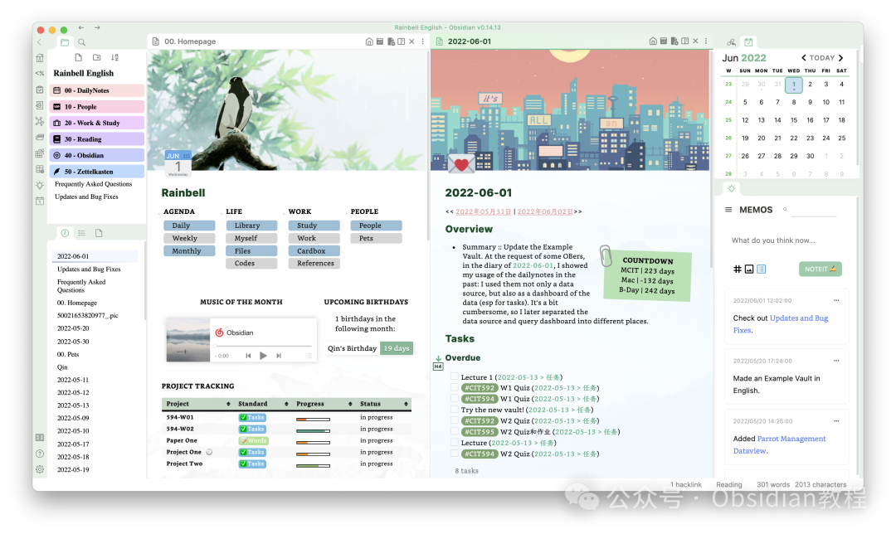

# Obsidian实战教程

Obsidian你在用吗？是否已经将它作为你的日常笔记管理专家了？  
在这个信息爆炸的时代，我们每天都被海量的数据和知识淹没。如何有效地管理这些知识，提高我们的学习和工作效率，成为了一个亟待解决的问题。幸运的是，Obsidian 这款链接型笔记工具的出现，为我们提供了解决方案。

### 为什么选择Obsidian?

  

主流的笔记软件都基本用过，各有优劣：

  

  * **有道云笔记：** 最早使用的，同步比较省心，可惜当时不支持 Markdown

  * **为知笔记：** 支持 Markdown，转收费后决定尝试一下印象笔记。

  * **印象笔记：** 广告越变越多后转到了 Joplin。

  * **Joplin：** 自带多种同步方式，开源、可导出 MD 文件。除了颜值差点用起来还算稳定。

  * **Obsidian：** 全平台，高颜值，插件丰富，甚至可以自定义开屏页。

  
Obsidian 不同于传统的笔记应用，它的核心功能是基于**链接的笔记系统** 。这意味着您可以轻松地将不同的笔记连接起来，形成一个复杂而有机的知识网络。这种方法不仅可以帮助您更有效地组织和回顾知识，还能激发新的创意和洞见。无论是学习新的知识还是整理工作中的信息，Obsidian 都能助您一臂之力。

### **课程介绍**

**  
**《Obsidian实战教程》是专为希望深入了解和掌握 Obsidian 的个人设计的。**课程内容从基础入门到高级技巧，涵盖了创建和管理链接型笔记的所有关键知识。**  
通过本课程，您将学会：

  * **Obsidian 的基础使用：** 熟悉界面，掌握快捷键和基本功能。

  * **高效笔记策略：** 如何创建、组织和链接您的笔记，使其成为一个强大的知识库。

  * **深度知识管理：** 运用 Obsidian 管理知识的艺术，提高学习和工作效率。

  * **实战案例分析：** 通过真实案例，展示如何在不同情境下使用 Obsidian 解决问题。

  * **与其他工具集成：** 学习如何将 Obsidian 与其他知识管理工具集成，实现数据同步和共享。

  * .......  

  
谁应该学习这个教程：  

  * 新手，刚接触Obsidian，希望迅速上手的用户
  * 中级用户，想要更进一步提高效率和创造性的人
  * 教育工作者、研究者、学生，和对个人知识管理有兴趣的每一个人
  * 企业团队，期望实现知识共享和协同工作

  
扫码查看课程大纲

《Obsidian实战教程》，您不仅学习如何使用一款软件，更重要的是，您将被引导穿梭于知识的迷宫，链接点滴思维，构建属于自己的知识宇宙。不再是简单地消费知识，而是开始创造知识，链接过去与未来，内在与外在。

这门课程是对未来的投资，一个让您在知识管理领域驾驭未来的机会。

Obsidian 实战，链接您的每一个思维瞬间！  

  

