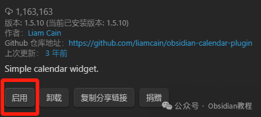
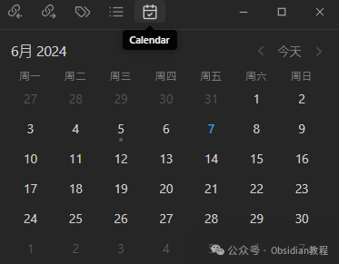
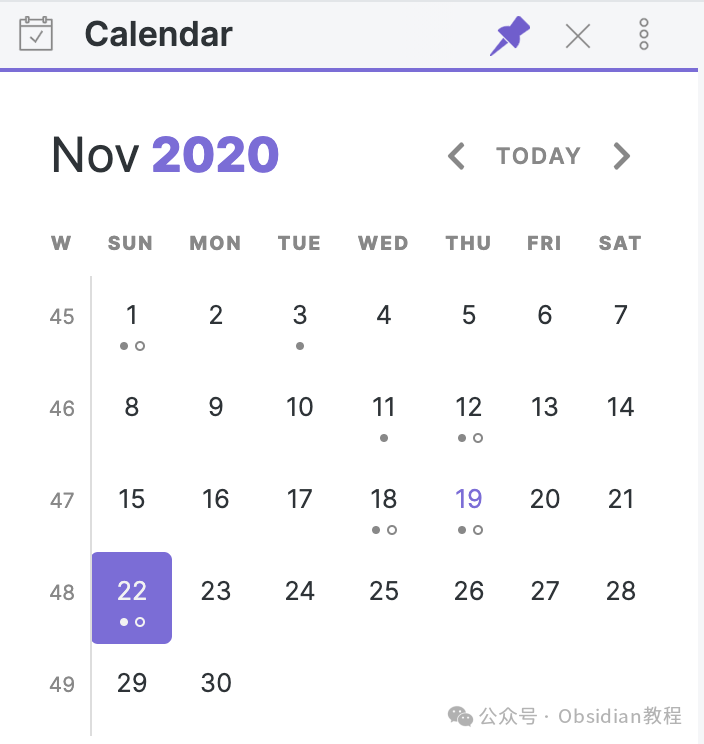

# Obsidian插件 : Calendar 可视化和导航你的日记笔记

嗨，我是鬼哥，10年+老程序员一枚。今天要跟大家分享的是一个Obsidian中的神奇插件——**Calendar** 插件。这个插件可以在Obsidian中创建一个简单的日历视图，用于可视化和导航你的日记笔记。Obsidian本身已经很强大了，但是加上这个插件，简直就是如虎添翼。

### **Calendar 插件简介**

Calendar插件的主要功能是为你的日记笔记提供一个直观的日历视图。这个视图不仅让你能够快速查看和导航每天的笔记，还能帮助你更好地组织和管理你的日记内容。Obsidian的Calendar插件是一款非常实用的工具，尤其是对于那些喜欢记录日常生活和工作计划的人。它不仅让你能更直观地管理和查看笔记，还能提高你的时间管理和组织能力。如果你是一个喜欢记录日常生活或工作计划的人，这个插件绝对能提升你的使用体验。

### **下载和安装**

安装的步骤其实非常简单：

### **1.在线安装**（需要科学上网） ：****

  
在Obsidian中安装插件是一个简单直接的过程：  

  1. 打开Obsidian，点击左下角的“设置”图标。
  2. 在设置菜单中，选择“第三方插件”选项。
  3. 点击“浏览”按钮，搜索“ Calendar ”。
  4. 找到插件后，点击“安装”。
  5. 安装完成后，切换插件的“启用”开关。  

### **2.离线安装：****  
****因为网络原因很多同学无法直接在线安装obsidian插件，这里我已经把obsidian所有热门插件下载好了**  

只需要关注下方公众号，后台回复：**插件** 即可获取

安装成功后，你的obsidian左侧栏目中就会出现他的标识。

**使用方法**

安装并启用插件后，你会在Obsidian的侧边栏看到一个新的日历图标。点击它，就可以打开日历视图了。

  * 查看日历：在日历视图中，你可以看到当前月份的日历。每个有日记笔记的日期都会高亮显示。

  * 创建日记笔记：点击任意日期，可以快速创建当天的日记笔记。笔记的命名格式通常为YYYY-MM-DD，这样便于管理和查找。

  * 导航日记笔记：点击高亮的日期，可以快速跳转到该日的日记笔记。

### **带来的好处**

  * 直观的笔记管理：日历视图让你一目了然地查看每天的笔记，避免了在大量笔记中迷失方向。

  * 高效的笔记创建：通过日历视图，可以快速创建和访问每天的日记笔记，提高了笔记管理的效率。

  * 良好的组织性：通过按日期组织笔记内容，可以更好地回顾和管理你的日记，方便日后的查阅。

### **能解决什么问题**

  * 笔记混乱：如果你的笔记很多，容易混淆和丢失重要信息。Calendar插件能帮助你有条理地管理笔记。

  * 时间管理：通过日历视图，你可以更好地规划和记录日常事务，提高时间管理能力。

  * 快速查找：通过高亮显示和点击导航，你可以快速找到特定日期的笔记，节省时间。

### **鬼哥的使用感受**

自从用了Calendar插件，鬼哥的笔记生活变得更加有序和高效。以前总是要花时间去找某天的笔记，现在只需点击日历上的日期就能快速跳转。而且，这个插件的安装和使用都非常简单，对新手友好。如果你和鬼哥一样，喜欢每天记点东西，那么这个插件绝对是你的不二选择。希望大家都能像鬼哥一样，通过Obsidian和Calendar插件，让自己的笔记生活变得更加高效和有序。赶快试试吧，保证你会爱上它的！  
  
  
1******扫码购买****《 Obsidian实战教程》****从入门到精通， 链接您的每一个思维瞬间。**  

