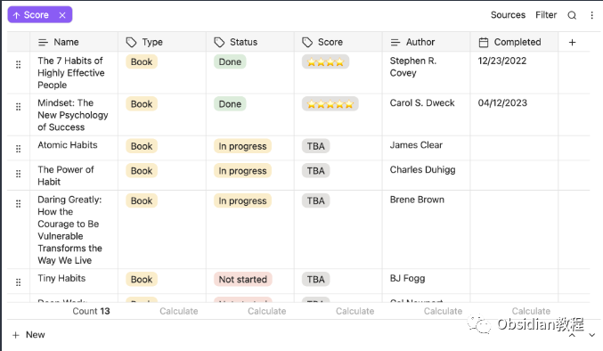
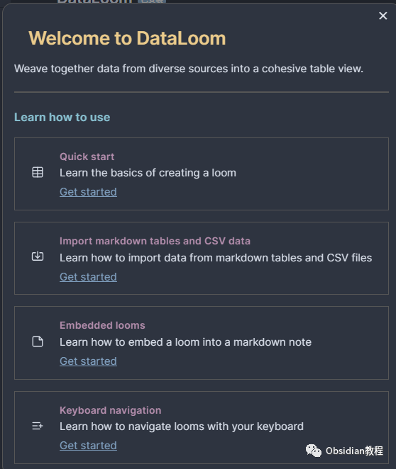
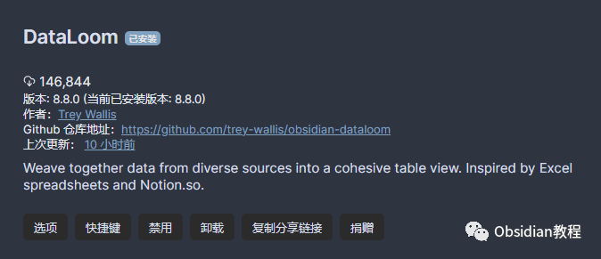
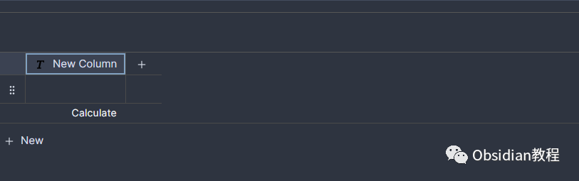
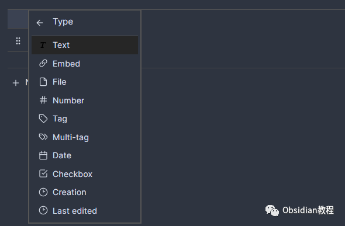
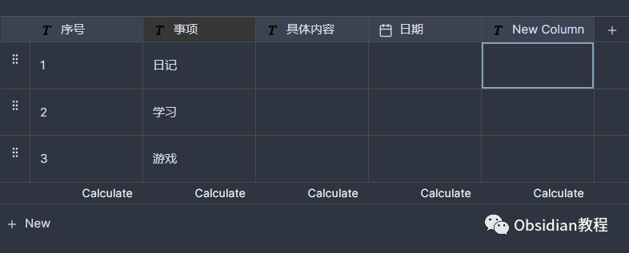

# Obsidian插件: DataLoom的数据管理魔法

点击下方公众号，回复关键字：**Obsidian** ，获取Obsidian资料合集。  
如果你是一个数据爱好者，渴望在 Obsidian 中整合、管理和展示数据，那么你来对地方了。DataLoom 就像一个魔法织布机，能够将各种数据编织成一张完美的表格。

## 1 DataLoom：数据的魔法织布机

想象一下，你手头有来自 YouTube、Instagram、Twitter 以及你的本地文件夹和标签的数据。你希望将这些数据整合在一起，形成一个完整的视图。  
DataLoom 就是为此而生的。它不仅仅是一个表格工具，更是一个数据的“织布机”，可以将多种数据源编织在一起。

## 2为什么选择 DataLoom？

  * 简单直观：与其他复杂的数据库工具相比，DataLoom 提供了一个直观的 WYSIWYG 用户界面，让你可以轻松地创建和编辑表格。
  * 灵活的数据源：无论是 Obsidian 的文件夹、标签，还是外部的 API，DataLoom 都可以完美整合。
  * 独立而强大：DataLoom 不依赖于其他插件，它有自己的菜单系统，提供了丰富的功能。

##   

## 3开始使用：创建你的第一个 loom

安装 DataLoom：首先，确保你已经安装了 Obsidian。

###   

### **1.在线安装**（需要科学上网） ：****

  
1.在Obsidian的设置中，找到“第三方插件”选项，点击“社区插件”2.在搜索框中输入“DataLoom”，找到并安装它。3.安装完成后，激活该插件，在成功安装插件后，我们需要对其进行简单的配置，以符合我们的需求。  

**2.离线安装：****  
****因为网络原因很多同学无法直接在线安装obsidian插件，这里我已经把obsidian所有热门插件下载好了**  
只需要关注下方公众号，后台回复：**插件** 即可获取创建一个新的 loom 文件：在 Obsidian 中，选择新建文件，并选择 .loom 格式。这就是你的数据“画布”。  
  

输入数据：现在，你可以开始输入数据了。无论是文本、数字、日期还是其他类型，DataLoom 都能完美支持。  

## 4数据织布：整合各种数据源

DataLoom 的魔力在于它可以整合各种数据源。你可以从文件夹、标签导入数据，也可以从 YouTube、Instagram、Twitter 等外部 API 导入数据。这意味着你可以在一个表格中查看你的笔记、视频、图片和推文，真正实现数据的统一管理。

## 

5定制你的表格：列和行的操作

  * 列操作：你可以轻松地切换列的可见性、更改列的名称和类型、排序列、插入新的列等。
  * 行操作：你可以根据条件过滤行、搜索文本、插入新的行、重新排序行等。

## 

## **美化你的表格：颜色和样式**

  
DataLoom 提供了亮色和暗色两种颜色方案，你可以根据自己的喜好选择。此外，你还可以为表格设置不同的样式，使其更加美观。

6与 Obsidian 的完美结合

## 

DataLoom 不仅仅是一个独立的插件，它还与 Obsidian 完美结合。你可以在表格中嵌入笔记，也可以在笔记中嵌入表格，真正实现了数据和笔记的无缝结合。  

## **移动端支持：随时随地管理你的数据**

  
DataLoom 不仅支持桌面端，还支持移动端。这意味着你可以在任何地方、任何时候管理和查看你的数据。  
DataLoom 是一个强大而灵活的插件，但最重要的是，它是为你而设计的。不要害怕尝试新的功能，不要害怕犯错误。只有通过实践，你才能真正掌握这个插件的魔力。  
总之，DataLoom可以帮助你更好地管理和展示数据。无论你是一个数据分析师、研究员还是日常生活中的数据爱好者，DataLoom 都是你的最佳选择。  
  
  
1**扫码购买****《 Obsidian实战教程》****从入门到精通， 链接您的每一个思维瞬间。**  
往期精彩[1.Obsidian插件：Zotero Integration，让文献管理得心应手](http://mp.weixin.qq.com/s?__biz=MzkyMDUyMDM2Mg==&mid=2247484439&idx=1&sn=c5161930a16de70029fca1263ebb6250&chksm=c190d7d2f6e75ec49094d9800a91e8c6a2fde9f39e62d8c18795068a19b4b8e2a3c8f876efbc&scene=21#wechat_redirect)  
[2.Obsidian插件：轻松实现思维导图和PDF注释的Obsidian MarkMind插件](http://mp.weixin.qq.com/s?__biz=MzkyMDUyMDM2Mg==&mid=2247484438&idx=1&sn=895f3041fa9688b8276cf2731b23c353&chksm=c190d7d3f6e75ec507ff918eb7cad18f78fa3dff799b9e9737b734f66e5c06e091653598cfb4&scene=21#wechat_redirect)  
[3.Obsidian 插件:Make.md赋能创作者的终极体验](http://mp.weixin.qq.com/s?__biz=MzkyMDUyMDM2Mg==&mid=2247484437&idx=1&sn=56d072590a221e82421f806bd14f9d01&chksm=c190d7d0f6e75ec6a112fc672ce1daca289b70893334e5c5bbd4d406836c641ef294bbdeace2&scene=21#wechat_redirect)  

点分享

点点赞

点在看
