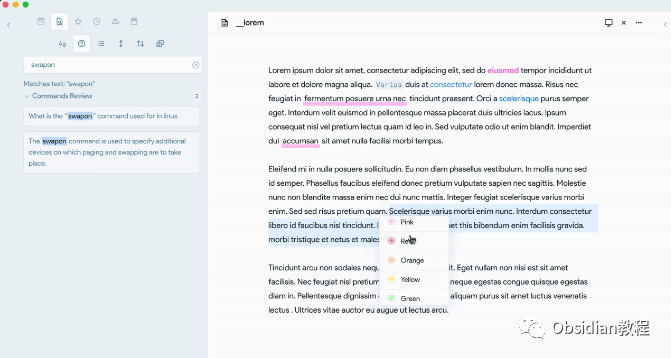
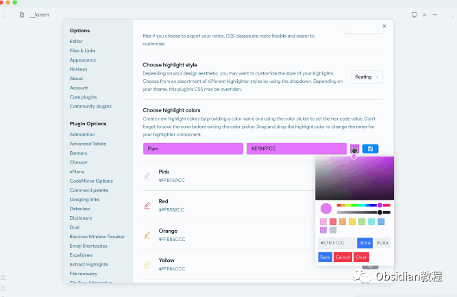
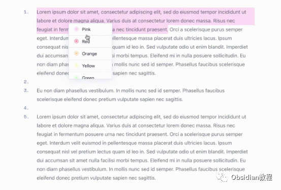
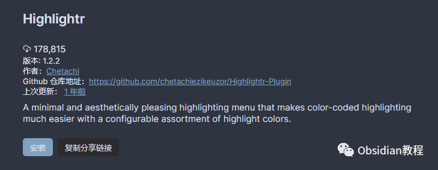
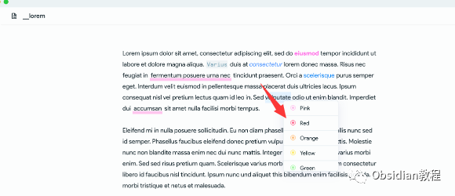
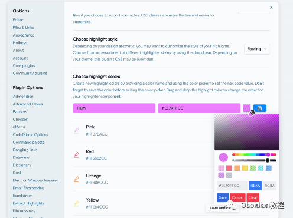
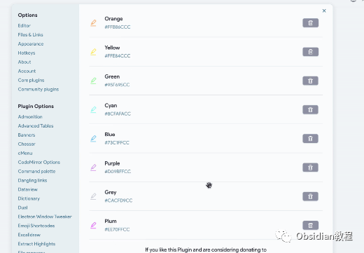

# Obsidian插件: Highlightr 为笔记提供简单而美观的高亮显示菜单

点击下方公众号，回复关键字：**Obsidian** ，获取Obsidian资料合集。  
‍  
Obsidian 的 Highlightr 插件为笔记提供了简单而美观的高亮显示菜单，使你能够以用户友好的方式为文本添加不同颜色的高亮，以丰富你的笔记内容。  
我们应该如何安装和使用 Highlightr 插件来高亮你的笔记？

##  1**插件介绍**   

Highlightr 插件是一个为 Obsidian 笔记应用带来简单、最小而美观的高亮显示菜单的插件。它让颜色编码的高亮变得容易，同时提供了一个用户友好的高亮颜色选择。  
  

## 2**功能说明**   

### **简单易用**

###   

  * 颜色选择：插件提供了一个美观的颜色选择菜单，让你可以轻松为文本添加高亮。
  * 主题通用：插件中包含的颜色旨在跨主题通用，无论是浅色还是深色模式。
  * 导出友好：使用内联 CSS 保持笔记的长期性，无需依赖任何外部 CSS 样式，使得你的笔记更加灵活。

###   

### **自定义高亮颜色**

###   

  * 添加新颜色：你可以自定义你的高亮颜色，创建新的高亮颜色非常简单，只需要在插件设置中设置颜色名称和颜色值即可。

###   

### **  
**

### **快捷高亮与取消高亮**

**  
**

  * 文本选择菜单：当你选择文本时，会出现“高亮”和“取消高亮”菜单项，方便你对文本进行高亮处理。
  * 快捷键支持：你可以为打开高亮菜单以及每种高亮颜色设置快捷键，快速高亮你的文本。

## 3**使用方法**

### **  
**

### **1.在线安装**（需要科学上网） ：****

  
1.在Obsidian的设置中，找到“第三方插件”选项，点击“社区插件”2.在搜索框中输入“Highlightr”，找到并安装它。3.安装完成后，激活该插件，在成功安装插件后，我们需要对其进行简单的配置，以符合我们的需求。  
**  
****2.离线安装：****  
****因为网络原因很多同学无法直接在线安装obsidian插件，这里我已经把obsidian所有热门插件下载好了**  
只需要关注下方公众号，后台回复：**插件** 即可获取

### 

  

### **2.基本使用**

  
打开高亮菜单：选择你想要高亮的文本，然后在出现的文本选择菜单中点击“高亮”，选择你想要的高亮颜色。  
  
取消高亮：如果你想取消文本的高亮，可以选择高亮的文本，然后在文本选择菜单中点击“取消高亮”。  

### **3.自定义高亮颜色**

  
打开 Obsidian 的设置，然后找到 Highlightr 插件的设置。  
在设置页面中，你可以添加新的高亮颜色，设置颜色的名称和颜色值，然后保存。  
  
新添加的高亮颜色将出现在高亮菜单中，你可以使用它来高亮你的文本。  

### **  
**

### **4.快捷键设置**

  

  * 在 Obsidian 的设置中找到“热键”选项，然后找到 Highlightr 插件的相关命令。
  * 为打开高亮菜单和每种高亮颜色设置你想要的快捷键。

  1.   

## 4**结语**   

Highlightr 插件为 Obsidian 用户提供了一个简单而美观的文本高亮解决方案。它不仅让你可以轻松地为文本添加高亮，还支持自定义高亮颜色和快捷键，极大地丰富了 Obsidian 的文本编辑功能。  
  
  
1**扫码购买****《 Obsidian实战教程》****从入门到精通， 链接您的每一个思维瞬间。****  
**  
往 期精彩1.[Obsidian插件: Pandoc 一个强大的文档导出工具](http://mp.weixin.qq.com/s?__biz=MzkyMDUyMDM2Mg==&mid=2247484337&idx=1&sn=0a7344f1a0d9d40e8a559f3ea2058f79&chksm=c190d074f6e759624befeebc9935cb831090a20adb10cdaaefb586df7d2e3ba65ce93339b699&scene=21#wechat_redirect)  
[2.Obsidian插件:DB Folder 为 Obsidian 用户提供类似 Notion 数据库功能](http://mp.weixin.qq.com/s?__biz=MzkyMDUyMDM2Mg==&mid=2247484336&idx=1&sn=d9f1c2f9592ec2a7b3ad655f31f441c8&chksm=c190d075f6e7596362d43485a56a8e0ee66441928475223879a5d7245127fa57070ea586cdd6&scene=21#wechat_redirect)  
[3.Obsidian插件:Advanced URI 通过打开一些 URIs 来控制 Obsidian 不同功能的能力。](http://mp.weixin.qq.com/s?__biz=MzkyMDUyMDM2Mg==&mid=2247484335&idx=1&sn=4d0656f9dff7276bd13c4d2eff3701b3&chksm=c190d06af6e7597cc7cd2bf93b265ba4cf78a7b8a310ac6e615e48cb342121516fd253c2b41e&scene=21#wechat_redirect)  

点分享

点点赞

点在看

  

