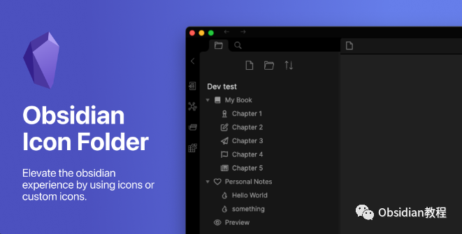
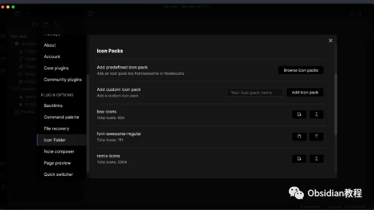
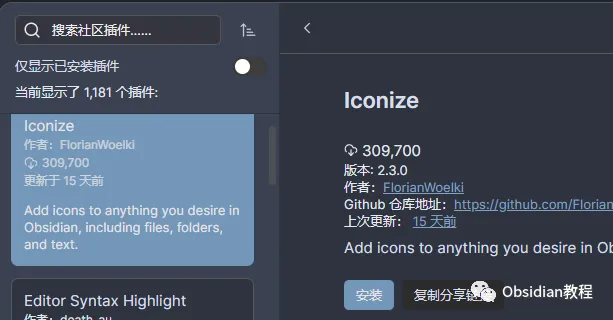
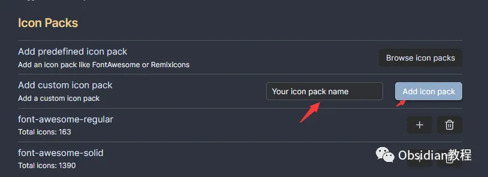
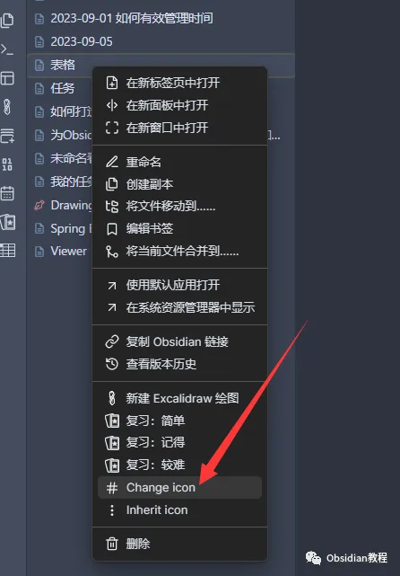
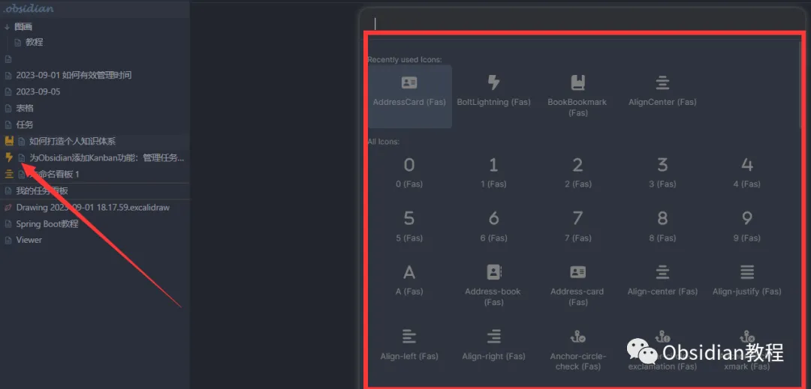
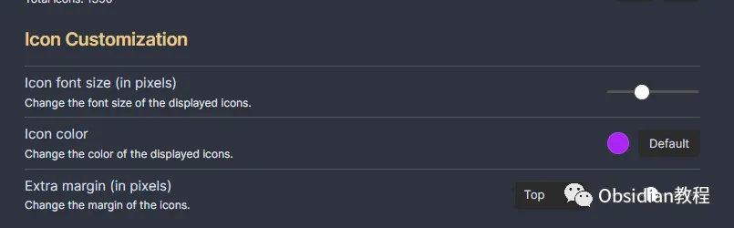
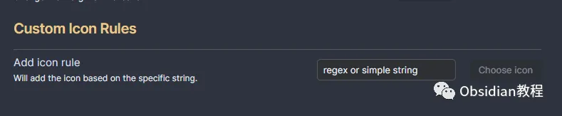

# Obsidian插件: Iconize 美化和个性化笔记，添加独特图标

嗨，我是鬼哥，10年+老程序员一枚。

今天我们来聊聊Obsidian里的一个超级酷炫的插件——**Iconize** 。

这款插件能够让你在Obsidian里添加各种自定义图标，无论是你自己制作的.svg图标，还是从图标包里选择的图标，都能轻松搞定。

简直是为那些喜欢美化和个性化笔记的小伙伴量身定制的神器。

**Iconize 插件简介**

首先，咱们简单介绍一下Iconize插件的功能。Iconize插件的主要作用是让你可以在Obsidian中给任何东西添加图标。这些图标可以是你自己制作的.svg文件，也可以是从现成的图标包里挑选的。

这个功能听起来可能有点简单，但它的应用场景和实际效果可是非常强大的。

**为什么选择Iconize？**

选择Iconize插件的理由有很多，最主要的几点如下：

  1. 个性化你的笔记：通过添加图标，你可以让每个笔记、文件夹甚至是标签都独具特色，瞬间提升你的笔记颜值。

  2. 提高效率：在视觉上直观地识别不同的笔记和分类，能大大提高你的工作效率。

  3. 简单易用：不需要编写代码，只需简单几步操作，就能完成图标的添加和管理。

### **插件下载和安装**

好了，聊完了优点，咱们来看一下如何安装这个插件。操作步骤如下：

### **1.在线安装**：****

  

  * 打开Obsidian，点击左下角的设置图标，进入“设置”页面。
  * 在左侧菜单中找到“第三方插件”并点击，再点击右侧的“浏览”按钮。
  * 在弹出的插件市场中搜索“Iconize”，找到Iconize插件并点击“安装”。
  * 安装完成后，回到“第三方插件”页面，找到Iconize插件，并将其旁边的开关打开，启用插件。

  
  
**2.离线安装：****  
****因为网络原因很多同学无法直接在线安装obsidian插件，这里我已经把obsidian所有热门插件下载好了**  

只需要关注下方公众号，后台回复：**插件** 即可获取

### **使用方法**

安装完插件之后，咱们就可以开始愉快地给各种东西添加图标了。

#### **添加自定义图标**

如果你有自己设计的.svg图标，完全可以使用Iconize来添加。具体步骤是：

  1. 在Obsidian中打开你想要添加图标的项目。

  2. 右键点击项目，选择“添加图标”选项。

  3. 在弹出的对话框中，上传你的.svg文件。

  4. 确认后，你的项目就会显示自定义图标了。

#### **使用图标包**

如果你没有自定义图标，也可以使用Iconize提供的图标包。步骤如下：

  1. 右键点击你想要添加图标的项目。

  2. 选择“添加图标”选项。
  3. 在图标库中浏览，选择一个你喜欢的图标。

  4. 确认选择后，图标就会应用到你的项目上。

#### ****

#### **图标管理**

Iconize还提供了一些基本的图标管理功能。你可以随时更改、删除图标，或是调整图标的大小和位置。只需右键点击已添加图标的项目，选择相应的管理选项即可。

### **实际应用场景**

咱们来看看Iconize的实际应用场景，看看它能为你带来哪些便利。

#### **1\. 分类标记**

通过为不同类型的笔记添加不同的图标，你可以快速识别出哪些是重要的会议记录，哪些是个人笔记，哪些是项目文档。这样一来，查找和管理笔记的效率就会大大提高。

#### **2\. 视觉美化**

有了Iconize，你可以让你的Obsidian笔记变得更加美观和个性化。不管是给文件夹、笔记还是标签添加图标，都能让你的笔记系统看起来更整洁、更专业。

#### **3\. 互动性提升**

直观的图标可以增强用户的交互体验。比如，你可以为待办事项添加一个勾选图标，为重要笔记添加一个星标图标，等等。这样不仅美观，还能直观地传达信息。

### **我的使用体验**

鬼哥自己用了Iconize一段时间，感觉这个插件确实为Obsidian的使用体验增色不少。每次打开笔记，看到那些精美的小图标，就感觉工作也变得更有趣了。而且，通过图标的快速识别，管理和查找笔记的效率也提高了不少。

Iconize是一个非常值得安装的插件。

它不仅能让你的Obsidian笔记变得更美观，还能大大提升你的工作效率。

对于那些喜欢个性化和美化笔记的小伙伴们来说，这个插件绝对是必装的。

赶紧去试试吧，鬼哥强烈推荐！

  
  
  
1******扫码购买****《 Obsidian实战教程》****从入门到精通， 链接您的每一个思维瞬间。**  

