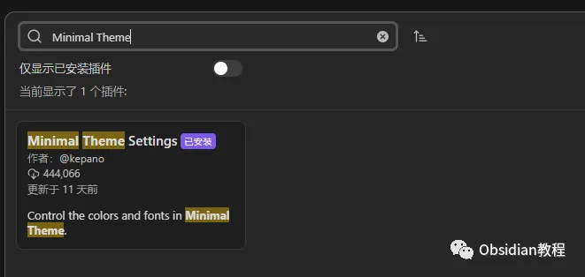
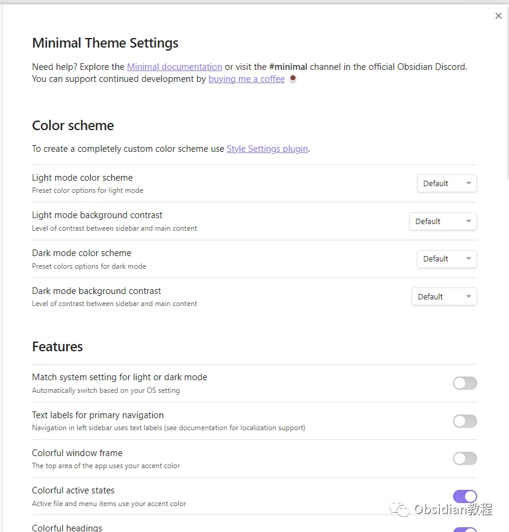
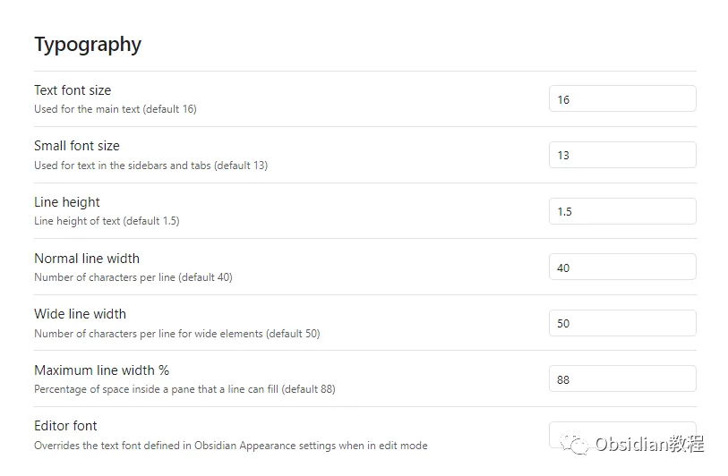

# Obsidian插件: Minimal Theme 自定义主题

嗨，我是鬼哥，10年+老程序员一枚。

今天咱们聊聊Obsidian中的Minimal主题和它的配套插件——**Minimal Theme Settings。**

作为一个Obsidian的忠实用户，鬼哥不得不说，这个插件真是太方便了，能让我们随心所欲地定制自己的笔记界面，不管你是颜控还是功能控，这个插件都能满足你。

接下来，鬼哥就带大家详细了解一下这个插件。

### **Minimal Theme Settings 插件简介**

Minimal Theme Settings 是一个与 Minimal 主题配套的插件，允许你直接从 Obsidian 设置面板中自定义主题。虽然使用 Minimal 主题并不需要这个插件，但我强烈推荐你安装它，因为它能大大提升你的使用体验，让你的 Obsidian 更加个性化和符合你的审美。

### **插件的下载与安装**

要使用 Minimal Theme Settings 插件，首先需要确保你已经安装了 Minimal 主题。具体步骤如下：

### **1.在线安装**：****

在Obsidian中安装插件是一个简单直接的过程：

  * 打开Obsidian，点击左下角的“设置”图标。
  * 在设置菜单中，选择“第三方插件”选项。
  * 点击“浏览”按钮，搜索“Minimal Theme Settings”。
  * 找到插件后，点击“安装”。
  * 安装完成后，切换插件的“启用”开关。

  
**2.离线安装：****  
****因为网络原因很多同学无法直接在线安装obsidian插件，这里我已经把obsidian所有热门插件下载好了**  

只需要关注下方公众号，后台回复：**插件** 即可获取

**插件的使用方法**  

安装好插件后，我们可以通过以下步骤进行设置：

  1. 打开 Obsidian 的设置面板，找到 Minimal Theme Settings 插件的设置选项。

  2. 在设置界面，你可以看到各种可自定义的选项，包括颜色、字体、间距等。

  3. 根据个人喜好进行调整，所有的修改都会即时生效，让你能够实时预览效果。

举个例子，如果你想改变笔记标题的颜色，只需要在颜色选项中找到对应的设置项，选择你喜欢的颜色，立刻就能在笔记中看到效果。这样的即时预览功能，真是方便极了！

### **插件带来的好处**

这个插件的最大优势就是它的直观和灵活性。通过 Minimal Theme Settings，你可以：

  * **定制化界面** ：无论是颜色、字体还是布局，你都可以根据自己的喜好进行调整，打造出完全符合你个人风格的笔记界面。

  * **提高效率** ：一个美观且符合你使用习惯的界面，能够让你在使用 Obsidian 时更加专注，提高工作效率。

  * **简单易用** ：插件的设置界面设计得非常直观，就算你是小白用户，也能轻松上手。

### **应用场景和示例**

举个实际例子，鬼哥在使用 Minimal Theme Settings 时，最常用的就是调整字体和配色。

鬼哥喜欢简洁的黑白配色，于是在插件中将背景设为纯白色，文字设为深黑色，再加上淡蓝色的链接，这样的配色看着非常舒服，长时间阅读和写作也不会觉得累。

鬼哥还调整了标题的字体和大小，让它们看起来更加醒目。这些小改动虽然看似简单，但对整体使用体验的提升却是非常明显的。

### **我的看法和总结**

Minimal Theme Settings 插件是一个非常实用的工具，特别适合那些喜欢个性化定制的用户。通过这个插件，你可以轻松调整 Obsidian 的外观，让它更符合你的个人喜好，从而提升使用体验和工作效率。

如果你还没试过这个插件，鬼哥强烈建议你去安装体验一下。

一旦用了这个插件，你会发现你的 Obsidian 变得更加美观和好用，写笔记的心情也会好很多。

  
  
  
1******扫码购买****《 Obsidian实战教程》****从入门到精通， 链接您的每一个思维瞬间。**  

