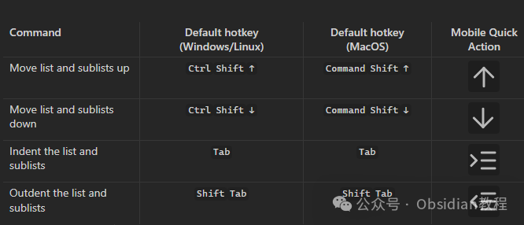
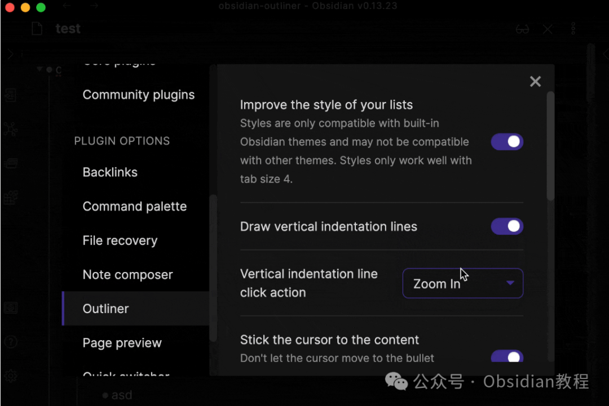
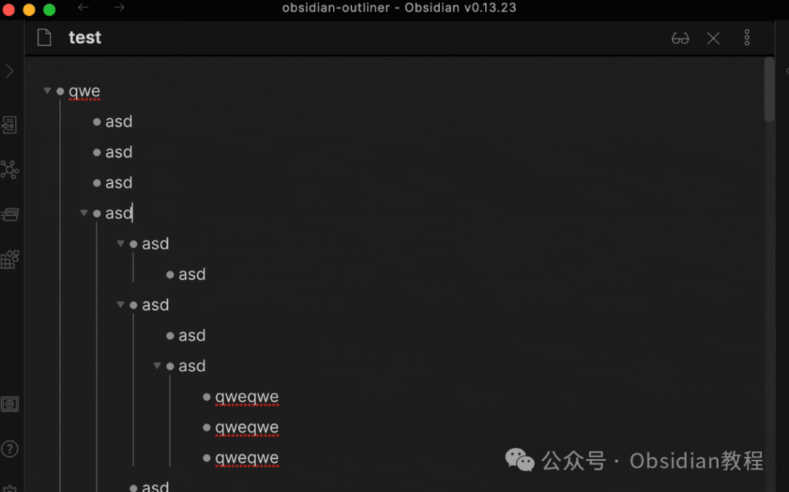

# Obsidian插件: Outliner 轻松移动深层次的结构化列表

嗨，我是鬼哥，10年+老程序员一枚。

今天咱们要聊聊 Obsidian 中一个非常实用的插件——Outliner。

说到笔记和列表，大家肯定都想要一个清晰、条理分明的结构，而 Outliner 正是为此而生的。

这个插件可以帮助你创建深层次的结构化列表，并通过快捷键轻松移动项目，极大提升了我们的工作效率。

废话不多说，下面就详细介绍一下这个插件的使用方法。

**Outliner 插件简介**

Outliner 是一个专门用于提升 Obsidian 列表样式和功能的插件。通过这个插件，你可以创建更加美观和功能丰富的列表，并且通过快捷键快速调整列表中的项目位置，让你的笔记更加条理清晰。

### **插件的下载与安装**

我们需要在 Obsidian 中下载并安装 Outliner 插件。具体步骤如下：

### **1 在线安装**：****

****  
****

  * 打开Obsidian，点击左下角的“设置”图标。

  * ### 

在设置菜单中，选择“第三方插件”选项。
  * 点击“浏览”按钮，搜索“ Outliner ”。
  * 找到插件后，点击“安装”。
  * 安装完成后，切换插件的“启用”开关。

**3.2离线安装：****  
****因为网络原因很多同学无法直接在线安装obsidian插件，这里我已经把obsidian所有热门插件下载好了**  

只需要关注下方公众号，后台回复：**插件** 即可获取

### **使用方法**

### 

####  安装好插件后，我们就可以开始创建结构化列表了。具体操作如下：  

打开一个新的笔记，输入你的列表内容。例如：

  *   *   *   *   *   * 

    
    
    - 项目1  - 子项目1.1  - 子项目1.2    - 子项目1.2.1- 项目2  - 子项目2.1

#### **使用快捷键移动项目**

Outliner 插件最强大的功能之一就是通过快捷键移动列表中的项目。以下是一些常用的快捷键：

  * 向上移动列表及子列表：Ctrl + Shift + ⬆

  * 向下移动列表及子列表：Ctrl + Shift+⬇

  * 减少列表和子列表的缩进：Shift + Tab
  * 向右缩进：Tab

举个例子，如果你想将“子项目1.2”上移，只需选中该任务项，然后按下 Ctrl + Shift + ⬆即可。

### **插件功能特点**

#### **改善列表样式**

Outliner 插件不仅在功能上提升了列表操作的便捷性，还在样式上进行了优化。如果你喜欢演示中的样式，可以在插件设置选项卡中启用它们。具体步骤如下：

  * 打开 Obsidian 的设置面板，找到 Outliner 插件的设置选项。
  * 在设置页面中，你可以看到各种样式选项。根据个人喜好进行选择和启用。

**提升工作效率** 通过 Outliner 插件，你可以大幅提升工作效率。它让你能够快速调整列表中的项目位置，而不需要手动剪切和粘贴，大大节省了时间。同时，结构化的列表也能让你的思维更加清晰，笔记内容更加有条理。**应用场景和示例** Outliner 插件特别适合那些需要频繁整理和调整列表内容的用户。例如：

  * **项目管理** ：在项目管理中，你可以使用 Outliner 插件来创建任务列表，并根据项目进展情况快速调整任务优先级和结构。

  * **学习笔记** ：在学习过程中，你可以用 Outliner 插件来整理知识点，将相关内容归类，形成清晰的知识结构。

### **鬼哥的看法**

使用 Outliner 插件后，鬼哥的 Obsidian 笔记变得更加有条理，操作也更加高效了。特别是在处理复杂的项目管理和学习笔记时，这个插件简直是神器。

如果你还没有尝试过 Outliner 插件，鬼哥强烈建议你安装并试用一下。

相信我，这个插件一定会让你的笔记体验提升一个档次，帮你更好地整理和管理信息。

  
  
  
1******扫码购买****《 Obsidian实战教程》****从入门到精通， 链接您的每一个思维瞬间。**  

