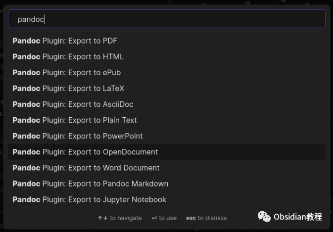
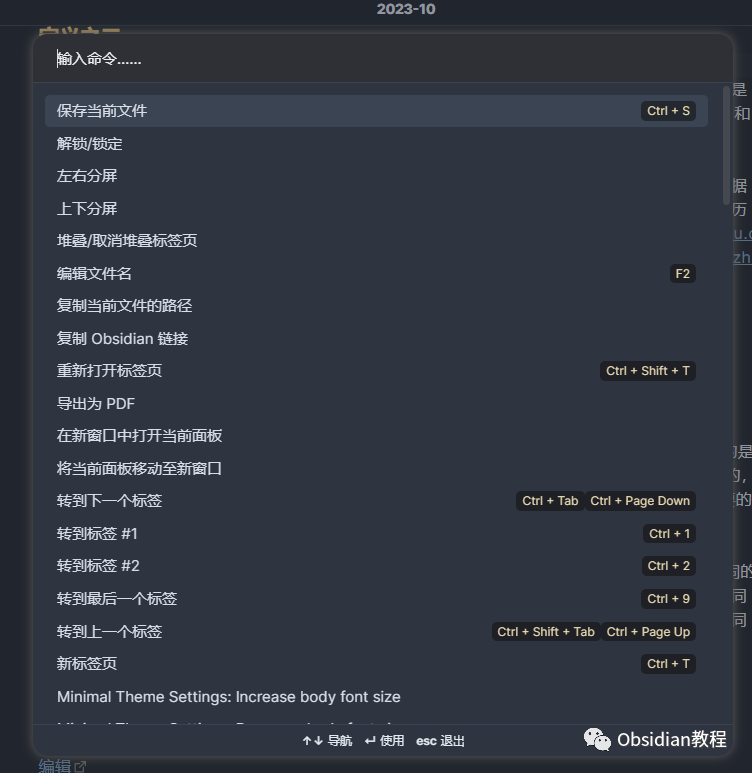
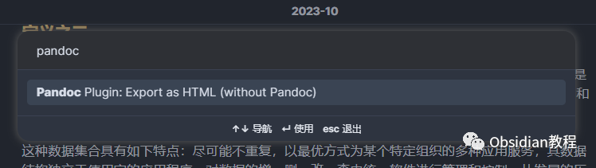
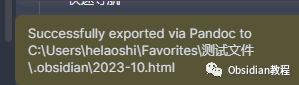

# Obsidian插件: Pandoc 一个强大的文档导出工具

点击下方公众号，回复关键字：**Obsidian** ，获取Obsidian资料合集。

  
Obsidian 的 Pandoc 插件是一个强大的文档导出工具，它提供了从 Obsidian 导出到多种格式的能力，如 Word 文档、PDF、ePub 书籍、HTML 网站、PowerPoint 和 LaTeX 等。  
通过这个插件，你可以在 Obsidian 中编写演示文稿、草拟书籍、制作网页和编写作业，然后导出到你需要的任何格式。  

## 1**插件介绍**

Pandoc 插件为 Obsidian 用户提供了一个方便快捷的文档导出解决方案。它通过 Pandoc 实现了多种格式的导出功能，让你可以方便地将 Obsidian 中的笔记转换为多种常见的文档格式。  

## **功能说明**

**  
**

  * 多格式导出：提供了多种文档格式的导出选项，包括 Word 文档、PDF、ePub 书籍、HTML 网站、PowerPoint 和 LaTeX 等。
  * 快捷命令面板：通过命令面板，你可以快速选择导出格式和执行导出操作。
  * 模板与引用支持：支持使用 Pandoc 模板和引用，使得文档导出更为灵活和个性化。

##   

### **基本使用**

  
打开命令面板：按 Ctrl+P 或 Cmd+P 打开命令面板。  

搜索并选择 Pandoc：在命令面板中输入 "Pandoc"，然后从列表中选择 Pandoc 插件。  

选择导出格式：选择你想要导出的文档格式。  
执行导出：按照提示执行导出操作。如果一切顺利，它会显示导出成功的提示。  

查看导出文件：导出成功后，在文件浏览器中你将看到与原始文件同名但不同格式的导出文件。  
例如，如果你导出了名为 Pandoc.md 的文件为 Word 文档，你将在同一文件夹中看到一个 Pandoc.docx 文件。

2下载与安装

要使用这个插件，我们首先需要在Obsidian中安装它。安装过程非常简单直接：

### **  
**

### **1.在线安装**（需要科学上网） ：****

  
1.在Obsidian的设置中，找到“第三方插件”选项，点击“社区插件”2.在搜索框中输入“Pandoc”，找到并安装它。3.安装完成后，激活该插件，在成功安装插件后，我们需要对其进行简单的配置，以符合我们的需求。  

**2.离线安装：****  
****因为网络原因很多同学无法直接在线安装obsidian插件，这里我已经把obsidian所有热门插件下载好了**  
只需要关注下方公众号，后台回复：**插件** 即可获取

### 3高级使用

  * 使用 Pandoc 模板：你可以使用 Pandoc 模板来定制导出文档的格式和样式。
  * 使用 Pandoc 引用：如果你需要在文档中添加引用，可以使用 Pandoc 的引用功能。
  * 合并/连接文档：通过 Pandoc 插件，你还可以将多个文档合并为一个文档并导出。

## 

4结语

通过 Obsidian 的 Pandoc 插件，用户可以方便快捷地将笔记导出为多种常见的文档格式，从而满足不同的使用需求。无论是制作演示文稿、草拟书籍、创建网页还是编写作业，Pandoc 插件都能为你提供强大的支持和便利。  
虽然该插件目前还处于测试阶段，可能存在一些格式问题，但它的强大功能和方便的操作无疑使其成为 Obsidian 用户的重要助手。  
  
  
1**扫码购买****《 Obsidian实战教程》****从入门到精通， 链接您的每一个思维瞬间。****  
**  
往 期精彩1.[Obsidian插件:DB Folder 为 Obsidian 用户提供类似 Notion 数据库功能](http://mp.weixin.qq.com/s?__biz=MzkyMDUyMDM2Mg==&mid=2247484336&idx=1&sn=d9f1c2f9592ec2a7b3ad655f31f441c8&chksm=c190d075f6e7596362d43485a56a8e0ee66441928475223879a5d7245127fa57070ea586cdd6&scene=21#wechat_redirect)  
[2.Obsidian插件:Advanced URI 通过打开一些 URIs 来控制 Obsidian 不同功能的能力。](http://mp.weixin.qq.com/s?__biz=MzkyMDUyMDM2Mg==&mid=2247484335&idx=1&sn=4d0656f9dff7276bd13c4d2eff3701b3&chksm=c190d06af6e7597cc7cd2bf93b265ba4cf78a7b8a310ac6e615e48cb342121516fd253c2b41e&scene=21#wechat_redirect)  
[3.Obsidian插件:Periodic Notes允许用户创建和管理日常、周和月的笔记](http://mp.weixin.qq.com/s?__biz=MzkyMDUyMDM2Mg==&mid=2247484334&idx=1&sn=140ada374b5dd16fb5646edc77de4431&chksm=c190d06bf6e7597d30949d3e4c90e2997b9875df5d1a8dbea353e584cebb23797a6da27c872b&scene=21#wechat_redirect)  

点分享

点点赞

点在看
