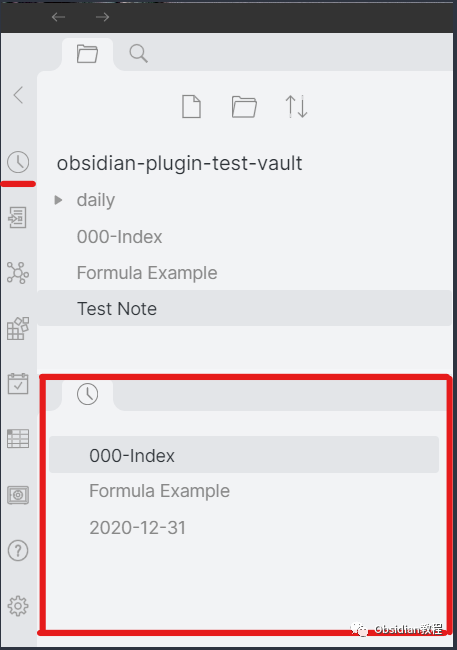
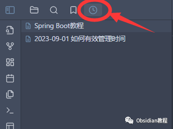
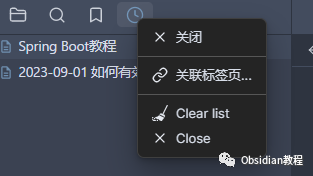
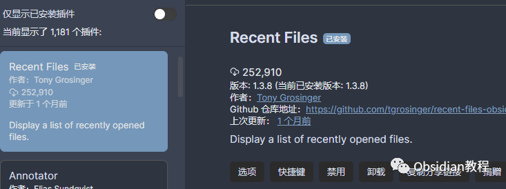
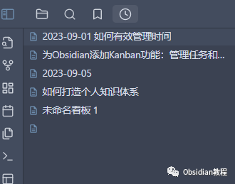
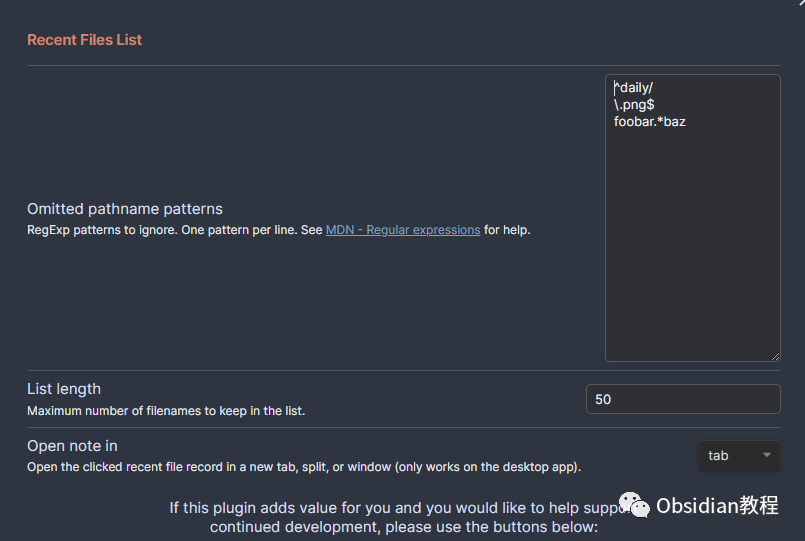

# Obsidian插件: Recent Files追踪最近打开过的文件

### 点击下方公众号，回复关键字：**Obsidian** ，获取Obsidian资料合集。

在数字时代，我们每天都要处理大量的文件和信息。Obsidian，作为一款高效的知识管理软件，为我们提供了一个整洁的环境来管理我们的思维和文档。  
众多 Obsidian 的插件中，Recent Files 插件无疑是一个实用的好帮手。它以简洁明了的方式，帮助我们追踪最近打开过的文件。  

今天，我们就一起来看看如何在 Obsidian 中安装和使用 Recent Files 插件。

1插件简介:

Recent Files 插件的主要功能是在 Obsidian 的侧边栏显示一个最近打开过的文件列表。这个列表让你可以快速回溯和访问最近编辑或查看过的文档，而无需在庞大的文件库中一遍遍地寻找。简洁而直观的设计，让它成为 Obsidian 用户的必备插件之一。

2功能亮点:  

  * 直观的文件列表：一目了然地展示你最近打开过的文件，无需额外设置。

  

  * 多功能点击：简单点击可以打开文件，同时支持ctrl-click 在新面板中打开文件，右键点击弹出菜单，提供多种操作选择。

  

  * 拖拽功能：你可以轻松拖拽列表中的项目到编辑器插入链接，或者移到文件夹中，整理你的文件结构。
  * 内容预览：悬停或ctrl-hover可以预览文件内容，快速了解文件的基本信息。

  
3下载与安装:

安装 Recent Files 插件非常简单。

### **  
**

### **1.在线安装**（需要科学上网） ：****

###   

### 在 Obsidian 的设置中，找到“第三方插件”选项，点击“浏览”

###   

### 然后在搜索框中输入“Recent Files”，找到 Recent Files 插件并点击“安装”。

###   

### 安装完成后，回到插件列表，找到 Recent Files 插件并开启它

###   

### 现在你的侧边栏就会显示最近打开的文件列表了。

###   

### 

**  
****2.离线安装：****  
****因为网络原因很多同学无法直接在线安装obsidian插件，这里我已经把obsidian所有热门插件下载好了**  
只需要关注下方公众号，后台回复：**插件** 即可获取4使用教程:

一旦安装完毕，你几乎不需要进行任何设置，Recent Files 插件就会自动追踪你打开过的文件。  
在侧边栏，你会看到一个清晰的文件列表，显示了你最近打开过的文档。你可以通过简单的点击操作，快速地打开或者在新的面板中打开文档，非常方便。  

如果有特定的文件你不想出现在最近文件列表中，可以在插件的设置选项中添加这些文件的路径，以将其从列表中排除。  

**注意事项:**  
虽然 Recent Files 插件非常实用，但它只是追踪你在 Obsidian 中打开过的文件。如果你在其他地方对文件进行了编辑，Recent Files 插件可能无法准确反映文件的最新状态。

5结语：

Recent Files 插件以其简洁实用而受到 Obsidian 用户的喜爱。它不仅能帮助我们快速访问最近的文件，而且还提供了一种简单易行的方式来管理我们的文档。安装 Recent Files 插件，让我们在 Obsidian 的使用中更加得心应手！！  
  
  
1**扫码购买****《 Obsidian实战教程》****从入门到精通， 链接您的每一个思维瞬间。****  
**  
往 期精彩[1.Obsidian插件:Sliding Panes使Obsidian用户界面焕然一新](http://mp.weixin.qq.com/s?__biz=MzkyMDUyMDM2Mg==&mid=2247484039&idx=1&sn=6e5179d2ab14e910b51cf6f0620e66a6&chksm=c190d142f6e75854221bbb18c231f9e1fdcccf00f0e6f50c366fecdaeea56ab99fad0006c87b&scene=21#wechat_redirect)  
[2.Obsidian插件:用QuickAdd插件快速打造你的Obsidian知识宝库](http://mp.weixin.qq.com/s?__biz=MzkyMDUyMDM2Mg==&mid=2247484028&idx=1&sn=e4785ef095bf1ea63d156b71273a689e&chksm=c190d1b9f6e758afc5d4db1839579512a70d4e22864e3b2eabf1069178649bc02b1edf2d1849&scene=21#wechat_redirect)  
[3.Obsidian插件:Style Settings调整某个特定主题的部分样式](http://mp.weixin.qq.com/s?__biz=MzkyMDUyMDM2Mg==&mid=2247484016&idx=1&sn=8d2293151cd2f31784f5cc32b99f039e&chksm=c190d1b5f6e758a3b10880a0c9332c22675882eae00d865b1d3ede3eb97cea390e6444c80080&scene=21#wechat_redirect)  

点分享

点点赞

点在看
