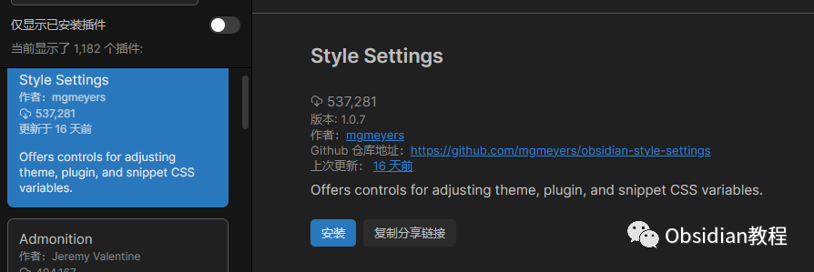
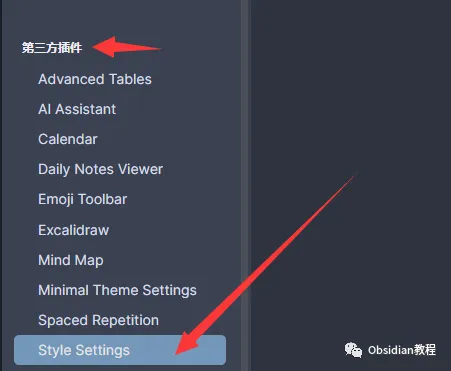
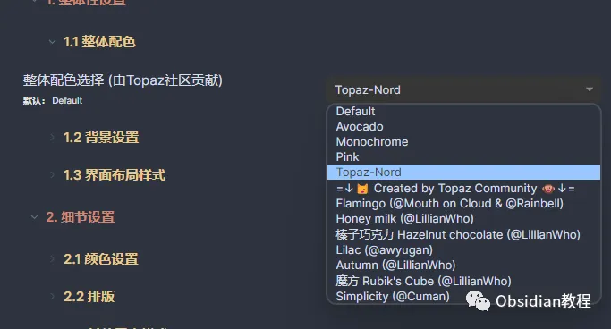
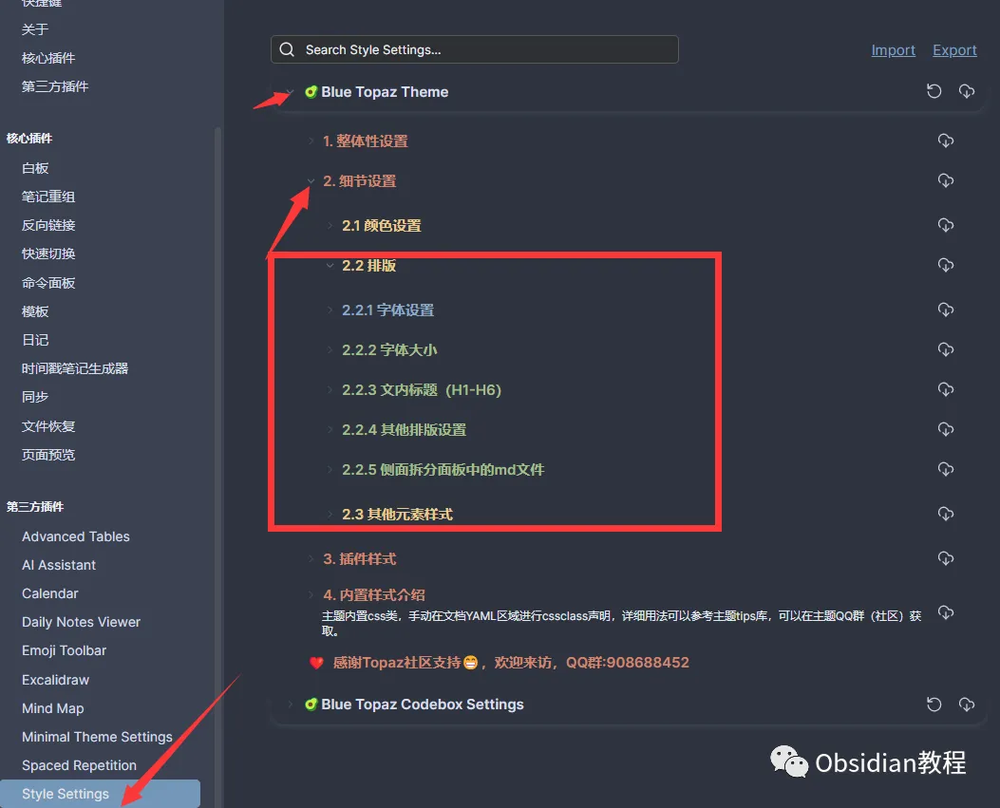

# Obsidian插件: Style Settings 简单直观美化Obsidian的外观

嗨，我是鬼哥，10年+老程序员一枚。

今天来聊聊Obsidian的一个神奇插件——**Style Settings** 。

这个插件能让你对Obsidian的外观进行全方位的自定义，让你的笔记软件不仅好用，还能看起来非常酷炫。

听起来是不是很棒？废话不多说，直接进入正题。

**Style Settings 插件简介**

首先，简单介绍一下Style Settings插件。这款插件的主要功能是允许你对Obsidian的各种CSS样式进行配置。不管是主题、片段还是其他插件的CSS文件，都可以通过Style Settings来进行统一管理和配置。

这个插件可以让你在一个设置面板中看到所有可以调整的设置，让你的Obsidian自定义体验更加直观和方便。

**为什么选择Style Settings？**

为什么要用Style Settings呢？简单来说，它让Obsidian的美化和自定义变得前所未有的简单和直观。你可以轻松地切换各种样式、调整颜色、字体大小、间距等等，让你的笔记本看起来更符合你的审美和使用习惯。

尤其对于那些对代码不太熟悉的小伙伴，这个插件简直是福音。

**插件下载和安装**

好了，说了这么多，咱们来看下怎么安装这个插件吧。安装过程非常简单，按照以下步骤操作即可：

### **1 在线安装**（需要科学上网） ：****

****  
****

  * ### 打开 Obsidian， 点击左下角的设置图标。

  * 在设置菜单中，选择“插件”。
  * 点击“社区插件”，然后在搜索框中输入“ Style Settings ”。
  * 找到“Style Settings”插件，点击“安装”。
  * 安装完成后，回到“插件”菜单，找到“Style Settings”并启用。

###   

**3.2离线安装：****  
****因为网络原因很多同学无法直接在线安装obsidian插件，这里我已经把obsidian所有热门插件下载好了**  

只需要关注下方公众号，后台回复：**插件** 即可获取

### **使用方法**

### 安装并启用插件后，你可以直接在已安装插件里面找到Style Settings ，点击它，你会进入插件的主界面。这里列出了所有可以定制的样式选项。

#### **1\. 调整CSS变量**

#### Style Settings插件允许你设置数值、字符串和颜色等CSS变量。比如，你想调整主题的主色调，可以在设置面板中找到相应的颜色选项，直接修改即可。

#### **2\. 切换CSS类**

这个插件还允许你在body元素上切换CSS类。比如，你可以通过简单的开关操作来启用或禁用某些样式效果。**3\. 统一管理所有设置**

使用Style Settings最大的好处之一就是它能统一管理所有的样式设置。不管你安装了多少主题和插件，都可以在一个面板中进行配置，再也不用在不同的设置菜单之间来回切换了。

**实际应用场景**

咱们来聊聊实际应用场景，看看Style Settings到底能为你解决哪些问题，带来哪些好处。

**1\. 统一管理，提高效率**

有了Style Settings，你可以在一个地方统一管理所有样式设置，大大提高了效率。特别是当你安装了多个主题或插件时，这个功能尤为实用。

**2\. 个性化设置，提升用户体验**

通过调整颜色、字体等各种CSS变量，你可以让Obsidian更加符合你的个人喜好，提升使用体验。比如，你可以设置一个更适合夜间阅读的主题，或者调整字体大小让阅读更舒适。

**3\. 简化操作，方便易用**

对于那些不太熟悉CSS代码的用户来说，Style Settings提供了一个简单直观的界面，让你无需编写代码就能轻松调整样式。这不仅降低了学习成本，还让更多人能享受到自定义的乐趣。

**我的使用体验**

鬼哥自己用了Style Settings一段时间，感觉确实方便了不少。以前调整样式得在不同的CSS文件里翻来翻去，现在只需要打开一个设置面板，所有可调节的选项一目了然，简直爽爆了。而且，不同主题和插件的样式设置也能轻松兼容，避免了各种冲突问题。

Style Settings插件大大提升了Obsidian的可用性和用户体验。

对于想要深度自定义Obsidian的小伙伴们来说，这个插件绝对是必装的。

赶紧去试试吧，鬼哥强烈推荐！

  
  
  
1******扫码购买****《 Obsidian实战教程》****从入门到精通， 链接您的每一个思维瞬间。**  

