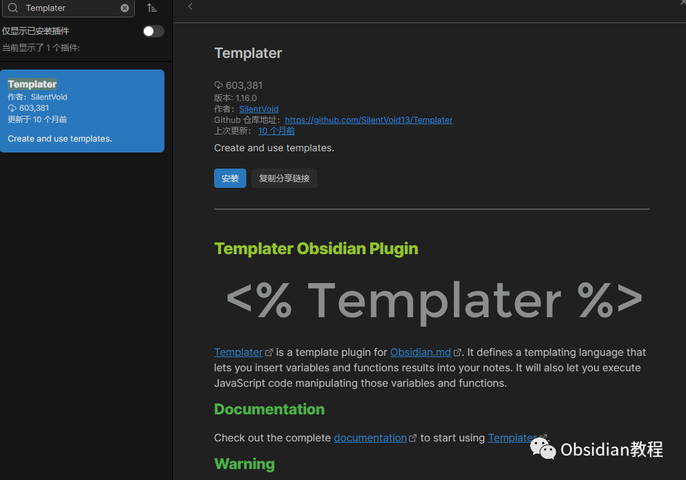
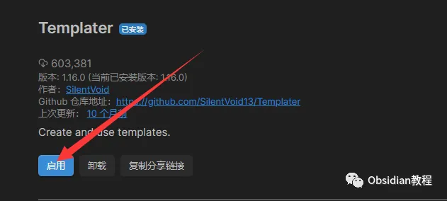

# Obsidian插件: ​Templater 预定义模板让笔记高效化

嗨，我是鬼哥，10年+老程序员一枚。今天咱们来聊聊 Obsidian 里的一个超级好用的插件——**Templater** 。这个插件绝对是 Obsidian 用户的必备神器，尤其是对那些喜欢自动化和高效工作流的朋友们来说，它简直就是救星。

### **Templater 插件介绍**

Templater 是 Obsidian.md 的模板插件，它定义了一种模板语言，让你可以将变量和函数的结果插入到笔记中。同时，它还允许你执行 JavaScript 代码来操作这些变量和函数。听起来有点复杂对吧？别急，鬼哥慢慢给你剖析。首先，Templater 能解决很多重复性的工作。比如说，你每次写日记都要手动输入日期和时间，再比如，你每次记录项目进度时都要写上一堆固定格式的内容。这些事情，Templater 都能帮你一键搞定。只要设置好模板，之后就只需要轻轻一点，所有内容自动生成，省时省力还不出错。

### **下载和安装**

先来看看如何安装这个插件：

### **1.在线安装**（需要科学上网） ：****

  
在Obsidian中安装插件是一个简单直接的过程：  

  * 打开Obsidian，点击左下角的“设置”图标。
  * 在设置菜单中，选择“第三方插件”选项。
  * 点击“浏览”按钮，搜索“ Templater ”。
  * 找到插件后，点击“安装”。
  * 安装完成后，切换插件的“启用”开关。

  

### **2.离线安装：****  
****因为网络原因很多同学无法直接在线安装obsidian插件，这里我已经把obsidian所有热门插件下载好了**  
只需要关注下方公众号，后台回复：**插件** 即可获取

  
搞定！Templater 插件已经安装并启用了。

### **配置 Templater**

安装完插件后，我们需要对它进行一些基本配置：

  1. 在“设置”页面中，找到“插件”列表，点击“Templater”。
  2. 在配置页面中，你可以设置模板文件夹路径（建议单独建一个文件夹专门存放模板），以及一些其他选项。

配置好这些之后，你就可以开始创建模板文件了。

### **使用方法**

#### **创建模板**

创建模板文件其实很简单。你只需要在模板文件夹里创建一个新的 Markdown 文件，然后在文件里定义你的模板内容。比如说，我们可以创建一个日记模板：
      
      *   *   * 
    
    
    
    # {{tp_date}} 日记  
    今天发生了什么有趣的事情呢？

在这个模板里，{{tp_date}} 是一个变量，它会自动插入当前的日期。

**设置用户变量**

在 Obsidian 的设置 > Templater 设置 > User defined templates variables 中定义你的变量。

  * 例如，你可以设置一个变量为你的名字，然后在模板中使用它。
  * 使用其他插件功能：确保你已经安装和启用了与 Templater 集成的其他插件。然后按照那些插件的文档来在模板中使用其功能。

#### **使用模板**

要使用模板也很简单。在你需要插入模板内容的地方，按下 Ctrl + P 打开命令面板，输入“Templater: Insert template”，然后选择你想要插入的模板。这样，模板内容就会自动插入到你的笔记中。

#### **JavaScript 功能**

Templater 的强大之处在于它不仅支持简单的变量替换，还支持执行 JavaScript 代码。比如说，你可以创建一个带有动态内容的模板：
      
      *   *   *   *   *   *   *   * 
    
    
    
    <%*const date = tp.date.now("YYYY-MM-DD");const greeting = date.getHours() < 12 ? "早上好" : "下午好";_%>  
    # {{date}} 日记  
    {{greeting}}，今天过得怎么样？

在这个模板里，我们使用 JavaScript 代码根据当前时间来决定插入“早上好”还是“下午好”。这样一来，你的模板就更加智能化了。

### **Templater 带来的好处**

  1. 节省时间：大幅减少重复性工作，让你专注于内容创作。

  2. 提高效率：通过自动化操作，让你的工作流更加高效。

  3. 个性化：通过自定义模板和 JavaScript 代码，让你的笔记更加个性化和智能化。

  4. 减少错误：通过预设模板，减少手动输入带来的错误。

### **适用场景**

Templater 插件适用于多种场景，包括但不限于：

  * 日记记录：自动生成日期和问候语的日记模板。

  * 项目管理：生成固定格式的项目进度报告。

  * 知识管理：快速插入标准化的知识卡片。

  * 会议记录：一键生成会议记录模板，包括会议时间、地点、参与人员等信息。

### **鬼哥的使用体验**

作为一个经常写笔记和记录项目进度的程序员，鬼哥对 Templater 的依赖已经到了无可救药的地步。每次写日记，只需要点击一下模板，所有格式都自动生成，再也不用担心漏掉什么细节。项目进度报告也是一样，模板里预设好所有需要填写的信息，省去了大量重复劳动。用上 Templater 之后，感觉工作效率提升了不止一个档次。Templater 真的是一个让人爱不释手的插件。不管你是写日记、做项目管理，还是记录会议内容，它都能帮你轻松搞定。还没有尝试的小伙伴赶紧试试吧，鬼哥强烈推荐！  
  
  
1******扫码购买****《 Obsidian实战教程》****从入门到精通， 链接您的每一个思维瞬间。**  

