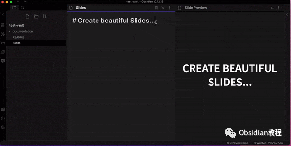
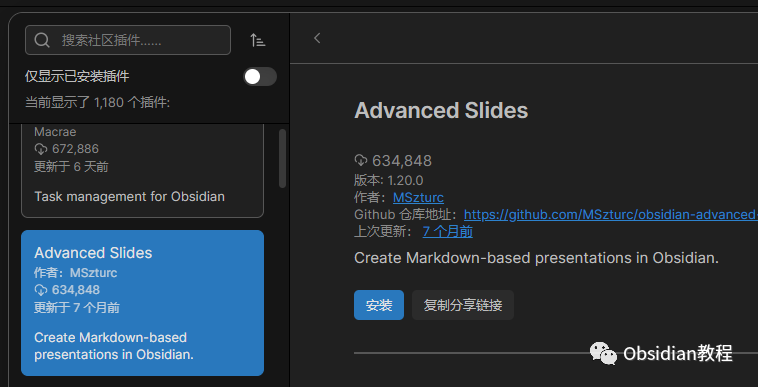
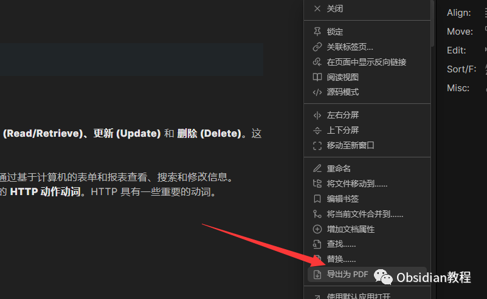
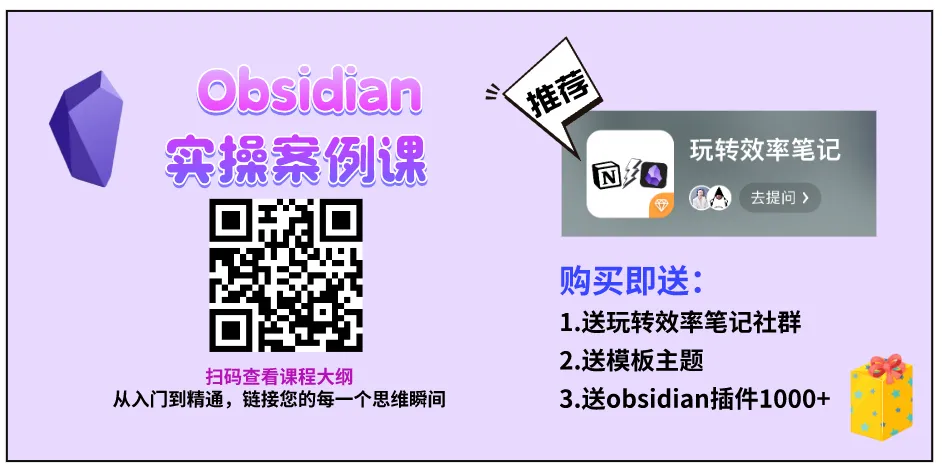

# Obsidian插件-Advanced Slides让你随时随地制作幻灯片

今天我要和大家聊一聊在 Obsidian 中如何轻松制作幻灯片，特别是使用一个超赞的插件——**Advanced Slides** 。

说到 Obsidian，相信很多重度笔记用户都不陌生，它是一款基于本地文件的笔记应用，支持 Markdown 格式的内容管理，因其强大的功能和自由度，已经成为许多知识工作者的必备工具。

不过，有一个问题，大家也许都遇到过：当我们想要分享笔记内容，尤其是把这些内容转化为简洁而专业的幻灯片形式时，往往就得借助外部工具，比如 PowerPoint 或者 Google Slides。

但问题来了——这些工具往往需要我们不断地在不同的应用之间来回切换。内容从 Obsidian 中复制出来，然后粘贴到幻灯片工具里，再去调整格式、修改字体、插入图片……

过程麻烦且容易出错，特别是原本在 Obsidian 中的链接和格式也常常会失真。最糟糕的是，这个过程不仅耗时，还容易影响我们的创作效率和体验。那么，有没有一种更简便的方式，既能保留 Obsidian 的灵活性，又能轻松制作幻灯片呢？答案就是**Advanced Slides** 插件！

### 为什么要使用 Advanced Slides？

Advanced Slides 插件的最大亮点在于它能让你直接在 Obsidian 中创建和管理幻灯片，完全摆脱了在多个软件中频繁切换的烦恼。你不再需要复制粘贴内容，手动调整格式，也不必担心错过一些折腾下来的细节。

这个插件会自动将你的笔记内容转化为专业的幻灯片，确保你的信息传递更加顺畅、高效。

有些朋友可能会问，“为什么不能直接使用 PowerPoint 或者 Google Slides 呢？”其实，在这些工具中做幻灯片时，你通常需要手动导入内容，格式也可能跟原本的笔记不符，甚至导致一些信息丢失。

而 **Advanced Slides** 插件的设计则是为了让你直接在 Obsidian 环境中编辑和展示幻灯片，节省了大量时间和精力，且完全保留了 Obsidian 强大的 Markdown 支持和灵活的内容管理方式。

### Advanced Slides 的核心功能

  1. **嵌入笔记内容**

你再也不需要将笔记从 Obsidian 复制粘贴到其他应用中。Advanced Slides 允许你在 Obsidian 中直接引入你的笔记内容，并将它们转换成幻灯片。你可以按照自己的需求，将整个笔记，或者其中的一部分，直接嵌入到幻灯片中，保持原始的格式和结构。这对需要频繁更新和管理大量信息的用户来说，简直是神器。

  2. **实时预览**

传统的幻灯片制作软件往往需要切换到预览模式才能看到最终效果，而 Advanced Slides 插件则做得更好。在你编辑幻灯片的同时，系统会实时展示你所做的改动，让你在编辑过程中就能看到最终效果。这一点非常实用，尤其是对于一些对细节要求较高的用户。你可以随时调整内容的展示方式，直到达到你想要的效果。

  3. **个性化主题与样式**

幻灯片的外观同样重要，Advanced Slides 插件不仅关注内容本身，还为你提供了个性化定制幻灯片的功能。你可以选择不同的主题、颜色和样式，让你的幻灯片看起来既专业又符合个人品味。无论是简约风格还是富有创意的设计，插件都能满足你的需求。

  4. **灵活的导出选项**

创建好的幻灯片，不论是要与同事分享，还是发布到社交平台上，都可以通过插件轻松导出。Advanced Slides 支持多种导出格式，包括 PDF 和 HTML，你可以根据自己的需求选择最合适的方式。尤其是导出为 PDF 的功能，可以让你方便地将幻灯片分享给不使用 Obsidian 的人。

  5. **完整的 Markdown 支持**

对于 Obsidian 的用户来说，Markdown 语法已经成为日常笔记的基础。Advanced Slides 完全支持 Obsidian 中的所有 Markdown 语法，你可以在幻灯片中使用标题、列表、链接、图片等，甚至插入代码块和表格。这样一来，你可以将更加丰富和有深度的内容融入幻灯片，让它们不仅仅是信息的堆砌，更是富有逻辑性和层次感的展示。

### 如何开始使用 Advanced Slides？

  1. **安装 Advanced Slides 插件**

首先，确保你已经安装并更新了最新版本的 Obsidian。打开 Obsidian，进入设置，点击“插件”选项卡，搜索“Advanced Slides”，然后点击“安装”。安装完成后，记得激活插件。这时，你就可以开始在 Obsidian 中使用这个插件了。

  2. **制作你的第一个幻灯片**

安装并激活插件后，你可以开始制作自己的幻灯片了。首先，创建一个新的笔记，然后在你想要制作为幻灯片的部分使用特定的 Markdown 语法，通常是某些特定的标题级别或者分隔符。插件的文档会详细说明如何使用这些语法，确保你能够快速上手。

  3. **导出与分享**

当你完成了幻灯片的制作后，Advanced Slides 插件允许你将幻灯片导出为 PDF 或 HTML 文件，这样你可以方便地分享给任何人。无论他们是否使用 Obsidian，都能查看和欣赏你的幻灯片。

### 总结：更高效的工作方式

对于 Obsidian 用户来说，Advanced Slides 插件无疑是一个宝贵的工具，它让笔记与幻灯片制作无缝连接。无论是平时做知识分享、汇报工作，还是整理学习资料，Advanced Slides 都能帮助你省去繁琐的切换和格式调整，让你的工作更加高效。

特别是当你需要快速将笔记中的信息转化为易于展示和分享的幻灯片时，Advanced Slides 能够让整个过程变得简单而直观。

如果你还没有尝试这个插件，我真心推荐你去试试。你会发现，在 Obsidian 环境中完成所有工作，不仅高效，而且更加愉快。感谢 Matthäus Szturc 创造了这个插件，它大大提升了我们在 Obsidian 中的工作体验，让我们能够以更轻松、更直观的方式来分享和展示知识。

### 点击下方公众号，回复关键字：**Obsidian** ，获取Obsidian资料合集。

  

****-END****-****

  

**ok，今天先说到这，如果你想更深入的了解Obsidian，现在只要购买我们的《Obsidian实操案例课》，便可免费加入「玩转效率笔记」社群，与一群人交流效率提升的经验，实现自我管理的目标。** 如果你对Obsidian有热情，这个课程绝对不容错过！
