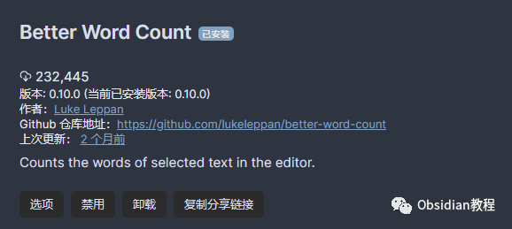
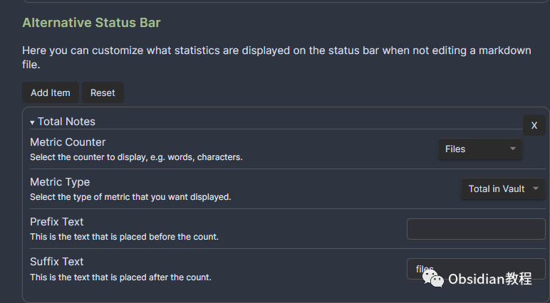

# Obsidian插件-Better Count Word你写作的得力助手

今天要跟大家分享的是我最近发现的一个非常实用的 Obsidian 插件——**Better Count Word** 。作为一名程序员，我一直在用 Obsidian 管理我的知识库，没想到它不仅是一个笔记工具，居然还能变成一个高效的写作助手！

如果你也在 Obsidian 中记录写作进度，或者你是一个喜欢精准数据追踪的人，那么这个插件一定能帮助你提升写作效率。接下来，就让我们一起看看这个插件到底有多强大吧！

## 为什么需要 Better Count Word？

作为 Obsidian 的重度用户，大家一定知道，Obsidian 的强大不仅仅体现在笔记管理上，它的插件生态同样让人惊艳。Better Count Word 插件便是其中一颗璀璨的明珠。

之前，我们在使用 Obsidian 时，如果想要了解写作的字数、字符数、句子数，虽然有原生的 Word Count 插件，但它只能统计整个文档的字数，使用起来有些局限性。而 Better Count Word 插件的出现，彻底解决了这个问题。

这个插件不仅能够统计选中文本的字数，还能为你提供多种丰富的统计数据，帮助你更全面、更精确地了解自己的写作进度。可以说，它是为那些喜欢数据化管理自己写作进程的人量身定制的。

## Better Count Word 的功能特点

### 1\. **存储库统计信息**

Better Count Word 插件最大的优势之一，就是它能对整个 Obsidian 库进行统计。这意味着，除了统计当前文件的字数外，它还会跟踪整个库中的写作数据，让你随时了解自己的写作量。

比如，你可以查看过去一段时间内你写作的总字数、字符数、句子数等信息。对于那些喜欢通过数字来衡量自己写作进展的朋友来说，这无疑是一个大大的福音。

### 2\. **全语言支持**

不管你是用中文、英文，还是其他语言进行写作，Better Count Word 都能准确统计你的数据。无论你写的是诗歌、论文、还是代码注释，它都能清晰地呈现给你统计结果。这个多语言支持的功能，特别适合像我这种跨语言写作的程序员，基本上可以满足我所有写作需求。

### 3\. **丰富的统计数据**

Better Count Word 插件不仅仅局限于字数，它还能提供更详细的统计信息。你可以看到当前文件的字数、字符数、句子数、脚注数量、Pandoc 引用数等。更酷的是，它还会展示你当天的写作数据——包括字数、句子数、脚注等等。通过这些数据，你可以随时了解自己一天的写作进度，帮助你调整写作节奏。

### 4\. **高度定制化的状态栏**

你可以根据自己的需求，自定义在 Obsidian 状态栏中显示哪些统计信息。比如，你可能只关心字数，或者更关注句子数和脚注数量，不同的用户需求可以通过插件设置轻松满足。这个定制化的功能非常方便，可以让你将 Obsidian 打造成最适合自己的写作环境。

### 5\. **支持 Markdown 和 Pandoc**

作为一名程序员，我对 Markdown 的支持特别看重。Better Count Word 插件完美支持 Markdown 语法，无论你是使用普通的文本格式，还是包含代码块的复杂文档，都能准确统计。对于想要将写作导出为 Pandoc 格式的用户来说，它也提供了很好的支持。这意味着，你可以将写作成果直接转化为其他格式，轻松进行分享和发布。

## 如何下载与安装？

### 1\. **在线安装**

首先，确保你已经安装了最新版本的 Obsidian。然后，在 Obsidian 的设置中找到**“第三方插件”** 选项，点击进入**“社区插件”** ，然后在搜索框中输入 **“Better Count Word”** ，找到插件并点击安装。安装完成后，你只需要激活插件即可。

对于大多数用户来说，在线安装是最便捷的方式。但如果你在使用过程中遇到网络问题，下面我会介绍离线安装的方法。

### 2\. **离线安装**

如果因为网络原因无法直接在线安装插件，你也可以选择离线安装。这里已经把安装包准备好了，点击下方公众号，回复关键字：**Obsidian** ，获取Obsidian资料合集。

## 如何使用 Better Count Word 插件？

### 1\. **启用插件**

安装完成后，回到插件列表，找到 **Better Count Word** 插件并启用它。启用后，插件会自动在你的 Obsidian 中生效。

### 2\. **选中文本进行字数统计**

如果你想统计某段文本的字数，只需要在 Obsidian 中选中一段文字，状态栏就会自动显示选中文本的字数。这对于写作过程中需要快速了解字数的情况非常有用。

### 3\. **查看更详细的统计数据**

你还可以通过设置，选择显示哪些统计数据。比如，你可以让状态栏展示当前文件的字数、句子数、脚注数等信息。这些数据都会实时更新，让你随时掌握自己的写作进展。

### 4\. **定制状态栏**

进入插件设置，你可以根据自己的需要定制显示在状态栏的统计信息。你可以选择是否显示总字数、字符数，或者单独查看当天的写作进度，完全根据个人喜好来调整。

## 结语

总的来说，Better Count Word 插件是一个非常实用的写作辅助工具。它通过精准的字数和写作统计数据，帮助用户更好地管理自己的写作进度和目标。

无论你是像我一样的程序员，还是一名热衷写作的学生，都会从这个插件中获益。它不仅增强了 Obsidian 的功能性，还让写作变得更加高效和数据化。

如果你还没有尝试过这个插件，不妨试试看。我相信它会成为你写作过程中的好帮手！

### 点击下方公众号，回复关键字：**Obsidian** ，获取Obsidian资料合集。

****-END****-****

  

**ok，今天先说到这，如果你想更深入的了解Obsidian，现在只要购买我们的《Obsidian实操案例课》，便可免费加入「玩转效率笔记」社群，与一群人交流效率提升的经验，实现自我管理的目标。** 如果你对Obsidian有热情，这个课程绝对不容错过！
