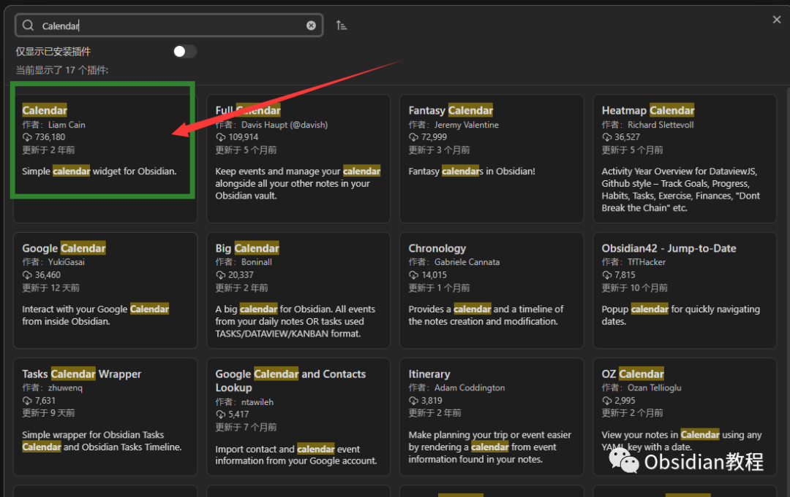
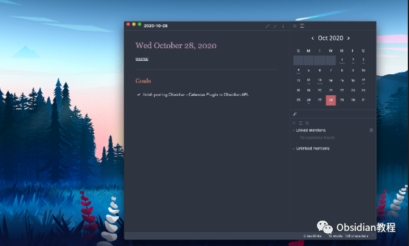
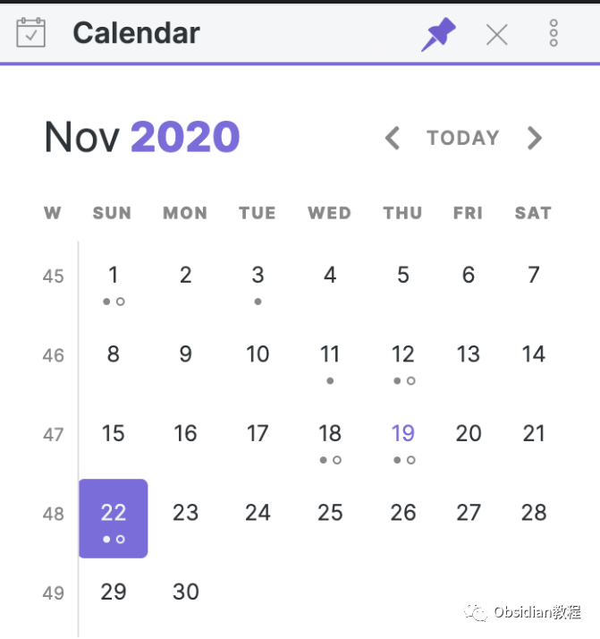

# Obsidian插件-Calendar插件，强大的日期和日历功能

### 点击下方公众号，回复关键字：**Obsidian** ，获取Obsidian资料合集。

  
Obsidian 是一款备受好评的知识管理工具，它的插件生态也日渐丰富。  
其中，"Calendar" 插件为 Obsidian 增添了强大的日期和日历功能，使得日期相关的知识管理变得更为直观和高效。  
  
以下是对该插件的详细介绍：

##  1**核心功能**   

### **1\. 日历视图**

**  
**

  * 月视图： Calendar 插件主要提供了一个月视图日历，允许用户在 Obsidian 的侧边栏中直观地查看整个月的日期。

  
  

  * 点击创建或打开：点击特定日期会打开与该日期相关的笔记。如果该日期还没有对应的笔记，点击会创建一个新笔记。

###  **2. 与已有笔记的链接****  
**

  * 当某一日期已经有相关的笔记时，这个日期在日历上会以不同的颜色或样式显示，提醒用户已有内容。
  * 这一功能对于日常计划、日记、会议记录等与日期强相关的内容尤为有用。

  

### 

###   

### 

**3.日期文件命名**

  

用户可以根据自己的喜好配置日期格式，以确定与特定日期关联的笔记的命名规则。例如：“2023-08-28”或“August 28, 2023”。

### 

**4.快捷键支持**

为了提高用户的操作效率，Calendar 插件提供了一系列快捷键。例如，用户可以快速切换到上一个或下一个月，或直接跳转到今天的日期。

### 

**5\. 与其他插件的集成**

**  
**

Calendar 插件支持与 Obsidian 的其他插件集成。例如，与任务管理插件集成后，可以在日历上直观地显示任务的截止日期或事件。  

##  2使用场景 

  

  * 日记和日常记录：对于那些喜欢写日记或记录每天的事件的用户，Calendar 插件提供了一个直观的方式来管理和回顾这些笔记。
  * 计划和目标管理：用户可以利用日历视图来计划未来的任务和事件，从而更好地管理时间和目标。
  * 会议和事件记录：企业和团队用户可以使用日历插件来记录每天的会议和事件，确保不遗漏任何重要信息。

  

## 3总结

Obsidian 的 Calendar 插件是一个强大的工具，特别适合需要与日期关联的笔记管理。它的直观界面和强大的集成功能使得日常的知识管理和计划变得更为高效。  
无论是个人还是团队，都可以从中受益。  
  
  
1点击下方公众号，回复关键字：**Obsidian** ，获取Obsidian资料合集。
