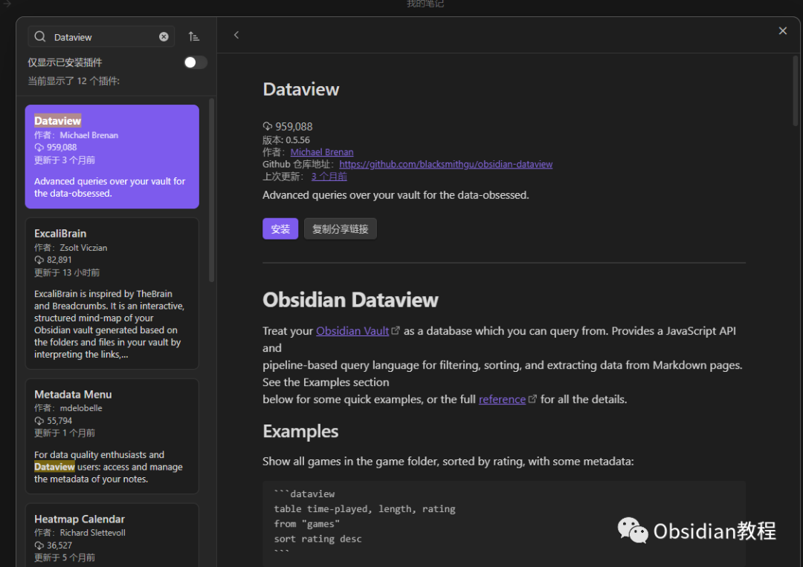

# Obsidian插件-Dataview强大的数据处理和查询功能

### 点击下方公众号，回复关键字：**Obsidian** ，获取Obsidian资料合集。

Obsidian 是一个非常受欢迎的知识管理工具，它支持链接思维和 Markdown 格式，让用户能够轻松创建、组织和链接他们的笔记。  
而 "Dataview" 插件则进一步增强了 Obsidian 的功能，为用户提供了一种强大的方式来查询、显示和分析他们的数据。  

### 1什么是 Dataview？

Dataview 是一个为 Obsidian 设计的高级查询插件，它允许用户使用一种简单的查询语言从其笔记中提取、筛选和展示数据。

### 

2主要功能

**查询语言：** Dataview 提供了一种基于 JavaScript 的查询语言，这意味着用户不仅可以进行简单的数据提取，还可以执行复杂的数据操作和计算。  
**动态视图：** 根据查询的结果，Dataview 可以动态生成表格、列表或其他格式的视图，这些视图可以直接嵌入到任何 Obsidian 笔记中。  
**YAML 元数据支持：** 用户可以在笔记的 YAML 头部定义自定义字段，然后使用 Dataview 查询这些字段。这为笔记的结构化数据提供了巨大的灵活性。  
与 Obsidian 的集成：Dataview 的查询结果可以直接嵌入到 Obsidian 笔记中，并随着源数据的更新而实时更新。  
3使用方法:

  

**数据:** Dataview 通过从 Markdown 的前言和内联字段中提取信息来生成数据。  
Markdown 前言是一个位于 markdown 文档顶部的，由 --- 围住的任意 YAML，用于存储有关该文档的元数据。  
内联字段是 Dataview 的一个特性，允许您在 markdown 文档中直接以 Key:: Value 语法编写元数据。  
查询: 一旦你给文档等添加了元数据，你就可以使用 Dataview 的四种查询模式之一进行查询。  

  * Dataview Query Language (DQL)：一种基于流水线的、略显 SQL 风格的表达式语言，可支持基本用例。
  * Inline Expressions：你可以直接嵌入 markdown 的 DQL 表达式，并在预览模式下评估。
  * DataviewJS：一个功能强大的 JavaScript API，提供完全访问 Dataview 索引和一些方便的渲染工具。
  * Inline JS Expressions：允许你执行任意 JS 的 JavaScript 等价物。

### 

4 总结

Dataview 插件为 Obsidian 增添了强大的数据处理和查询功能，使得 Obsidian 不仅仅是一个笔记应用，更是一个可以进行复杂数据分析和管理的平台。  
无论你是想简单地筛选笔记，还是进行复杂的数据操作，Dataview 都是一个不可或缺的工具。  
如果你正在寻找一种方法来更好地组织和分析你的 Obsidian 笔记，那么 Dataview 插件绝对值得一试。  
  
  
1点击下方公众号，回复关键字：**Obsidian** ，获取Obsidian资料合集。
