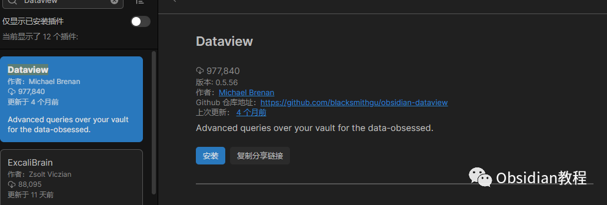

# Obsidian插件-Dataview：强大的数据查询和展示工具

### 点击下方公众号，回复关键字：**Obsidian** ，获取Obsidian资料合集。

  
Obsidian 是一款高度可定制的笔记应用，通过各种插件可以进一步增强其功能。  
其中，Dataview 是一个强大的插件，让你能够查询和展示你的笔记数据。  


### 1**Dataview 插件简介**   


Obsidian的Dataview插件是一个高度强大的数据管理工具，允许用户在Obsidian中以各种方式查询和组织数据。通过Dataview，你可以更高效地管理和提取笔记中的信息。  


### **1\. 功能概览**

**  
**

  * 数据查询：Dataview允许你使用类似于SQL的查询语言来搜索你的笔记，并返回满足特定条件的笔记。
  * 动态列表和表格：根据你的查询，Dataview可以生成动态的列表或表格，当相关笔记内容变化时，这些列表和表格会自动更新。
  * 元数据支持：Dataview特别适用于有元数据的笔记。你可以在笔记的前导部分定义元数据，例如日期、作者、标签等，然后使用Dataview查询和组织这些数据。
  * 灵活的显示选项：除了常规的列表和表格，你还可以使用Dataview创建任务列表、日历视图等。


### 

2安装 Dataview 插件

步骤如下：  


  * 打开 Obsidian。
  * 进入设置区域。
  * 点击“社区插件”标签。
  * 在搜索框中输入“Dataview”。
  * 在搜索结果中找到 Dataview 插件并点击“安装”。
  * 安装完毕后，记得点击旁边的开关，启用该插件。




### 3使用 Dataview 插件

**基本查询**  
在你的笔记中，你可以使用以下代码块形式来进行查询：
      
      *   *   *   * 
    
    
    
    ```dataviewtablefrom "你的笔记文件夹"where your-condition

这会从指定的文件夹中查询满足条件的笔记，并以表格形式显示。  
**高级查询**  
你可以使用更复杂的查询，例如：
      
      *   *   *   *   * 
    
    
    
    ```dataviewtable title, date(created) as "创建日期"from "你的笔记文件夹"where contains(title, "关键词")sort date(created)

这将列出包含“关键词”的标题以及笔记的创建日期，并按创建日期排序。  
**其他视图**  
除了 table 视图，你还可以使用 list 和 task 视图来展示查询结果。

### 

4示例

假设你有一系列书籍笔记，每个笔记都有以下元数据：
      
      *   *   *   *   *   * 
    
    
    
    ---author: 作者名publish_date: 发布日期---  
    书籍内容...

  
你可以使用 Dataview 插件如下查询：
      
      *   *   *   *   * 
    
    
    
    ```dataviewtable author, publish_datefrom "书籍笔记"where contains(author, "某作者")sort publish_date desc

  
这将会显示“某作者”写的书以及其发布日期，并按发布日期降序排列。

### 

### 

5常见应用场景

**1) 项目管理：**

  


你可以为每个项目创建一个笔记，并在其中添加相关的元数据，如项目开始日期、结束日期、负责人等。然后使用Dataview查询和组织这些项目笔记。

  


**2) 书籍或文章索引：**

  


如果你有一个书籍或文章的笔记集合，你可以使用Dataview为这些笔记添加作者、出版日期等元数据，并创建一个动态的书籍或文章索引。

  


**3) 日常任务跟踪：**

  


你可以在笔记中定义任务，并为其添加截止日期、优先级等元数据。然后使用Dataview创建一个动态的任务列表。

### 

6结论

  


Dataview插件为Obsidian带来了强大的数据管理和查询功能，使得Obsidian不仅仅是一个笔记应用，还可以作为一个轻量级的个人数据库。对于希望在Obsidian中更高效地组织和查询信息的用户来说，Dataview是一个不可或缺的工具。

  
  
  
1**扫码购买****《 Obsidian实战教程》****从入门到精通， 链接您的每一个思维瞬间。****  
**  
往 期精彩[1.Obsidian插件:Mind Map - 将你的笔记转化为思维导图](http://mp.weixin.qq.com/s?__biz=MzkyMDUyMDM2Mg==&mid=2247483845&idx=1&sn=ad8ce1c9212d6c1d261faec1e038d848&chksm=c190d200f6e75b16810f9ce688c67db9b4e4d38e54c740e6799b405a0291e4d3b1bc347943d7&scene=21#wechat_redirect)  
[2.为Obsidian添加Kanban功能：管理任务和项目](http://mp.weixin.qq.com/s?__biz=MzkyMDUyMDM2Mg==&mid=2247483837&idx=1&sn=efbeb3de938067424152467d7bcaf377&chksm=c190d278f6e75b6e891a24ef2e69b5d9e54f5b88cabd99e8758ea9eedf3b9c08020ec3673c71&scene=21#wechat_redirect)  
[3.Obsidian插件-Sliding Panes（Andy Matuschak Mode），让笔记像堆叠的卡片](http://mp.weixin.qq.com/s?__biz=MzkyMDUyMDM2Mg==&mid=2247483829&idx=1&sn=ad4344a210175ec0e40b83dff7afbf10&chksm=c190d270f6e75b664b42a1fe1e599a3565f52817095536d24cb7d124b16f6d1d807f5eed140c&scene=21#wechat_redirect)


点分享


点点赞


点在看

### 
