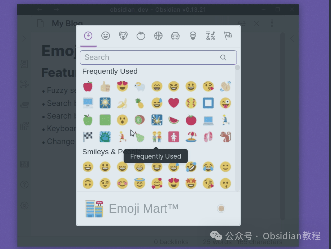
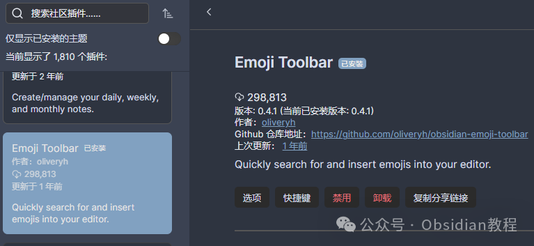

# Obsidian插件-Emoji Toolbar 插件让你的笔记更生动~

今天咱们来聊聊 Obsidian 里的一款非常有趣的插件——**Emoji Toolbar** 。别小看这个看似简单的小插件，它可以让你的笔记瞬间变得生动有趣，充满个性。

作为一个重度 Obsidian 用户，我发现给笔记加点 emoji，不仅能让笔记看起来更有趣，还能帮助我传递一些文字无法表达的情感。毕竟，生活已经够枯燥了，笔记何必也这么单调呢？

### Emoji Toolbar 插件简介

**Emoji Toolbar** 插件是专门为 Obsidian 设计的，它的作用很简单：让你在 Obsidian 编辑器中，能够快速搜索并插入表情符号。这不仅让你的笔记变得更加生动，还能让信息的传递变得更加直观和有趣。尤其是在处理长篇笔记或复杂的知识体系时，表情符号的加入可以让我们在阅读时更容易抓住重点，也让情感表达变得更加丰富。

### 为什么要给笔记加 emoji？

如果你和我一样，也觉得表情符号能给文章、笔记甚至代码添加一些生活气息，那么你肯定会喜欢这个插件。

毕竟，我们的笔记不仅仅是为了记录信息，也需要激发思考、带来灵感和享受。适当的 emoji 就像是一种润滑剂，它能让文字显得更加人性化，甚至能帮助你记住一些信息点。

举个简单的例子：有时候在记录代码相关的笔记时，可能会用到“错误”这种概念，通常我们写的就是“出错了”，看起来有点干巴巴的。如果此时能加上一个“🚨”表情，那整个笔记的情绪立马就出来了。是不是感觉有点魔力？👀

### 使用 Emoji Toolbar 插件的体验

我个人认为，**Emoji Toolbar** 插件的最大亮点就是它的“快速搜索”功能。通过简单的关键词搜索，你可以迅速找到自己需要的表情符号，插入到笔记中。更妙的是，插件支持肤色选择、模糊搜索、最近使用等功能，让你的表情符号更贴合实际需求。

具体的使用方法也非常简单。在 Obsidian 中启用这个插件后，你会在设置里找到一个新的选项：“Emoji Toolbar: Open emoji picker”。

你可以给它设置一个快捷键，按下后就能弹出表情符号选择界面。接着，输入关键词，插件会自动帮你匹配相关的表情符号。选好后，只需按回车键或者点击表情，就能将其插入到当前的笔记中。真的很便捷！

### 插件功能亮点

  1. **肤色支持**  
你可以根据自己的需求选择不同肤色的表情符号。比如说，你可以选择更贴合自己肤色的表情，或者在需要时切换肤色来传达不同的情感。例如，😎、🧑🏾‍🦱等表情符号，给人一种更加个性化的体验。

  2. **模糊搜索**  
有时候我们并不记得表情的具体名称，但通过模糊搜索，只要输入相关关键词，插件就能帮你自动匹配最合适的表情符号。这一点特别方便，尤其是在你急需某个表情符号时，免去了你费力地翻找的困扰。

  3. **最近使用**  
插件还会记录你最近使用的表情符号，这样下次你就能轻松找到那些常用的表情。对于我这种每天都用大量 emoji 的用户来说，这个功能真的非常实用，节省了很多时间。

  4. **Twitter 表情符号格式**  
这一功能允许你使用 Twitter 上的表情符号格式，在预览和插入模式下都能得到更好的支持。如果你习惯了在 Twitter 上使用某些表情符号，这个功能可以让你在 Obsidian 中同样享受这种格式。

### 安装与配置

如果你也想让 Obsidian 更有趣，那就快去安装 Emoji Toolbar 插件吧。安装非常简单，按照以下步骤就能完成：

  1. 打开 Obsidian，点击左下角的设置按钮。
  2. 在设置菜单中，选择“第三方插件”选项。
  3. 确保 Obsidian 的“安全模式”已经关闭。
  4. 点击“浏览”按钮，搜索“Emoji Toolbar”。
  5. 找到插件后，点击“安装”并启用它。

如果你所在的网络环境不允许直接在线安装插件，那也没关系。我已经把所有热门的 Obsidian 插件整理好了，大家可以通过关注我的公众号，回复“插件”即可获取。

### 我的使用心得

安装完 Emoji Toolbar 插件后，我的笔记真的变得更加生动和有趣了。通过模糊搜索，我可以快速找到我想要的表情符号，简直省了不少时间。

而且，肤色选择的功能特别贴心，帮我选择了最适合的表情符号。再加上最近使用记录，我再也不需要为寻找最常用的表情而烦恼了。

最让我喜欢的是，当我看到自己的笔记被各种 emoji 装点得五光十色时，那种成就感真是无与伦比。尤其是在做笔记时，很多时候一个简单的表情符号就能让我立刻联想到某个概念或情境，让记忆变得更加深刻。

如果你是 Obsidian 的忠实用户，喜欢让自己的笔记变得更生动有趣，绝对不能错过这个插件。

它不仅能帮助你轻松插入表情符号，还能让你更加高效地组织和呈现笔记中的信息。给笔记加点料，让它不再枯燥！快去试试吧，保证你会爱上它！🎉

### 点击下方公众号，回复关键字：**Obsidian** ，获取Obsidian资料合集。

****-END****-****

**ok，今天先说到这，如果你想更深入的了解Obsidian，现在只要购买我们的《Obsidian实操案例课》，便可免费加入「玩转效率笔记」社群，与一群人交流效率提升的经验，实现自我管理的目标。** 如果你对Obsidian有热情，这个课程绝对不容错过！
