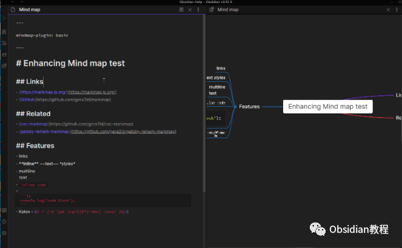
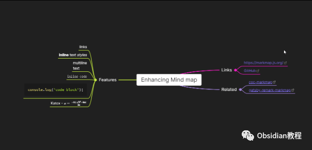

# Obsidian插件-Enhancing Mindmap强大的思维导图

### 点击下方公众号，回复关键字：**Obsidian** ，获取Obsidian资料合集。

Obsidian已经是信息工作者和笔记爱好者的首选工具，而它的插件系统使得用户可以根据自己的需求定制功能。

其中，"Enhancing Mindmap"插件为用户提供了一个强大的思维导图功能，将文本和结构化的思考完美地结合在一起。  

接下来，我们将深入探讨这个插件的功能和特点。  

#### 1插件简介

“Enhancing Mindmap”插件是一个为Obsidian设计的增强型思维导图工具，允许用户直接在Obsidian内创建、编辑和查看思维导图。

#### 

2主要功能

  * 链接支持: 用户可以在思维导图中直接插入外部链接或Obsidian的内部链接。
  * 文本样式: 支持多种Markdown文本样式，如加粗、斜体、删除线等，使得思维导图更加丰富多彩。
  * Katex公式: 对于学术或数学相关的内容，可以直接在思维导图中插入Katex公式。
  * 节点操作: 提供丰富的节点操作快捷键，如创建、编辑、删除、移动节点等。
  * 视图切换: 允许用户在Markdown视图和思维导图视图之间自由切换，同步更新内容。
  * 数据同步: 在不同的板块或页面之间同步思维导图数据。

#### 

3快捷键

该插件提供了一系列的快捷键，帮助用户高效地操作思维导图，如创建新的思维导图、添加子节点、编辑和删除节点等

  * 创建新思维导图: Ctrl/Cmd+P
  * 创建子节点: Tab
  * 创建同级节点: Enter
  * 删除节点: Delete
  * 编辑节点: Space 或 双击节点
  * 撤销: Ctrl/Cmd+Z
  * 重做: Ctrl/Cmd+Y
  * 退出编辑节点: Tab
  * 扩展节点: Ctrl/Cmd + /
  * 折叠节点: Ctrl/Cmd + /
  * 将节点移动到另一个节点: 拖放节点
  * 切换节点: 上/下/左/右
  * 放大/缩小: Ctrl/Cmd + 鼠标滚轮
  * 思维导图居中: Ctrl/Cmd + E

  

#### 4总结

"Enhancing Mindmap"插件为Obsidian带来了强大的思维导图功能，使得用户不仅可以记录文字，还可以用图形化的方式组织和呈现自己的思考。对于需要结构化信息和进行脑力风暴的用户，这无疑是一个非常有价值的工具。  
如果你还没有尝试这个插件，建议你下载并安装一下，体验一下在Obsidian中创建思维导图的乐趣！  
  
  
1点击下方公众号，回复关键字：**Obsidian** ，获取Obsidian资料合集。
