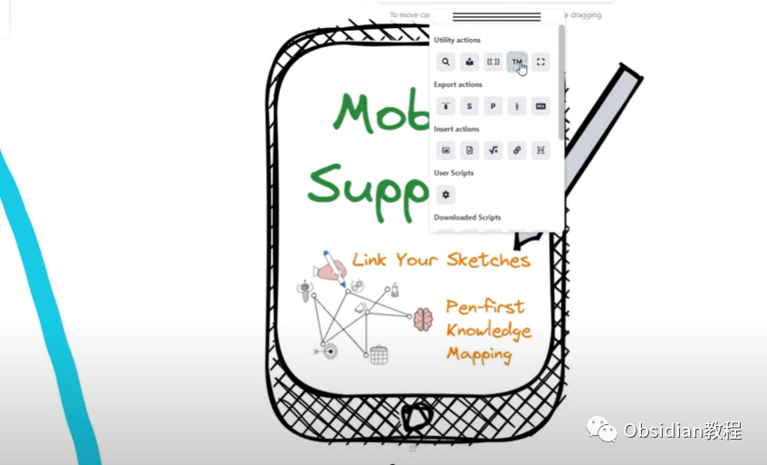
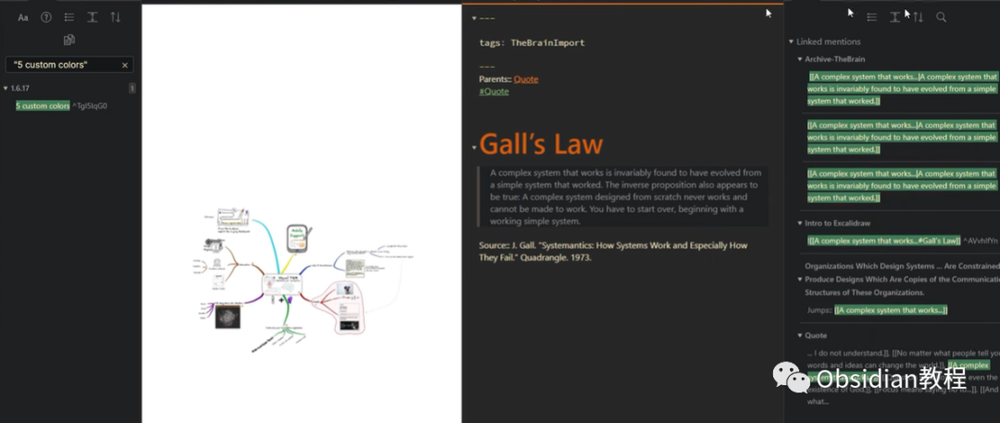
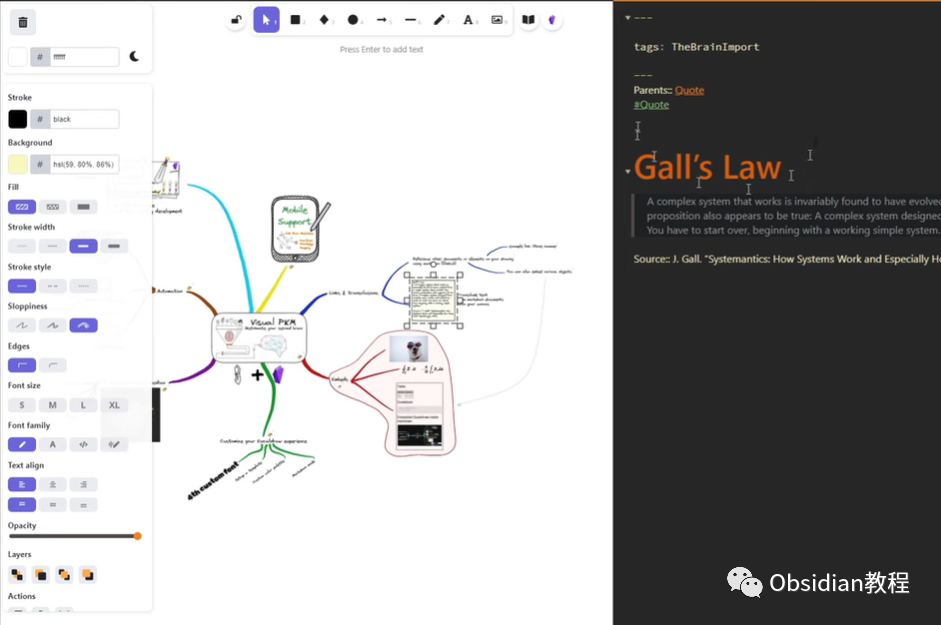
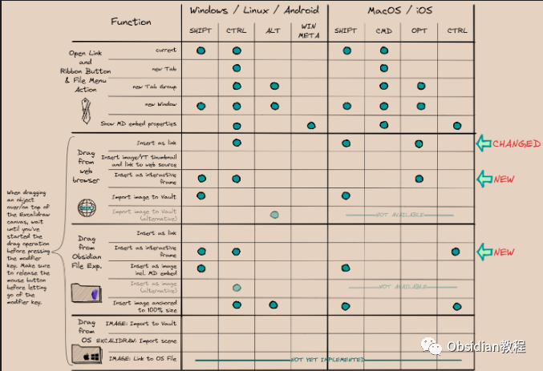
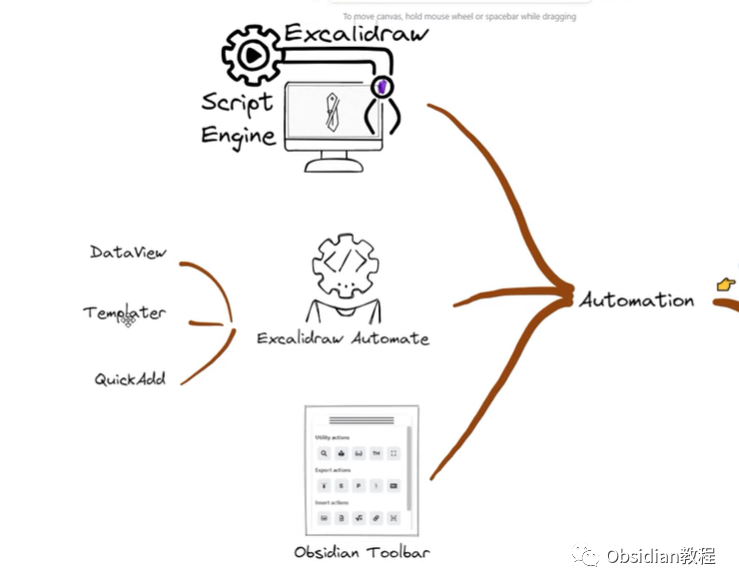

# Obsidian插件-Excalidraw，开源手绘式设计工具

作为一个程序员，我经常琢磨怎么把笔记管理得更高效、更有条理。最近有点“心头好”，要跟大家唠唠，那就是 Obsidian 和它的 Excalidraw 插件。

对于我们这种一天到晚跟需求文档、代码注释、架构图打交道的人，这东西可以说是工作利器！💡

### **Obsidian 的隐藏大招**

我们都知道，Obsidian 是 Markdown 笔记管理的天花板，用起来清爽又高效，但单纯的文字记录总觉得少了点什么——尤其当你需要画个架构图、流程图啥的。

这时候 **Excalidraw 插件** 就派上用场了！它相当于在 Obsidian 里内嵌了一个“数字手绘白板”，而且功能不输专业工具。

我用了一段时间后，发现这插件特别对程序员的胃口。写文档时，直接把图嵌进去，图文并茂，项目组的兄弟们一看就懂，省得我解释半天。更重要的是，所有图表跟笔记完美融合，查找方便，还能内链，效率拉满！🚀

### **Excalidraw 插件的“程序员友好”功能**

#### **1\. 简单到傻瓜的界面**

说真的，Excalidraw 的编辑界面可以说是手残党的福音。对于像我这样画图像鸡爪的程序员，打开 Excalidraw，随便画两笔就能搞出个像模像样的流程图。那些预设的几何图形，拖拖拽拽，几分钟就能整出一张交互示意图，领导看了还夸我“画功了得”。其实心里嘀咕：这不全靠插件吗？

#### **2\. 想怎么画就怎么画**

我个人觉得，Excalidraw 的灵魂就在它的“手绘感”。无论是标准的方框、线条，还是你随手画的“鬼画符”，都能给人一种随性自然的感觉。

这对于画草图、头脑风暴或者快速表达思路非常合适。毕竟，不是所有图都需要整得像 PPT 那么规整，有时候“丑点”反而更真实。

#### **3\. 丰富的样式选项**

作为一名追求“代码优雅”的程序员，我觉得画图也得讲究点风格。Excalidraw 提供了超多样式选项，像颜色、线条粗细、填充样式这些都可以自由调整。画完后稍微调整一下，整个图瞬间“高级感”拉满。😎

#### **4\. 和 Obsidian 的无缝集成**

这个功能才是真正让我对它“路转粉”的原因！绘制完成的图形直接保存在 Obsidian 的笔记库里，跟你的文字内容、内链、标签都可以打通。写技术文档时，直接插入相关图表，一目了然，还省去了用外部工具画完图再导入的麻烦。技术小组分享文档，或者给后端的兄弟说明接口逻辑，效率直接翻倍。

### **Excalidraw 的使用场景：程序员的快乐源泉**

**1\. 画架构图** 画技术架构图绝对是 Excalidraw 的主场。比如微服务系统的通信流程，用户请求的处理路径，分布式组件的工作原理，全部都能用几分钟画出来。你要是想偷懒，就画点简单的方框、箭头，照样能说明问题。

**2\. 流程图和逻辑分析** 日常需求评审时，领导总爱问“这功能流程是什么样的？”我就直接开 Excalidraw，把用户路径、交互逻辑啥的梳理出来。流程复杂？没事，多画几页，直接在 Obsidian 里跳转，还能跟需求文档动态关联，领导看得连连点头。

**3\. 思维导图和头脑风暴** 偶尔开脑暴会的时候，用 Excalidraw 快速画思维导图也是一绝。它的手绘风特别适合这种非正式场合，既能记录下团队讨论的结果，又不会显得过于“正式”，团队氛围更轻松。

**4\. 项目演示** 我们程序员不太擅长讲解，尤其是给非技术人员演示技术方案时，经常用到 Excalidraw 的简单图示。比如，画个用户登录流程，配上点说明文字，就比一堆晦涩的技术术语好懂多了。

### **如何在 Obsidian 中安装 Excalidraw？**

新手入门 Excalidraw 其实也很简单，三步走即可：

  1. **安装插件** ：打开 Obsidian 的社区插件市场，搜索“Excalidraw”，一键安装并启用。这里已经把插件准备好了：

### 点击下方公众号，回复关键字：**Obsidian** ，获取Obsidian资料合集。

  2. **新建文件** ：在 Obsidian 的笔记页面，点击新建 Excalidraw 文件，就可以打开编辑界面。
  3. **开始创作** ：用工具栏选择各种图形、线条，自由组合，完成后保存即可。

用熟了之后，你还能设置快捷键，甚至自定义样式模板，画图效率直接飙升。

### **为什么推荐 Excalidraw 插件？**

作为程序员，我觉得它最大的优点是“简单高效”。我们平时画图是为了解决问题，而不是比拼美术功底。Excalidraw 恰好抓住了这个点，让绘图变成一件轻松愉快的事。

此外，它还完美契合 Obsidian 的知识管理功能。文字、图形、内链无缝结合，再加上 Markdown 强大的文本处理能力，整个知识库既美观又实用，简直是技术人员的“神器”！

总之，我强烈建议大家试试 Obsidian 的 Excalidraw 插件，无论你是技术大佬还是刚入行的小白，这个工具都能让你的笔记脱颖而出，甚至会让你爱上画图这件事。如果你用了，别忘了跟我分享你的体验，说不定还能让我偷学几招呢！✍️

********

****-END****-****

  

**ok，今天先说到这，如果你想更深入的了解Obsidian，现在只要购买我们的《Obsidian实操案例课》，便可免费加入「玩转效率笔记」社群，与一群人交流效率提升的经验，实现自我管理的目标。** 如果你对Obsidian有热情，这个课程绝对不容错过！
