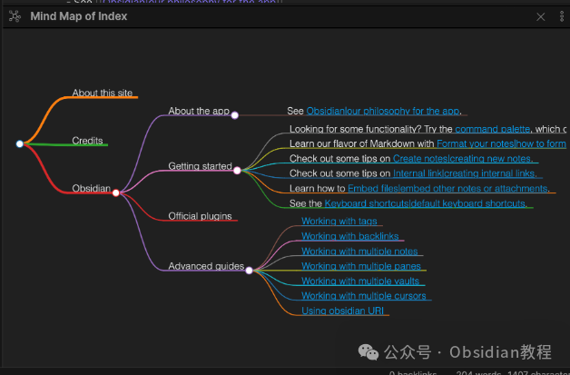

# Obsidian插件-Mind Map将笔记转换为思维导图

今天我们来聊聊一个我最近发现的超实用插件——Obsidian Mind Map。这可是一个能让你在Obsidian中将Markdown笔记转化为思维导图的神器！

如果你也是Obsidian的忠实粉丝，或者你对笔记管理有追求的同学，这个插件肯定能让你的笔记大变样。

### 什么是Obsidian Mind Map？

Obsidian本身就因其强大的笔记管理功能而受到开发者和知识工作者的喜爱。而Mind Map插件的出现，可以说是锦上添花。

它的功能简单直接——将你平时在Obsidian中写的Markdown笔记，转换成直观的思维导图！这对很多喜欢用思维导图来整理思路、展示信息的人来说，无疑是一个福音。

如果你平时习惯用脑图工具整理思路，那么你一定知道，思维导图能帮助你理清复杂的逻辑关系，让一切变得更加条理清晰。Obsidian Mind Map 就是要实现这一目标，将你的笔记从一串文字转换为可视化的思维导图，让你看得更加清晰，也能让你更加高效地理解和整理信息。

### 插件特色：让你的笔记焕然一新

#### 1\. 实时预览

你是不是觉得思维导图的预览只能是静态的？那就大错特错了！Obsidian Mind Map插件能实时预览你的思维导图。也就是说，当你在Obsidian中修改笔记内容时，思维导图会即时更新，确保你看到的是最新的逻辑结构。

就像Obsidian的Local Graph、Outline和Backlink窗格一样，Mind Map的预览窗格会根据你选择的笔记实时更新。这样的设计，让你随时都能看到笔记中的信息是如何在脑图中展示的，帮助你理解和整理知识。

#### 2\. 固定预览

有时候，你可能需要在查看其他笔记时，保持当前的思维导图不变。别担心！这个插件支持将思维导图的预览窗格固定在当前笔记上。

你只需要点击一个小图钉图标，就能固定这个思维导图视图，即使你切换到其他笔记，当前的导图也不会变化。这种设计真的是相当贴心，避免了反复切换笔记时，不断刷新导图的麻烦。

#### 3\. 截图复制

这个功能也相当强大！你可以将思维导图生成的SVG格式图片直接复制到剪贴板中，然后粘贴到Obsidian笔记中，或者其他任何图像编辑器中。这对于制作汇报或者整理图表非常方便。毕竟，手动去画一张思维导图不仅耗时，还不如直接生成一个清晰的SVG图片来得高效。

### 使用方法：简单易用

#### 打开思维导图预览

使用这个插件并不复杂，只需要几个简单的操作，你就能看到笔记中的思维导图。首先，你可以通过一个命令来打开当前笔记的思维导图预览，轻松快捷。如果你想要保持思维导图的稳定显示，还可以选择将预览窗格固定，这样就能避免频繁的更新，专心查看当前的导图。

### 

#### 截图复制

你也可以随时将思维导图的SVG图片复制到剪贴板中，不管是粘贴到其他笔记中，还是直接用于图像编辑，都是极其方便的。

### 为什么你一定要试试这个插件？

如果你平时的笔记大多是文字为主，感觉有点单调，或者在整理复杂的思路时有点混乱，那么Obsidian Mind Map插件绝对能帮助你脱颖而出。它不仅能让你轻松地将笔记转化为思维导图，还能实时预览和修改，让信息更加有条理，展示得更加清晰。

### 结语：让你的笔记更“高大上”

对于我个人而言，Obsidian Mind Map插件真的是一个让人爱不释手的工具。

每次打开自己的笔记，看到那棵“信息大树”逐渐展开，所有的思路都清晰地展示出来，真的是一种视觉和思维的双重享受。这个插件不仅让笔记更加生动，也让整理思路变得更加高效。如果你是一名经常需要整理思路、制作笔记的人，Obsidian Mind Map绝对是你不可或缺的利器。

总的来说，Obsidian Mind Map插件可以说是将Obsidian的功能提升了一个档次，让我们能够更加高效、直观地管理知识和信息。如果你还没有尝试过，赶紧去试试吧！相信我，你一定会爱上它的！

### 点击下方公众号，回复关键字：**Obsidian** ，获取Obsidian资料合集。

****-END****-****

**ok，今天先说到这，如果你想更深入的了解Obsidian，现在只要购买我们的《Obsidian实操案例课》，便可免费加入「玩转效率笔记」社群，与一群人交流效率提升的经验，实现自我管理的目标。** 如果你对Obsidian有热情，这个课程绝对不容错过！
