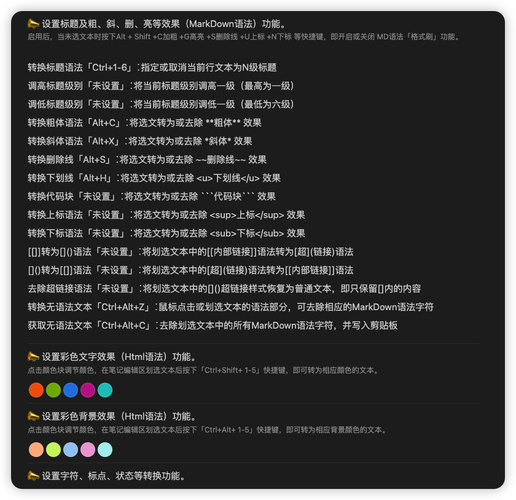
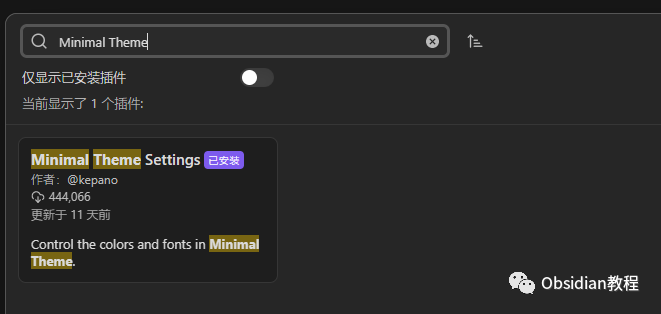
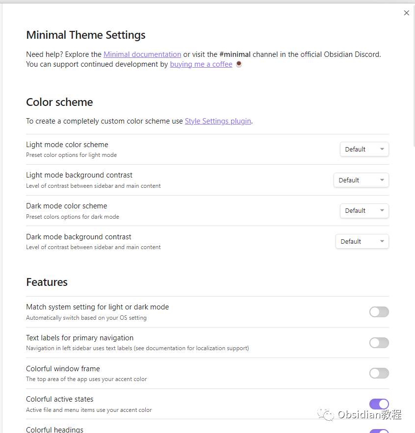
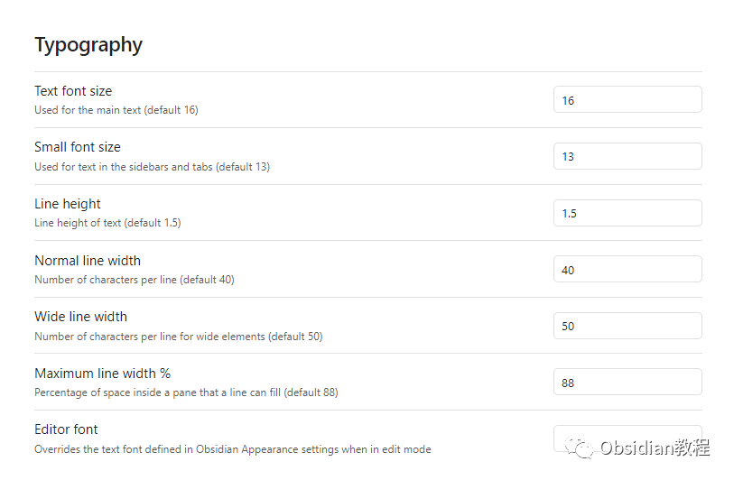

# Obsidian插件-Minimal Theme自定义主题

### 点击下方公众号，回复关键字：**Obsidian** ，获取Obsidian资料合集。

Obsidian是一个功能强大的知识管理工具和笔记应用，但它的真正魅力在于它的可定制性，尤其是通过主题和插件。  
其中，"Minimal Theme"是其社区中最受欢迎的第三方主题之一。这个主题提供了一个干净、优雅的界面，使得内容成为焦点，同时保持功能的完整性。  
 1**主要特点：**  
**简洁的设计：** 如其名所示，Minimal Theme为用户提供了一个简洁无杂的界面，使得内容真正成为焦点。  
**深色和浅色模式：** 主题提供了两种颜色方案供用户选择，以适应不同的环境和偏好。  
**细微的动画效果：** Minimal主题在某些元素上加入了轻微的动画，如鼠标悬停或点击，为用户交互提供了平滑的体验。  
**优化的字体渲染：** 该主题使用了经过精心选择的字体堆栈，确保在不同平台和屏幕上提供一致而优雅的阅读体验。  
**高度可定制：** 尽管Minimal Theme的目标是为用户提供一个即开即用的体验，但它也为那些想要进一步定制其外观的用户提供了大量的CSS变量。 **2****使用方法：**  

  * 在Obsidian中，转到设置 > 外观 > 主题。
  * 选择“获取更多主题”。
  * 在列表中找到"Minimal Theme"并点击安装。

  
  

  * 安装完成后，返回主题列表并选择“Minimal”应用。

3定制与进阶配置：

尽管Minimal Theme为大多数用户提供了出色的即开即用体验，但你仍然可以进一步定制它。如果你对CSS有所了解，你可以在Obsidian中创建一个新的CSS片段，然后重写主题的某些部分，或添加新的样式。  

  
另外，它也提供了诸如字体大小、行间距之类的设置

此外，主题的作者经常在GitHub仓库中更新和改进主题，所以如果你想要获得最新版本或提出建议，建议访问其GitHub页面。  
4结论：

Obsidian的"Minimal Theme"为那些追求简洁设计和高度可定制性的用户提供了一个完美的解决方案。  
  
无论你是一个新手，只想要一个漂亮的笔记环境，还是一个高级用户，希望深入定制每一个细节，这个主题都是一个值得尝试的选择。  
  
  
1点击下方公众号，回复关键字：**Obsidian** ，获取Obsidian资料合集。

****-END****-****

**ok，今天先说到这，如果你想更深入的了解Obsidian，现在只要购买我们的《Obsidian实操案例课》，便可免费加入「玩转效率笔记」社群，与一群人交流效率提升的经验，实现自我管理的目标。**

  

