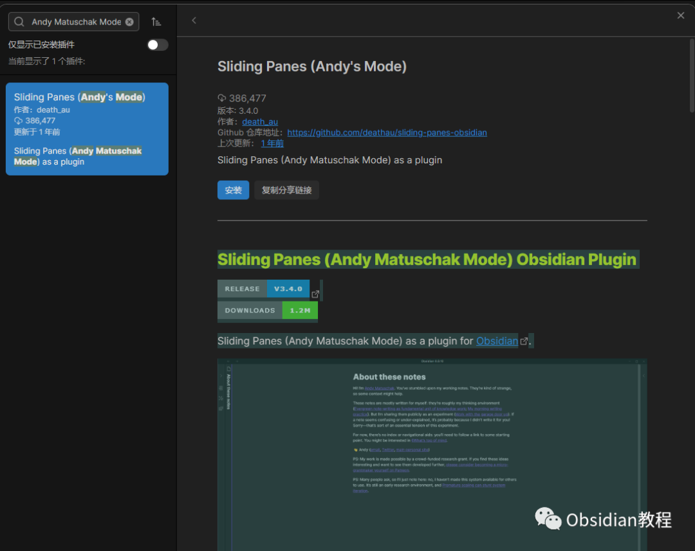
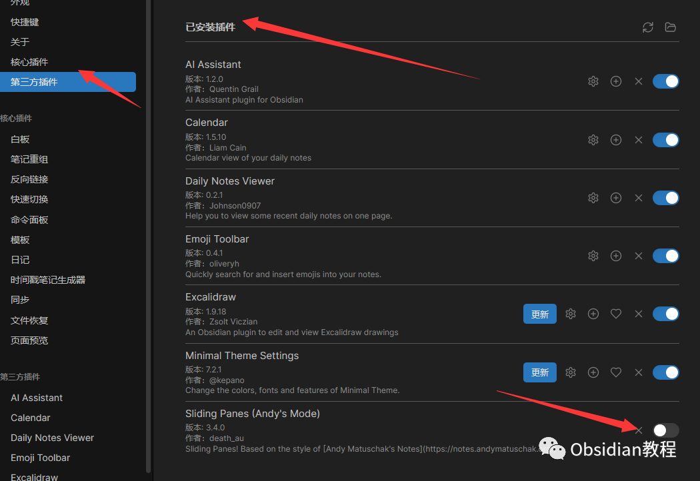
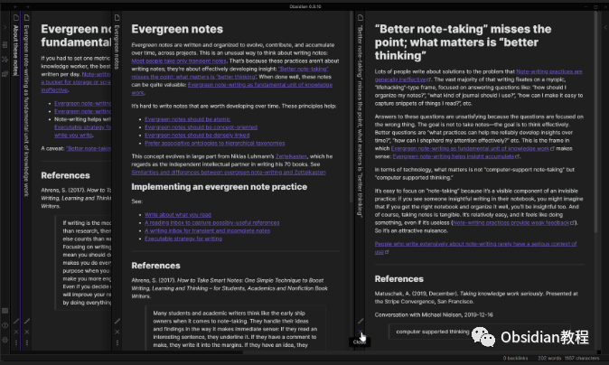

# Obsidian插件-Sliding Panes（Andy Matuschak Mode），让笔记像堆叠的卡片

### 点击下方公众号，回复关键字：**Obsidian** ，获取Obsidian资料合集。

  

### 1**插件概述**   

Sliding Panes（也被称为 Andy Matuschak Mode）是一个为 Obsidian 用户设计的插件。  
该插件改变了主工作区中窗格的处理方式，灵感来源于 Andy Matuschak 的笔记界面。不是缩小工作区以适应窗格，而是使窗格保持固定（但可调整）的宽度并堆叠，以便你可以在它们之间滚动。笔记标题旋转并添加到窗格的左侧，如同书脊（可选），在你滚动时会堆叠（也可选），便于在它们之间导航。  
注意：在 Obsidian 中在新窗格中打开链接，请按 ctrl/cmd 点击它们  
**主要特点****  
**

  * 并排笔记：使多个笔记可以在同一屏幕上并排显示，提供宽广的视野和容易的导航。
  * 动态调整：你可以轻松地调整每个面板的大小，只需点击并拖动它们之间的边界。
  * 流畅的动画：当打开或关闭笔记时，插件提供平滑的动画效果。
  * 集中式导航：快速地在各个滑动面板之间切换，无需返回到文件列表。

  
**设置****  
**

  * 切换 Sliding Panes：全局打开或关闭滑动窗格（也可通过命令/热键）。
  * 叶片自动宽度：如果打开，窗格宽度应填充可用空间（也可通过命令/热键）。
  * 叶片宽度：单个窗格的默认宽度。
  * 切换旋转标题：旋转标题以用作书脊（也可通过命令/热键）。
  * 交换旋转标题方向：交换旋转标题的方向（也可通过命令/热键）。
  * 切换堆叠：窗格会堆叠到左侧和右侧（也可通过命令/热键）。
  * 书脊宽度：用于堆叠的旋转标题（或间隙）的宽度。

  
兼容性自定义插件仅适用于 Obsidian v0.9.7+。此 repo 的当前 API 针对 Obsidian v0.10.9。 2**使用方法**   
**1.安装插件**  
  
安装从 Obsidian 内部：从 Obsidian v0.9.8 开始，你可以通过以下操作在 Obsidian 内激活此插件：  

  * 打开设置 > 第三方插件。
  * 确保安全模式已关闭。
  * 点击浏览社区插件。
  * 搜索此插件。
  * 点击安装。
  * 安装后，关闭社区插件窗口并激活新安装的插件。

**  
****离线安装：**  

  * 从 GitHub 仓库的 Releases 部分下载最新版本。
  * 将插件文件夹从 zip 文件中提取到你的金库的插件文件夹：<vault>/.obsidian/plugins/。注意：在某些机器上 .obsidian 文件夹可能被隐藏。在 MacOS 上，你应该可以按 Command+Shift+Dot 在查找器中显示文件夹。
  * 重新加载 Obsidian。
  * 如果提示关于安全模式，你可以禁用安全模式并启用插件。否则转到设置，第三方插件，确保安全模式已关闭，并从那里启用插件。

###   
**启用插件**  
在“第三方插件”列表中找到“Sliding Panes”并启用它。  
  

  * 使用滑动面板
    * 打开一个笔记，然后再打开另一个。你会看到新的笔记在旧的笔记旁边打开，形成滑动面板。
    * 要调整面板的大小，只需点击并拖动两个面板之间的边界。
    * 如果你想关闭一个面板，只需点击面板的关闭按钮，或者从文件列表中选择另一个笔记，被替换的笔记会自动关闭。

###   

  

### **小贴士**

**  
**

  * 快速导航：熟悉和使用 Obsidian 的快捷键，如 Cmd/Ctrl + O 来快速打开新笔记，可以极大提高使用滑动面板的效率。
  * 适量打开：虽然滑动面板非常有用，但并排打开过多的笔记可能会让你感到分心。找到适合自己的平衡点，并时常整理面板，使工作区保持整洁。

### 

###  5**总结**

Sliding Panes（Andy Matuschak Mode）为 Obsidian 用户提供了一个新颖、直观的方式来查看和管理他们的笔记。  
它是那些希望在笔记之间轻松切换，同时保持上下文的用户的理想选择。  
  
  
1点击下方公众号，回复关键字：**Obsidian** ，获取Obsidian资料合集。  

