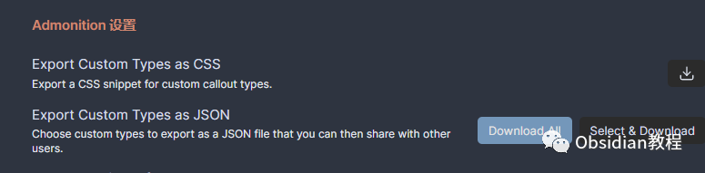
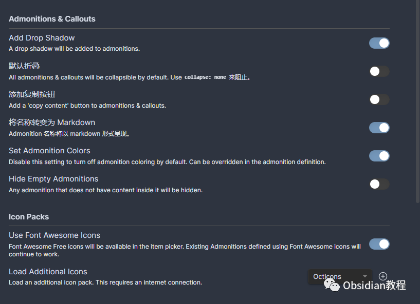
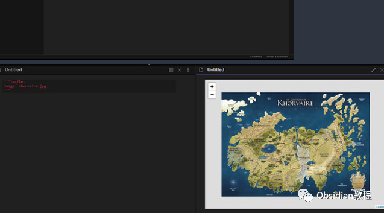

# Obsidian插件:Admonition在笔记中插入引人注目的提示框、警告框和其他信息块。

### 点击下方公众号，回复关键字：**Obsidian** ，获取Obsidian资料合集。

写笔记时，我们都希望能清晰地突出重点，使内容条理更为分明。Obsidian 的Admonition插件正是为此而生。  
  
以下，我将为你深入介绍这款插件的功能及其使用方法。  


### 1**什么是Admonition插件？**   


Admonition，翻译为“警告”或“提示”，是Obsidian的一个插件，主要是为你的笔记增添吸引眼球的提示、警告或其他信息块。  
信息记录的时候，真的是有这个需求的，有的地方需要重点标识，或者有时候想再笔记中添加一个小提示，或是重要的警告标记都没有办法，但是使用Admonition，这一切都变得轻而易举。

###  **2****功能亮点**   


  * 多种内置类型：提供了tip、warning、caution、note等多种预定义类型，满足不同的标注需求。
  * 高度定制性：除了预设的图标和样式，你还能利用CSS进行个性化定制。每一种提醒都可以根据你的需要进行独特的风格设置。

  
  


  * 扩展性：它能与其他插件（如Obsidian Templates和Templater）无缝结合，带来更为丰富的使用体验。
  * 易于导入和导出：你可以轻松地通过.json文件导入或导出自己的提醒样式。

  
  


### 3**安装与使用**   


**1.在线安装 （需要科学上网）：****  
**

  * 在Obsidian中，进入"设置"。
  * 在“社区插件”部分中，搜索"Admonition"并安装。

  
**2.离线安装：****  
****因为网络原因很多同学无法直接在线安装obsidian插件，这里我已经把obsidian所有热门插件下载好了****  
****  
**只需要关注下方公众号，后台回复：**插件** 即可获取  
  
**使用简介：**  


  * 使用Callout方式：在编辑模式下，键入如>[!tip]之类的命令，然后输入你的内容。
  * 使用Admonition方式：键入如```ad-tip的代码块，接着在下面的行写入内容。例如：


  *   *   * 

    
    
    ```ad-tiptitle: 这是一个小提示这是关于该提示的具体内容。

### **  
**

### **开发与支持**

  
虽然Admonition目前已进入维护模式，但这并不意味着它的生命期已结束。你仍然可以期待bug的修复和插件的改进，但可能不会有新的功能添加。

###  4**更多的Javalent插件**   


Javalent为Obsidian带来了多款有趣的插件，例如：Obsidian Leaflet（为笔记添加交互地图）、Dice Roller（内联骰子滚动）、Fantasy Statblocks和Initiative Tracker等。这些都是对Obsidian功能的有趣补充。  


### **  
**

### **结语**

  
Admonition插件为Obsidian用户带来了丰富的文本格式化工具，无论是新手还是资深用户，都值得一试。  
你的笔记将因此变得更为生动和有条理，从而提高你的笔记效率和阅读体验。  
  
  
1**扫码购买****《 Obsidian实战教程》****从入门到精通， 链接您的每一个思维瞬间。****  
**  
往 期精彩[1.Obsidian插件:Templater 一个为 Obsidian 用户设计的插件](http://mp.weixin.qq.com/s?__biz=MzkyMDUyMDM2Mg==&mid=2247483964&idx=1&sn=c157b7b458c9256f9585925b7fe94b14&chksm=c190d1f9f6e758ef33b886d915251e1c12d1f072cc663f17cb3b6771ed53726d2bd56482de4b&scene=21#wechat_redirect)  
[2.Obsidian插件:Advanced Slides为你的知识网络增加动态幻灯片功能](http://mp.weixin.qq.com/s?__biz=MzkyMDUyMDM2Mg==&mid=2247483950&idx=1&sn=92edb3fe9c4331d6c007fe7d2ac4549e&chksm=c190d1ebf6e758fdff7da2afc5e82aff39e07de8fcb879e163c4c211f3d393e84f3bce551c49&scene=21#wechat_redirect)  
[3.Obsidian插件:Tasks从零散笔记到完美任务管理](http://mp.weixin.qq.com/s?__biz=MzkyMDUyMDM2Mg==&mid=2247483938&idx=1&sn=6603deda8ad8a2aa37784514fc945f3d&chksm=c190d1e7f6e758f144409e0aa7cc19df581f1cd2a5894d3f67c6b6b789c922acf752f83b5b45&scene=21#wechat_redirect)  


点分享


点点赞


点在看
