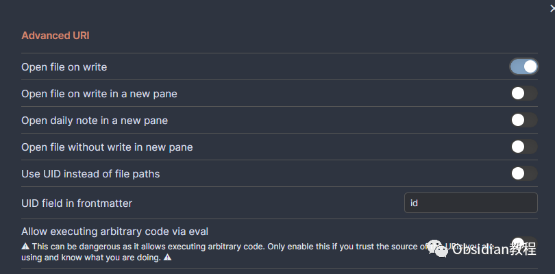
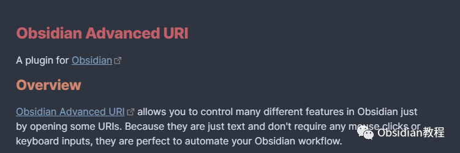

# Obsidian插件:Advanced URI 通过打开一些 URIs 来控制 Obsidian 不同功能的能力。

### 点击下方公众号，回复关键字：**Obsidian** ，获取Obsidian资料合集。

  
Obsidian 的 Advanced URI 插件提供了通过打开一些 URIs 来控制 Obsidian 中许多不同功能的能力。由于它们只是文本，并不需要任何鼠标点击或键盘输入，因此它们非常适合自动化您的 Obsidian 工作流程。  

## 1**插件介绍**

Advanced URI 插件是一款为 Obsidian 用户提供多种功能控制通过 URI 的插件。它允许用户打开、编辑和创建文件，打开工作区，导航到标题/块，以及在文件中自动搜索和替换，从而大大提高了 Obsidian 工作流程的效率和便利性。  
  

## 2**功能说明**

### **文件操作**

**  
**

  * 打开文件：通过 URI，用户可以快速打开指定的文件。
  * 编辑文件：可以通过 URI 指令来编辑现有的文件，包括添加、删除和修改文本。
  * 创建文件：如果需要创建新的文件，可以通过 URI 指令快速完成。

###   

### **工作区控制**

**  
**

  * 打开工作区：通过 URI，可以快速打开指定的工作区，帮助用户快速切换不同的工作环境。

### **  
**

### **导航与搜索**

**  
**

  * 导航到标题/块：可以通过 URI 快速导航到指定的标题或块，提高文档的导航效率。
  * 自动搜索和替换：在文件中自动执行搜索和替换操作，通过 URI 指令可以快速完成。

##  3**使用方法**

为了利用 Advanced URI 插件，首先需要在 Obsidian 中安装和启用该插件。安装完成后，可以通过构造特定的 URI 来控制 Obsidian 的不同功能。  
例如，要打开一个名为 "Meeting Notes.md" 的文件，您可以使用以下 URI：
    
    
      
    
      
        * 
    
    
    
    obsidian://open?vault=my-vault&file=Meeting%20Notes.md

在这个示例中，vault=my-vault 指定了保险库的名称，而 file=Meeting%20Notes.md 指定了要打开的文件的名称。  
类似地，可以通过构造不同的 URI 来执行编辑、创建文件以及其他操作。所有的操作和参数都可以在插件的文档中找到详细的说明。

##  4**下载与安装**

要使用这个插件，我们首先需要在Obsidian中安装它。安装过程非常简单直接：

### **  
**

### **1.在线安装**（需要科学上网） ：****

  
1.在Obsidian的设置中，找到“第三方插件”选项，点击“社区插件”2.在搜索框中输入“Advanced URI”，找到并安装它。3.安装完成后，激活该插件，在成功安装插件后，我们需要对其进行简单的配置，以符合我们的需求。  

  
**2.离线安装：****  
****因为网络原因很多同学无法直接在线安装obsidian插件，这里我已经把obsidian所有热门插件下载好了**  
只需要关注下方公众号，后台回复：**插件** 即可获取

## 

  

## 5**结语**

通过 "Advanced URI" 插件，Obsidian 用户可以快速和方便地通过 URI 来控制不同的功能，从而实现工作流程的自动化。这不仅可以大大节省用户的时间，还可以使 Obsidian 的使用更加高效和便利。  
对于希望提高效率和自动化工作流程的用户来说，这是一个非常有价值的插件。  
  
  
1**扫码购买****《 Obsidian实战教程》****从入门到精通， 链接您的每一个思维瞬间。****  
**

点分享

点点赞

点在看
