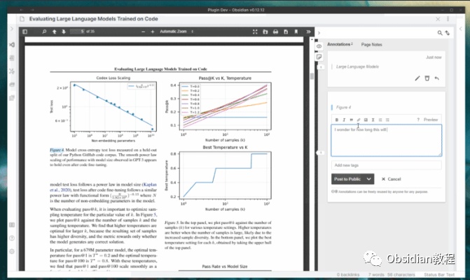
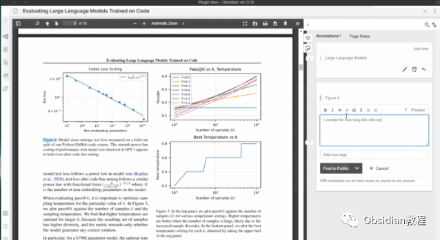
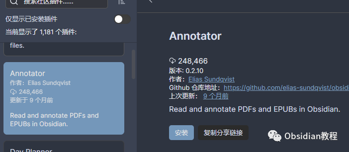
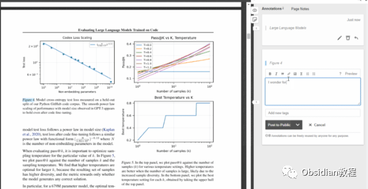

# Obsidian插件:Annotator赋予用户在Obsidian环境中直接打开、阅读和注释PDF与EPUB文件的能力

### 点击下方公众号，回复关键字：**Obsidian** ，获取Obsidian资料合集。

  

在数字化的时代，如何优雅、高效地管理和整理知识成为了我们面临的重要挑战。不过好消息是，Obsidian 这款神奇的知识管理工具正在悄无声息地改变着我们处理知识的方式。

  

今天，我们要深入探讨的是Obsidian的一个强大插件——Annotator，它将为你的PDF和EPUB文件阅读体验增色不少。

  

1Annotator插件简介

## 

Obsidian Annotator是一个为Obsidian设计的插件，它赋予了用户在Obsidian环境中直接打开、阅读和注释PDF与EPUB文件的能力。

  

此插件基于开源项目hypothes.is，但经过定制，将注释数据储存在本地的Markdown文件中，而非互联网上，保障了用户数据的私密安全。

  

通过这个插件，你可以轻松标注文献、保存想法、整理笔记，让知识的积累变得井然有序。

  

2功能亮点

  * 文件支持：直接打开和注释PDF及EPUB文件，不再需要切换到其他应用程序。

  * 本地储存：所有的注释数据储存于本地，保障了数据的安全和私密。

  * Markdown注释：注释以Markdown格式保存，方便整理和查看。

  * 深度集成：与Obsidian的其他功能如Dataview插件等深度集成，提供更丰富的功能体验。

  

## 3下载与安装

首先，确保你已经安装了Obsidian软件。

### **  
**

### **1.在线安装**（需要科学上网） ：****

  

1.在Obsidian的设置中，找到“第三方插件”选项，点击“社区插件”

2.在搜索框中输入“Annotator”，找到并安装它。

3.安装完成后，激活该插件，即可开始你的注释之旅。

  

**2.离线安装：****  
****因为网络原因很多同学无法直接在线安装obsidian插件，这里我已经把obsidian所有热门插件下载好了**  
只需要关注下方公众号，后台回复：**插件** 即可获取

## 4如何使用

打开文件：在Obsidian的笔记前置元数据中添加annotation-target属性，并设置为你想要注释的PDF或EPUB文件的位置。例如：annotation-target: Pdfs/mypdf.pdf。  

  

开始注释：在打开的笔记窗格中，选择“更多选项”（右上角的三个点），新出现的“注释”选项就是进入注释模式的入口。点击它，你将看到你的PDF或EPUB文件呈现在你面前，开始你的注释之旅吧。

  

  

保存与查看：在注释模式下，所有的注释都会实时保存至本地的Markdown文件中，你可以随时切换回Markdown模式查看和编辑你的注释。

## 

5注意事项

文件重命名：切勿重命名原始的PDF或EPUB文件，否则插件将失去与注释之间的联系。

  

兼容性：目前插件在iOS 16.3或更高版本上存在已知问题，请根据自身设备系统选择使用。

  

高级设置：你可以通过插件的设置选项，如修改深色模式、字体大小等来优化你的阅读体验。

## 

6结语

Obsidian Annotator插件像是在茫茫知识海洋中为我们点亮的一盏明灯，让我们能在知识的世界里更自如地游走。

  

安装和使用Annotator插件，让我们在Obsidian这个强大的知识管理平台上，迈向知识的深渊，发掘无穷的智慧。

  
  
  
1**扫码购买****《 Obsidian实战教程》****从入门到精通， 链接您的每一个思维瞬间。****  
**  
往 期精彩

  1. [Obsidian插件: Recent Files追踪最近打开过的文件](http://mp.weixin.qq.com/s?__biz=MzkyMDUyMDM2Mg==&mid=2247484118&idx=1&sn=005a8e8df6fdedc65652ee1539bc2a0e&chksm=c190d113f6e758050ec859a87dcd29facc1dd509ba896fcf3bc5971af04f033334727222ded6&scene=21#wechat_redirect)  

  2. [Obsidian插件:Remotely Save为Obsidian设计的非官方同步插件](http://mp.weixin.qq.com/s?__biz=MzkyMDUyMDM2Mg==&mid=2247484117&idx=1&sn=591d2150d0297403d12d8f78f79c0a4a&chksm=c190d110f6e758065927e3c3018d60b6d364cd205d2a85e7eda856bb4cb9fdc7839617f93870&scene=21#wechat_redirect)
  3. [Obsidian插件:Editor Syntax Highlight为代码块提供语法高亮](http://mp.weixin.qq.com/s?__biz=MzkyMDUyMDM2Mg==&mid=2247484073&idx=1&sn=8074d9fcfe4d0f07afe1a8522658d712&chksm=c190d16cf6e7587ad52c092ae247db443d8210ad066cf8d82407fad9a3171fd2d1c1ea187f91&scene=21#wechat_redirect)
  4. 

点分享

点点赞

点在看

