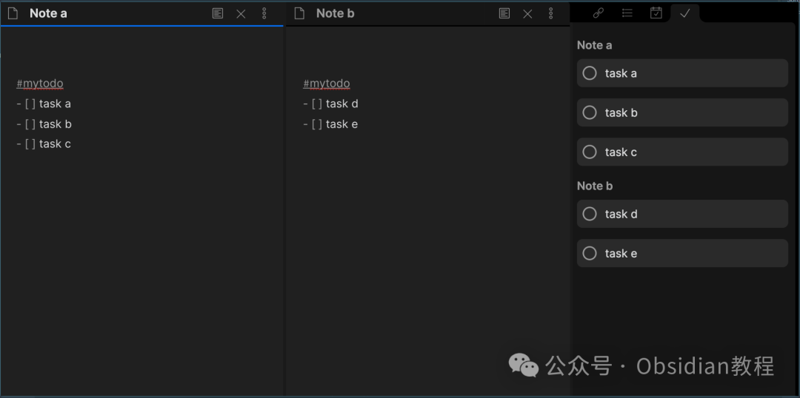
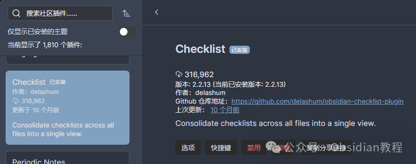
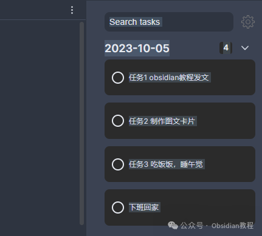
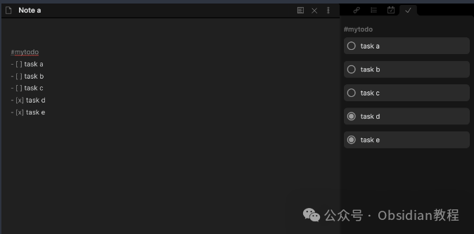
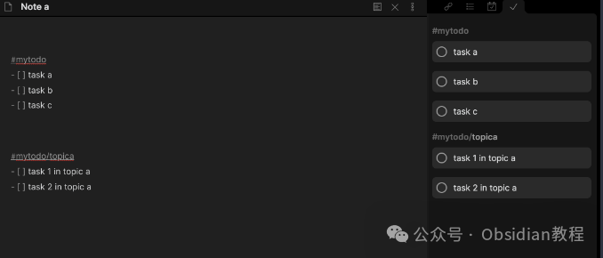

# Obsidian插件Checklist ：告别任务混乱，管理笔记任务更高效！

嗨，我是鬼哥，10年+老程序员一枚。  
今天来聊聊一个能让你管理笔记任务更高效的小插件——Obsidian Checklist Plugin。  
如果你像我一样，时常被各种待办事项搞得焦头烂额，那么这个插件绝对是你的救星。咱们一起来看看这个插件的详细用法吧。  

### **Checklist Plugin 简介**

  
Obsidian Checklist Plugin 是一个能把分散在不同笔记文件里的待办事项（checklist）汇总到一个视图中的插件。  
想象一下，你在不同笔记本里写下了各种任务，而这个插件能让你一目了然地查看和管理所有任务，简直是效率神器。  

### **下载和安装****Checklist**

  
虽然说了这么多，还是要教大家如何下载和安装这个神器。  
**1.在线安装**  
如何安装 Obsidian 插件，通常可以通过以下步骤进行安装：  

  1. 打开 Obsidian 的设置页面。
  2. 导航到“社区插件”部分。
  3. 点击“浏览”按钮，搜索“”。Checklist
  4. 找到插件后，点击“安装”按钮。
  5. 安装完成后，返回插件列表，启用该插件。

### 

**  
****2.离线安装：****  
****很多同学无法直接在线安装obsidian插件，这里我已经把obsidian所有热门插件下载好了**  
只需要关注下方公众号，后台回复：**插件** 即可获取

### 

  
安装完成后，别忘了在插件列表中启用它。这样，你就可以开始体验 Checklist带来的强大功能了。  

### **使用方法**

  
**启用插件**  
首先，你需要在Obsidian的插件管理界面中启用这个插件。启用后，插件会在右侧边栏显示一个清单视图。如果你没有看到这个视图，可以通过命令面板（Command Palette）运行“Checklist: Open View”命令手动打开。  

**基本操作**  
默认情况下，任何被标记为 #todo 的待办事项都会出现在右侧边栏。你可以在编辑器中通过勾选（例如：- [ ] -> \- [x]）来完成任务，或者直接点击侧边栏中的待办事项，插件会自动更新你的.md文件。

### **配置选项**

  
这个插件提供了丰富的配置选项，让你可以根据自己的需求进行调整。  
**标签名称**  
默认情况下，插件会查找标记为 #todo 的待办事项，但你可以修改为任何你喜欢的标签。  
**显示已完成任务**  
默认设置下，插件只显示未完成的任务，完成的任务会自动从侧边栏移除。但你可以选择显示所有任务，包括已完成的。  
**显示文件中的所有任务**  
默认情况下，插件只显示被标记块中的任务。如果你希望显示文件中所有的任务，只需更改相应设置即可。  
**按文件或标签分组**  
你可以选择按文件或标签名进行分组。如果按标签分组，任务会按照它们首次出现在文件中的顺序显示（或根据排序顺序显示）。

**排序顺序**  
默认情况下，任务会按它们在文件中出现的顺序显示，文件则按照最旧的在上排列。你可以更改设置，让最新的文件显示在顶部。  

### **总结**

  
这个插件真的是为那些像我一样，笔记里任务繁多的小伙伴们量身打造的。不仅可以汇总所有待办事项，还能灵活配置各种显示和排序方式，极大提高了管理效率。  
鬼哥我用了之后感觉日子都清爽了不少，再也不怕漏掉任何一个任务了。  
如果你也觉得这插件不错，不妨试试吧！  

> **对obsidian感兴趣的同学，可以链接我微信：hls404 拉你进入“obsidian交流社群”。**

  
**热门推荐**  
**  
**

  * [Obsidian神级插件：Natural Language Dates ，助你高效管理笔记!](http://mp.weixin.qq.com/s?__biz=MzkyMDUyMDM2Mg==&mid=2247485907&idx=1&sn=ab5a21e4c9b9b0329309b5757615e988&chksm=c190da16f6e753009c66ae6da91b7d7ba7c6310ab8f1cb002c17e85d5382ff422548a3181816&scene=21#wechat_redirect)

  * [Obsidian插件：Make.md为你量身打造一个完美的个人系统。](http://mp.weixin.qq.com/s?__biz=MzkyMDUyMDM2Mg==&mid=2247485896&idx=1&sn=a13c9fcd01a0693dafef7a6edce5de8f&chksm=c190da0df6e7531b4890c7b581bf793c4255ea4183c567405b920a407f802ff338b1e86cbb3c&scene=21#wechat_redirect)

  * [Obsidian插件：Editing Toolbar 让笔记编辑变得更加简单和直观](http://mp.weixin.qq.com/s?__biz=MzkyMDUyMDM2Mg==&mid=2247485885&idx=1&sn=fdd0b6299765f6149bd0b6c538716552&chksm=c190da78f6e7536ef9827d3f5cff76054bb7653626368c89f711e79ee8819b6207e1f5d83210&scene=21#wechat_redirect)  

