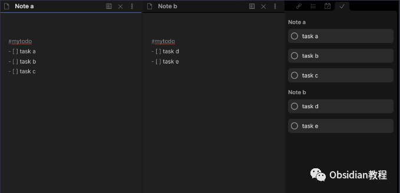
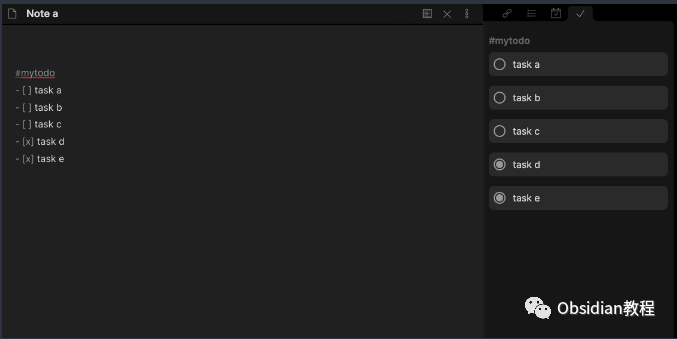
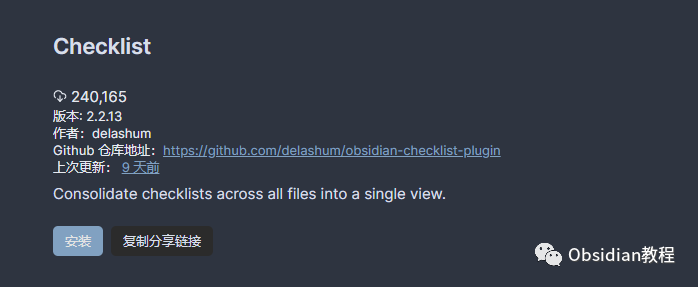
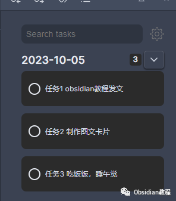
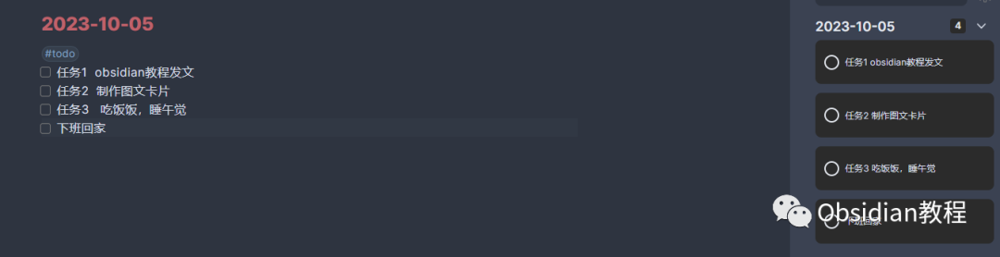
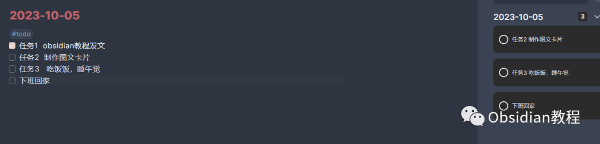
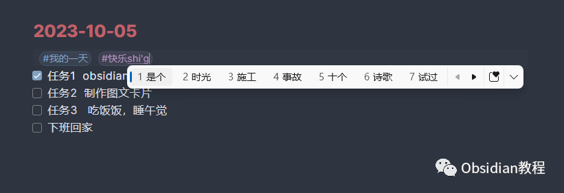
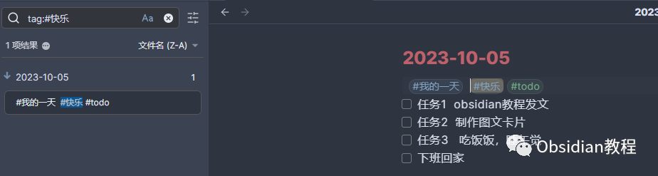

# Obsidian插件:Checklist优雅地管理任务

### 点击下方公众号，回复关键字：**Obsidian** ，获取Obsidian资料合集。

Obsidian 是我们日常知识管理的得力助手，而Checklist插件则是Obsidian中一个简洁而有力的任务管理工具。  
这款插件能够帮助我们集中管理各个文件中的任务列表，让我们的日常工作和生活变得井井有条。  

1插件简介

## 

Checklist插件的主要功能是将Obsidian中跨文件的任务列表集中展示在一个视图中。它能够将你标记为#todo的任务块集中显示在右侧栏中，让你能够一目了然地看到所有待办事项。  
你可以直接在编辑器中或通过点击侧边栏中的任务项来完成任务，非常方便。  

2下载与安装

首先，确保你已经安装了Obsidian软件。

### **  
**

### **1.在线安装**（需要科学上网） ：****

  

1.在Obsidian的设置中，找到“第三方插件”选项，点击“社区插件”

2.在搜索框中输入“Checklist”，找到并安装它。

3.安装完成后，激活该插件

  

**2.离线安装：****  
****因为网络原因很多同学无法直接在线安装obsidian插件，这里我已经把obsidian所有热门插件下载好了**  
只需要关注下方公众号，后台回复：**插件** 即可获取3基本使用

## 

### **1\. 开启插件视图**

  
安装并启用插件后，你将在右侧栏看到任务列表。如果没有显示，说明你可能没有创建任务。  

### **2\. 创建与管理任务**

  
在任意Markdown文件中，你可以通过创建一个带有#todo标签的任务块来添加任务。例如：
    
    
    #todo  
    - [ ] 任务1  
    - [ ] 任务2  
    

你可以通过在编辑器中勾选或点击侧边栏中的任务项来完成任务。完成的任务会在侧边栏中消失（默认设置），但你可以在插件设置中选择显示所有任务。  

4插件配置

### **1\. 标签名称**

  
默认的标签是#todo，但你可以根据喜好更改它。  

### **2\. 显示已完成任务**

  
默认情况下，插件只会显示未完成的任务。你可以选择显示所有任务。  

### **3\. 在文件中显示所有任务**

  
默认情况下，插件只会显示标记了#todo的任务块中的任务。你可以更改此设置，让插件显示文件中的所有任务，只要页面上任何地方有#todo标签。  

### **4\. 分组与排序**

  
你可以选择按文件或标签名称分组任务，并可以更改任务和文件的排序顺序。  

### **5\. 文件匹配**

  
通过“包括文件”设置，你可以使用Glob文件匹配来指定哪些文件的任务应该被包括在内。例如，!{_templates/**,_archive/**}会排除_templates和_archive目录，而{Daily/**,Weekly/**}仅包括Daily和Weekly目录中的文件。5细节与建议

### **1.标签使用**

  
合理使用标签可以帮助你更好地分类和管理任务。除了默认的#todo标签外，你还可以创建其他标签来标记不同类型或优先级的任务。  

### **2\. 侧边栏利用**

  
充分利用侧边栏可以快速查看和管理你的任务。你可以通过单击来完成任务，也可以通过右键菜单来进行更多操作。  
Checklist插件是一个简单但功能强大的工具，它以简洁的界面和直观的操作为我们提供了强大的任务管理能力。  
尽管它可能不如一些专业的任务管理软件那样功能丰富，但它的简洁和易用性使它成为Obsidian用户日常任务管理的不二之选。  
  
  
1**扫码购买****《 Obsidian实战教程》****从入门到精通， 链接您的每一个思维瞬间。****  
**  
往 期精彩1.[Obsidian插件:Day Planner，规划你的一天](http://mp.weixin.qq.com/s?__biz=MzkyMDUyMDM2Mg==&mid=2247484148&idx=1&sn=0bbd2cb464c8f051da65642eab1eeab5&chksm=c190d131f6e75827dadf81f1ea4a430828a481d8a0206ac010d4b47001f930fe6ec57cdc2068&scene=21#wechat_redirect)[2.Obsidian插件:Annotator赋予用户在Obsidian环境中直接打开、阅读和注释PDF与EPUB文件的能力](http://mp.weixin.qq.com/s?__biz=MzkyMDUyMDM2Mg==&mid=2247484119&idx=1&sn=b1491121e681ce684988d100cf588dd0&chksm=c190d112f6e758048455acc822832f8db8750e60becfe3020bfdda9fba175a1e7a00f159a1d5&scene=21#wechat_redirect)  
3[.Obsidian插件: Recent Files追踪最近打开过的文件](http://mp.weixin.qq.com/s?__biz=MzkyMDUyMDM2Mg==&mid=2247484118&idx=1&sn=005a8e8df6fdedc65652ee1539bc2a0e&chksm=c190d113f6e758050ec859a87dcd29facc1dd509ba896fcf3bc5971af04f033334727222ded6&scene=21#wechat_redirect)

点分享

点点赞

点在看
