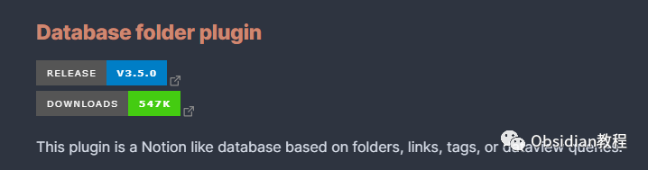
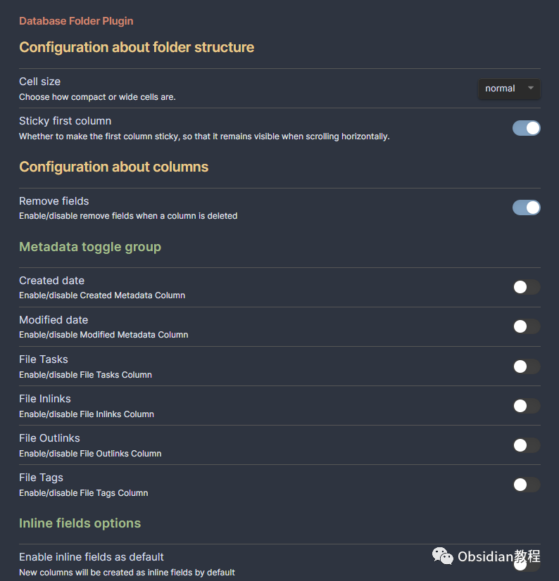
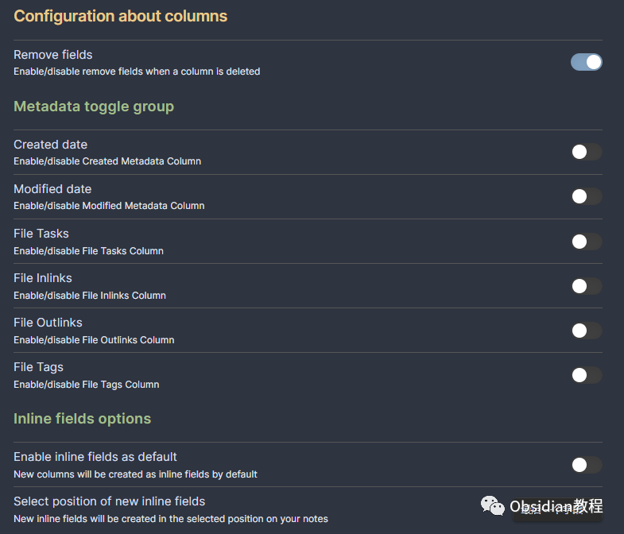
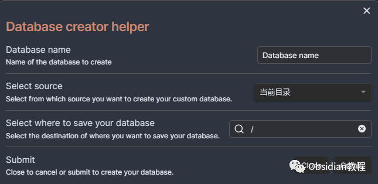
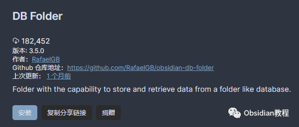

# Obsidian插件:DB Folder 为 Obsidian 用户提供类似 Notion 数据库功能

### 点击下方公众号，回复关键字：**Obsidian** ，获取Obsidian资料合集。

  
Obsidian 的 DB Folder 插件提供了一个类似 Notion 数据库的功能，基于文件夹、链接、标签或 dataview 查询来组织和展示数据。  
它允许用户在 Obsidian 中创建和管理具有特定视图类型的数据库，以高效地组织和检索信息。本教程将为您介绍如何使用 DB Folder 插件来构建和管理您的数据库。  
  

## 1**插件介绍**

DB Folder 插件是一个为 Obsidian 用户提供类似 Notion 数据库功能的插件。  
它可以根据多种数据源（如文件夹、标签、链接和 dataview 查询）搜索所有笔记，然后显示您指定的列/元数据。通过这个插件，用户可以在 Obsidian 中以一种结构化和有组织的方式管理和展示数据。  
  

## 2**功能说明**

### **数据库视图**

**  
**

  * 独特的视图类型：数据库拥有自己的视图类型，可以根据多种数据源显示指定的列/元数据。
  * 多数据源支持：可以基于文件夹、标签、链接和 dataview 查询等多种数据源来搜索和展示笔记。
  * 列/元数据展示：可以指定要显示的列/元数据，以便于查看和管理信息。

### **数据操作**

**  
**

  * 信息添加与编辑：在数据库中添加或编辑的信息将被保存到目标 Obsidian 笔记中，保证数据的实时更新和保存。

###   

### **数据查询与展示**

  

  * 高效的数据查询：通过 dataview 查询功能，可以快速检索和筛选需要的数据。
  * Notion样式的基础展示：提供类似 Notion 的样式基础，使数据展示更为清晰和有组织。

## 

3使用方法

  
要使用 DB Folder 插件，首先需要在 Obsidian 中安装和启用该插件。安装完成后，可以根据插件的文档创建和管理数据库。  
创建数据库通常包括以下步骤：  
选择数据源：确定要基于哪种数据源来创建数据库（例如，文件夹、标签、链接或 dataview 查询）。  
指定列/元数据：确定要在数据库视图中显示哪些列/元数据。  
添加和编辑信息：在数据库中添加新的信息或编辑现有的信息。所有添加或编辑的信息都将被保存到目标 Obsidian 笔记中。

## 4下载与安装

要使用这个插件，我们首先需要在Obsidian中安装它。安装过程非常简单直接：

### **  
**

### **1.在线安装**（需要科学上网） ：****

  
1.在Obsidian的设置中，找到“第三方插件”选项，点击“社区插件”2.在搜索框中输入“DB Folder”，找到并安装它。3.安装完成后，激活该插件，在成功安装插件后，我们需要对其进行简单的配置，以符合我们的需求。  

**2.离线安装：****  
****因为网络原因很多同学无法直接在线安装obsidian插件，这里我已经把obsidian所有热门插件下载好了**  
只需要关注下方公众号，后台回复：**插件** 即可获取

## 

5结语

通过 DB Folder 插件，Obsidian 用户可以在熟悉的环境中创建和管理类似 Notion 的数据库，从而以一种高效、结构化和有组织的方式管理和展示数据。  
这不仅可以大大提高数据管理的效率，还可以使 Obsidian 的使用更加灵活和多功能。对于希望在 Obsidian 中实现高效数据管理的用户来说，这是一个非常有价值的插件。  
  
  
1**扫码购买****《 Obsidian实战教程》****从入门到精通， 链接您的每一个思维瞬间。****  
**  
往 期精彩1.[Obsidian插件:Periodic Notes允许用户创建和管理日常、周和月的笔记](http://mp.weixin.qq.com/s?__biz=MzkyMDUyMDM2Mg==&mid=2247484334&idx=1&sn=140ada374b5dd16fb5646edc77de4431&chksm=c190d06bf6e7597d30949d3e4c90e2997b9875df5d1a8dbea353e584cebb23797a6da27c872b&scene=21#wechat_redirect)  
[2.Obsidian插件:Omnisearch 一款强大的搜索引擎](http://mp.weixin.qq.com/s?__biz=MzkyMDUyMDM2Mg==&mid=2247484271&idx=1&sn=c8bb17a26c364aba21d13ec5c5da7f55&chksm=c190d0aaf6e759bcf7169e6de0eeb5f7ae35f05cbadeb9bcafd0424b544845a09fe2d6006159&scene=21#wechat_redirect)  
[3.Obsidian插件:Ozan's Image in Editor Plugin在编辑器视图下直接查看和处理多种文件和内容](http://mp.weixin.qq.com/s?__biz=MzkyMDUyMDM2Mg==&mid=2247484258&idx=1&sn=2e9d410c6cc3d5aa643cde31ee9e9a9f&chksm=c190d0a7f6e759b1d4f7939ec44329e5b00bc61a92b5f49311f1f8defe5ad2f78454d796e077&scene=21#wechat_redirect)  

点分享

点点赞

点在看
