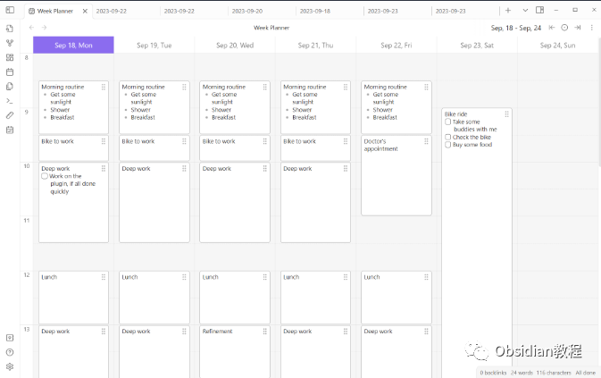
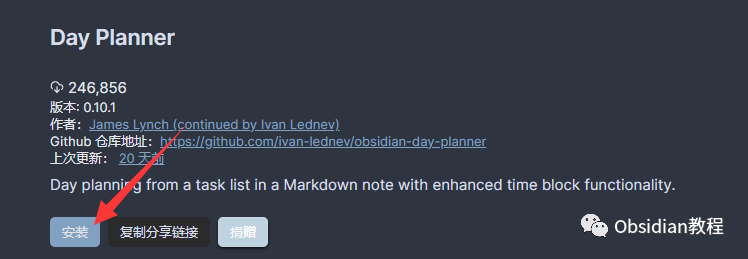
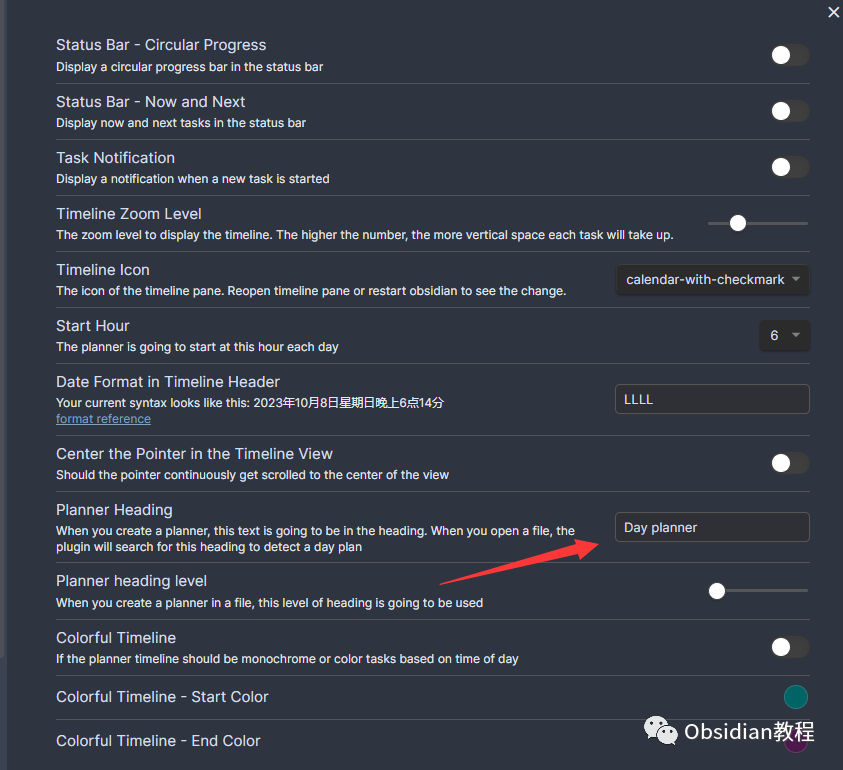
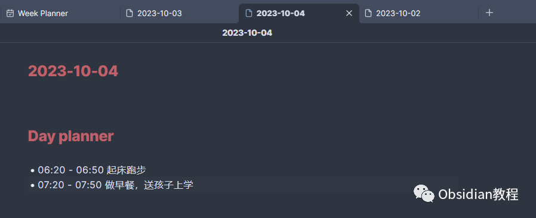
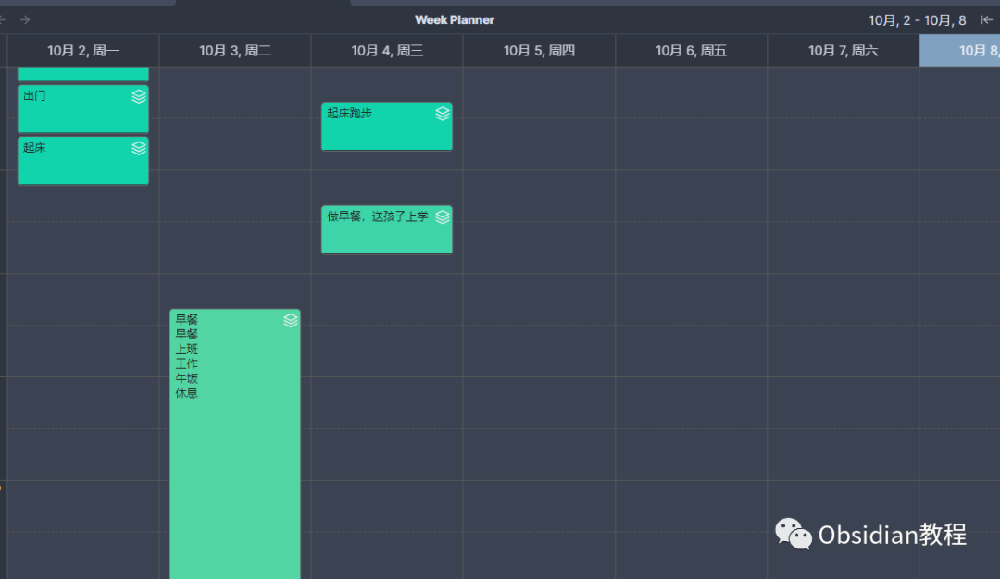
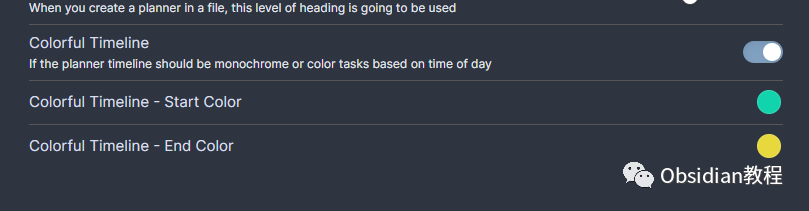

# Obsidian插件:Day Planner，规划你的一天

### 点击下方公众号，回复关键字：**Obsidian** ，获取Obsidian资料合集。

  

Obsidian 是一个非常灵活的个人知识管理工具，它允许我们创建、编辑和链接笔记。

  

而通过Day Planner插件，我们能够方便地将日程安排整合到Obsidian中，让时间管理变得触手可及。  

  

  
1**下载和安装** 首先，确保你已经安装了Obsidian软件。

### **  
**

### **1.在线安装**（需要科学上网） ：****

  
1.在Obsidian的设置中，找到“第三方插件”选项，点击“社区插件”2.在搜索框中输入“Day Planner”，找到并安装它。3.安装完成后，激活该插件，在成功安装插件后，我们需要对其进行简单的配置，以符合我们的需求。  
  
**2.离线安装：****  
****因为网络原因很多同学无法直接在线安装obsidian插件，这里我已经把obsidian所有热门插件下载好了**  
只需要关注下方公众号，后台回复：**插件** 即可获取  
2

## 

## 配置Day Planner插件

在成功安装插件后，我们需要对其进行简单的配置，以符合我们的需求。  

  * 返回到“插件”页面，找到Day Planner插件，然后点击启用。
  * 点击插件旁边的设置图标，进入配置页面。
  * 在配置页面，你可以设置预配置的标题（默认是# Day Planner），选择时间格式等。

##   

  
3

## 

## 开始规划你的一天

## 

有了Day Planner插件，规划你的一天变得非常简单。  

  * 创建一个新的Markdown笔记，或打开一个现有的笔记。
  * 在笔记中，根据你的日程创建一个任务列表。你可以使用“# Day Planner”作为任务列表的标题。

现在，我们可以开始添加任务了。  

## **添加和编辑任务**

**  
**

  * 直接在Markdown笔记中输入你的任务，例如“10:00-11:00 开会”。
  * 你可以随时编辑或删除任务，只需在Markdown笔记中对应的文本进行编辑或删除即可。

## **时间线视图**

  
时间线视图是Day Planner插件的核心特点之一，它能让我们直观地看到一天的安排。  

  * 在菜单栏中选择“weekplan”按钮，打开时间线视图。
  * 在时间线视图中，你可以看到你的所有任务按时间排序。你可以通过拖放任务来调整你的日程。

  

## **高级功能**

  
Day Planner插件还有一些高级功能，可以帮助我们更好地管理时间。  

  * 状态栏进度：在Obsidian的底部状态栏中，你可以看到你的日程进度。
  * 周视图：通过选择“weekplan”命令，你可以打开周视图，为接下来的几天规划任务。
  * 基于时间的任务颜色：你可以根据时间为任务着色，帮助你快速识别即将到来的任务。
  * 创建和移动任务：在时间线视图中，你可以通过点击来创建新任务，通过拖放来移动任务。

##   

通过这个插件，你可以轻松地将你的日程安排和任务管理集成到Obsidian中，从而让你的时间管理变得更加高效和有条不紊。现在，你可以开始尝试使用Day Planner插件，感受它带来的便利吧！  
  
  
1**扫码购买****《 Obsidian实战教程》****从入门到精通， 链接您的每一个思维瞬间。****  
**  
往 期精彩[1.Obsidian插件:Annotator赋予用户在Obsidian环境中直接打开、阅读和注释PDF与EPUB文件的能力](http://mp.weixin.qq.com/s?__biz=MzkyMDUyMDM2Mg==&mid=2247484119&idx=1&sn=b1491121e681ce684988d100cf588dd0&chksm=c190d112f6e758048455acc822832f8db8750e60becfe3020bfdda9fba175a1e7a00f159a1d5&scene=21#wechat_redirect)  
[2.Obsidian插件: Recent Files追踪最近打开过的文件](http://mp.weixin.qq.com/s?__biz=MzkyMDUyMDM2Mg==&mid=2247484118&idx=1&sn=005a8e8df6fdedc65652ee1539bc2a0e&chksm=c190d113f6e758050ec859a87dcd29facc1dd509ba896fcf3bc5971af04f033334727222ded6&scene=21#wechat_redirect)  
[3.Obsidian插件:Remotely Save为Obsidian设计的非官方同步插件](http://mp.weixin.qq.com/s?__biz=MzkyMDUyMDM2Mg==&mid=2247484117&idx=1&sn=591d2150d0297403d12d8f78f79c0a4a&chksm=c190d110f6e758065927e3c3018d60b6d364cd205d2a85e7eda856bb4cb9fdc7839617f93870&scene=21#wechat_redirect)  

点分享

点点赞

点在看

  

