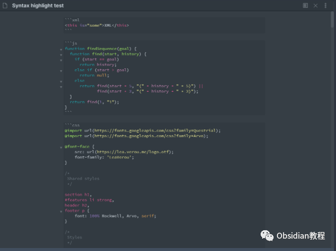
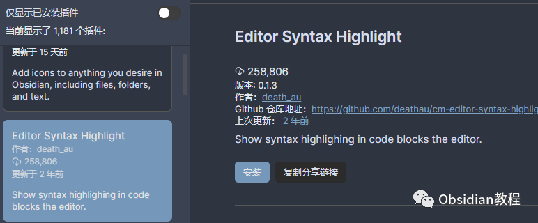

# Obsidian插件:Editor Syntax Highlight为代码块提供语法高亮

### 点击下方公众号，回复关键字：**Obsidian** ，获取Obsidian资料合集。

当你沉浸于Obsidian的神秘世界，你将逐渐发现，它不仅仅是一个笔记应用，更是一个强大的个人知识管理工具。它的强大在于其无限的定制性和丰富的插件生态。  
今天，我们要探讨的是一款名为"Editor Syntax Highlight"的插件，它为Obsidian的编辑器带来了色彩斑斓的代码高亮功能。

###  1**介绍**   

Editor Syntax Highlight插件，顾名思义，它的核心功能就是为Obsidian的代码块提供语法高亮。不管你是一个程序员，还是喜欢在笔记中嵌入各种代码片段的创作者，这个插件都能大大提升你的编写和阅读体验。  
通过使用来自CodeMirror的语法高亮模式，这款插件使得你的代码不再是单调乏味的黑白文字，而是色彩丰富、清晰易读的艺术品。  

###   
2**功能**   

  * 丰富的语法高亮模式：插件支持多种编程语言的语法高亮，无论是Python、JavaScript还是YAML，都能得心应手。
  * 夜间模式支持：对于喜欢深色主题的用户，插件提供了Yonce主题，保证了在夜间模式下的优秀阅读体验。

  

### 3**下载与安装**   

### **在线安装**（需要科学上网） ：****

####   

#### 通过Obsidian安装：

  

  * 打开Obsidian，进入Settings（设置）。
  * 选择Third-party plugin（第三方插件），确保Safe mode（安全模式）已关闭。
  * 在搜索框中输入"Syntax Highlight"，找到Editor Syntax Highlight插件并点击Install。
  * 安装完毕后，关闭社区插件窗口，回到Third-party plugin页面，找到Editor Syntax Highlight插件并启用它。

  
**2.离线安装：****  
****因为网络原因很多同学无法直接在线安装obsidian插件，这里我已经把obsidian所有热门插件下载好了**  
只需要关注下方公众号，后台回复：**插件** 即可获取**注意事项**  
兼容性：插件仅适用于Obsidian v0.9.7及更高版本。  

### 4**结语**   

Editor Syntax Highlight插件为Obsidian的用户提供了一个视觉享受和高效编写的可能。  
它的出现让Obsidian不仅仅是一个黑白的文本编辑器，而是一个色彩缤纷的创作舞台。通过简单的安装过程，你就可以拥有这样一个强大的工具，为你的编码和创作之路增色不少。在代码的世界里，让我们不再单调乏味，而是多姿多彩！  
  
  
1**扫码购买****《 Obsidian实战教程》****从入门到精通， 链接您的每一个思维瞬间。****  
**  
往 期精彩[1.Obsidian插件:Iconize让你的知识库焕发新生](http://mp.weixin.qq.com/s?__biz=MzkyMDUyMDM2Mg==&mid=2247484062&idx=1&sn=2328ba9b58e7e5ef792c47c98e64d9be&chksm=c190d15bf6e7584dff17010e5dbaa69e4efe28f25a4c73c1ba67826de2a16c135854e60fd5b4&scene=21#wechat_redirect)  
[2.Obsidian插件:Sliding Panes使Obsidian用户界面焕然一新](http://mp.weixin.qq.com/s?__biz=MzkyMDUyMDM2Mg==&mid=2247484039&idx=1&sn=6e5179d2ab14e910b51cf6f0620e66a6&chksm=c190d142f6e75854221bbb18c231f9e1fdcccf00f0e6f50c366fecdaeea56ab99fad0006c87b&scene=21#wechat_redirect)  
[3.Obsidian插件:用QuickAdd插件快速打造你的Obsidian知识宝库](http://mp.weixin.qq.com/s?__biz=MzkyMDUyMDM2Mg==&mid=2247484028&idx=1&sn=e4785ef095bf1ea63d156b71273a689e&chksm=c190d1b9f6e758afc5d4db1839579512a70d4e22864e3b2eabf1069178649bc02b1edf2d1849&scene=21#wechat_redirect)

点分享

点点赞

点在看
