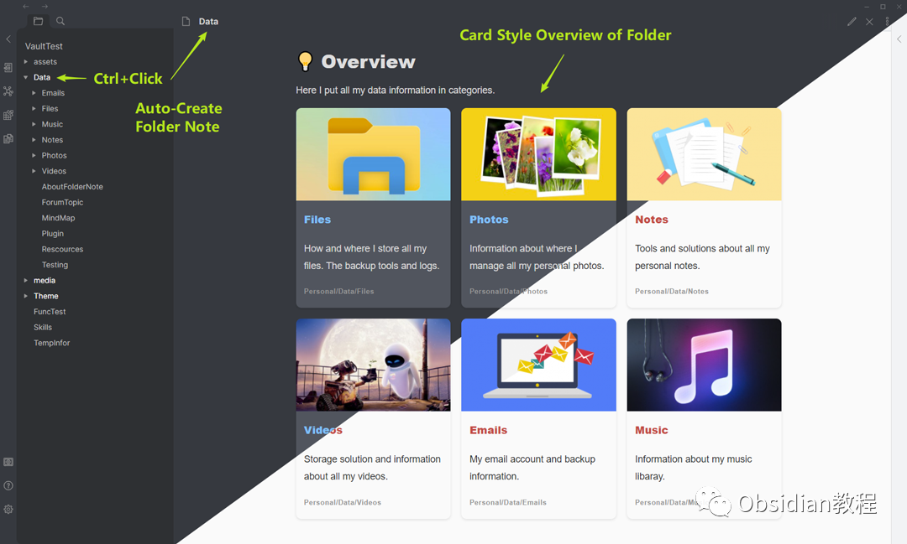
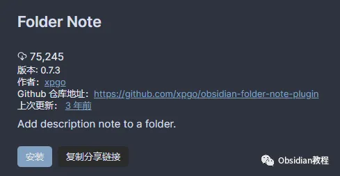
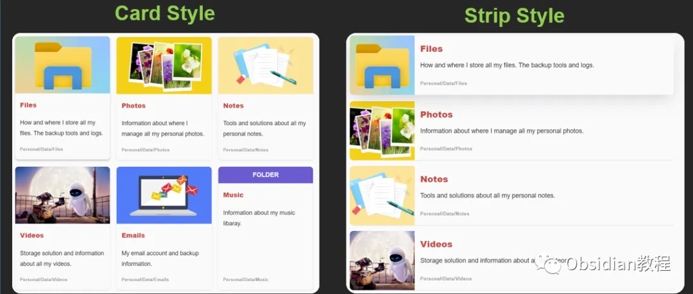

# Obsidian插件Folder Note：轻松打造层级化笔记系统

嗨，大家好，我是何老师。最近，我发现了一个叫做Obsidian的插件——Folder Note。这个插件可以说是Obsidian的锦上添花，让笔记的管理从一堆文件变成了真正有层次的笔记系统，听起来是不是很高大上？别急，今天我就来跟大家聊聊这个插件的强大功能和使用技巧。

**Obsidian是什么？**

  

如果你还不知道Obsidian是什么，那我只能说，你可能错过了一个让你从笔记小白变成笔记高手的机会。Obsidian是一款基于Markdown的笔记软件，它最大的特点就是自由度高、扩展性强，而且能够通过各种插件满足你的奇奇怪怪的需求。

  

对我来说，Obsidian已经从一款笔记软件升级成了我的第二大脑，几乎每天都要用它来记录各种灵感和工作笔记。

  

**Folder Note插件到底能干啥？**

  

Folder Note插件给Obsidian的文件夹加上了“笔记”这个功能。想象一下，你有一个文件夹，里面存了好几十个项目文档，每次都要一个个点开来看才能找到你要的东西，是不是很麻烦？

  

而有了Folder Note插件，你可以直接给这个文件夹附上一个笔记，这个笔记不仅可以总结文件夹的内容，还可以通过各种卡片视图，直观地展示出来，让你轻轻松松找到你要的东西。

  

**插件的主要特点**

  

**1.显示和管理文件夹笔记：** 只要点击文件夹，就能直接访问或删除对应的笔记。就像按一下按钮，魔法般地让所有重要信息都呈现在眼前。

**2.三种不同的文件夹笔记方法：** Inside-Folder（文件夹内部）、Outside-Folder（文件夹外部）和Index-File（索引文件）。这种灵活性简直是强迫症的福音，想怎么放就怎么放，满足你对整理的各种苛求。

**3.自动同步文件夹和笔记名称：** 再也不用担心文件夹和笔记名称不一致了，Folder Note插件会自动帮你搞定。

**4.自定义初始内容：** 你可以用一些特定关键字（如{{FOLDER_NAME}}）来配置新文件夹笔记的初始内容，省去了每次手动输入的麻烦。

  

**如何安装和配置？**

  

先别急着问这插件怎么用，先搞定安装。

  

**1.在线安装：** 只要在Obsidian的“社区插件”里搜索“Folder Note”，点一下“安装”，再启用，搞定。

  

启用插件：安装成功后，点击“启用”以启用插件。

### **2.离线安装：**  
**很多同学无法直接在线安装obsidian插件，这里我已经把obsidian所有热门插件下载好了**  
只需要关注下方公众号，后台回复：**插件** 即可获取

安装好了之后，记得去设置面板里配置一下笔记文件方法、文件名和初始模板。Obsidian的配置虽然多，但是灵活性也高，完全能满足你对个性化的追求。

  

**插件功能和使用技巧**

  

说到插件功能，这可是Folder Note的核心。它不仅能让你创建和管理文件夹笔记，还能用卡片和条形样式视图来优雅地展示文件夹内容。

  

**添加描述性笔记：** 按住CTRL，点击一个文件夹，直接就能添加描述性笔记。每个文件夹就像一本书的封面，你可以在上面写上这个文件夹的主要内容，让你一目了然。

  

**显示和删除笔记：** 想看笔记？点击文件夹就行。想删除笔记？直接删掉对应的笔记文件，分分钟搞定。

  

**文件夹笔记的三种方法**  

  

**1\. Inside-Folder：** 笔记放在文件夹里面，和其他文件打成一片，适合那种喜欢整洁的朋友。

****

**2\. Outside-Folder：** 笔记放在文件夹外面，独立成章，方便独立查看。

**3\. Index-File：** 使用特定的索引文件作为文件夹的描述性笔记，特别适合那些项目文档一大堆的情况。

  

**使用技巧**

  

这个插件还支持通过ccard代码块生成文件夹内容的概览视图，不仅好看，还实用。你可以在设置页面的初始文件夹笔记模板中预设ccard代码块，或者用关键字（如{{FOLDER_BRIEF}}）生成代码块，这样一来，每个文件夹都能有一个漂亮的概览视图。

  

**插件的优点和局限性**

  

Folder Note的优点就是让文件夹管理变得更加直观和高效，特别是当你有大量文件和笔记的时候，这种优雅的展示方式简直救命。

  

想象一下，你的笔记本里有几十个文件夹，每个文件夹下都是密密麻麻的文件，有了Folder Note，你能轻松浏览这些文件夹的内容，根本不用点开每个文件逐一查看。

  

不过，插件也有点小小的局限性，比如文件夹笔记可能会在创建时显示出来，需要再次点击才能隐藏。但这并不影响它的整体表现，毕竟没有什么东西是完美的。

  

**结语**

****  

总的来说，Folder Note插件确实是Obsidian的一个强力补充，特别适合那些需要组织大量笔记或者项目的用户。它不仅提升了文件夹管理的效率，还增加了可视化的程度，让你的笔记系统看起来更直观、更有条理。

  

对我来说，这个插件已经成为了Obsidian中不可或缺的一部分，让我在管理笔记时省了不少心。如果你还没试过这个插件，强烈推荐你安装一个试试，可能你会发现，管理笔记其实也可以变得这么有趣和简单。

  

你们怎么看？欢迎大家在评论区讨论交流。

### 

# **  
**

# **Obsidian交流社群来了**

[**我们搞了一个专门分享笔记工具的社群：**](http://mp.weixin.qq.com/s?__biz=MzkyMDUyMDM2Mg==&mid=2247485997&idx=1&sn=9a528871be62e4c74a1df3807b28f2bd&chksm=c190d9e8f6e750fe9df7a333b666fdd8561fdeb928d1df1f367d2374742efa34727a3f91cbc0&scene=21#wechat_redirect)****[**玩转效率笔记**](http://mp.weixin.qq.com/s?__biz=MzkyMDUyMDM2Mg==&mid=2247485997&idx=1&sn=9a528871be62e4c74a1df3807b28f2bd&chksm=c190d9e8f6e750fe9df7a333b666fdd8561fdeb928d1df1f367d2374742efa34727a3f91cbc0&scene=21#wechat_redirect)，社群的主要内容包括**使用技巧、模板主题和插件** 等，帮助更多人提升效率，实现自我管理的目标。  
如果你对Notion、Obsidian有热情、对知识有渴望，这个社群绝对不容错过！
