# Obsidian插件:Iconize让你的知识库焕发新生

### 点击下方公众号，回复关键字：**Obsidian** ，获取Obsidian资料合集。

  

Obsidian，作为一款优秀的个人知识管理工具，拥有着广泛的用户群和活跃的开发社区。而在众多为Obsidian量身打造的插件中，Iconize无疑是让你的知识库焕发新生的利器。

这款插件允许你为文件和文件夹定制独特的图标，使得你的知识库在美观的同时，也更加直观和组织化。  
  

### 1**功能简介**   

Iconize插件的核心功能可以概括为三点：图标定制、图标继承和图标自动应用。你不仅可以为你的文件和文件夹选择心仪的图标，还可以设定某个文件夹的继承图标，使得新创建的文件自动继承该图标。  
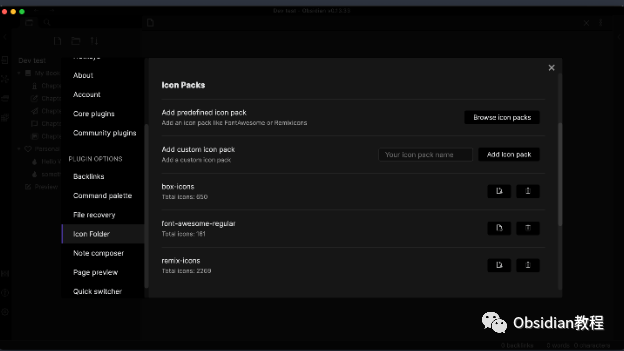  
更为强大的是，你可以通过设定规则，使得特定条件的文件或文件夹自动应用指定的图标。  
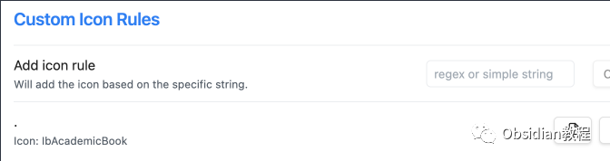  

#### **图标定制**

  
图标包支持：Iconize插件支持多种图标包，包括Remixicon、Fontawesome、IconBrew、SimpleIcons和LucideIcons。  

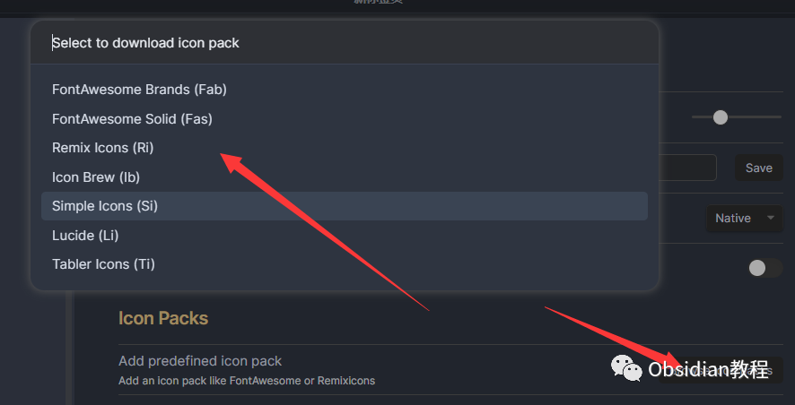

你可以轻松下载预设的图标包，也可以上传自定义的SVG图标，打造专属于你的图标集合。  

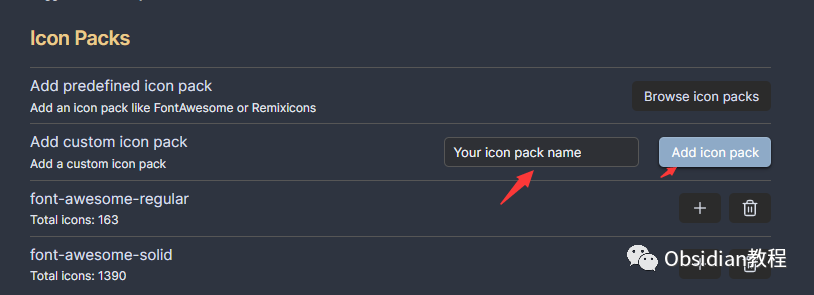

图标样式调整：你可以为所有图标统一设置边距、颜色和大小，保持图标的协调和美观。  

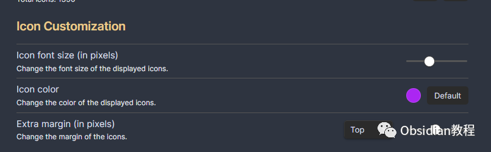

#### **图标继承**

  
当你设定了某个文件夹的继承图标后，该文件夹内所有文件都会自动应用这个图标，新创建的文件同样如此，省去了你手动设置的麻烦。  

#### **图标自动应用**

  
通过简单的规则设定，你可以使得满足特定条件的文件或文件夹自动应用指定图标。例如，你可以设定所有标题含有“会议记录”的文件自动应用一个会议图标，使得你能在第一时间识别出相关文件。

###  2**下载与安装**   

### **在线安装**（需要科学上网） ：****

  

  * 打开Obsidian，点击左下角的设置图标，进入“设置”页面。
  * 在左侧菜单中找到“第三方插件”并点击，再点击右侧的“浏览”按钮。
  * 在弹出的插件市场中搜索“Iconize”，找到Iconize插件并点击“安装”。
  * 安装完成后，回到“第三方插件”页面，找到Iconize插件，并将其旁边的开关打开，启用插件。

  
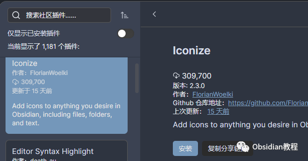  
**2.离线安装：****  
****因为网络原因很多同学无法直接在线安装obsidian插件，这里我已经把obsidian所有热门插件下载好了**  
只需要关注下方公众号，后台回复：**插件** 即可获取恭喜你，现在你已经成功安装并启用了Iconize插件，接下来我们将介绍如何使用它来定制你的Obsidian。

###  3**图标定制实操**   

#### **下载与上传图标包**

  
1.下载预设图标包：进入Iconize的设置页面，你可以看到几个预设的图标包，点击你喜欢的图标包，然后点击“下载”按钮，图标包会自动下载并应用到你的Obsidian中。  

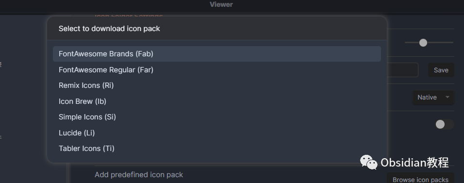

2.上传自定义图标：在Iconize的设置页面，点击“上传图标”按钮，选择你的SVG图标文件并上传。上传完成后，你的自定义图标会出现在图标列表中，随时可供你选择和使用。

####   

#### **为文件和文件夹设置图标**

  
在Obsidian的文件浏览器中，找到你想要设置图标的文件或文件夹，右键点击它。  
在弹出的菜单中选择“更改图标”（Change Icon），接着在弹出的图标选择器中挑选你喜欢的图标并点击，图标将立即应用到你选择的文件或文件夹上。  

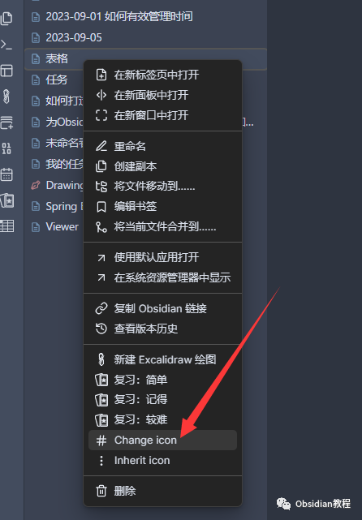

#### 

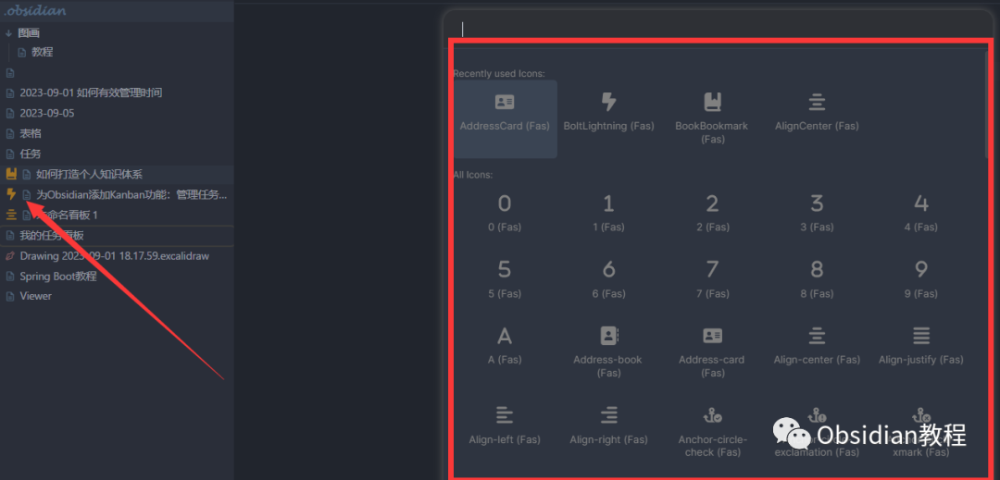

#### **删除图标**

  
如果你想要删除某个文件或文件夹的图标，只需右键点击它，然后在弹出的菜单中选择“删除图标”（Delete Icon），图标将被移除。  

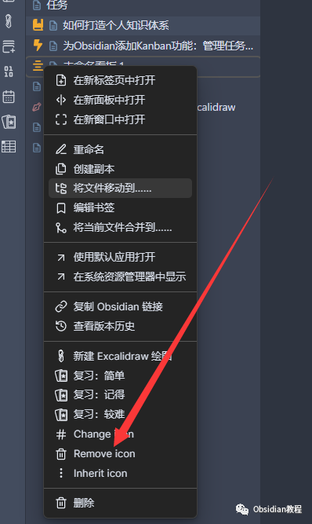

###  4**图标继承与自动应用**   

#### **设定图标继承**

  
1.右键点击你想要设置图标继承的文件夹。2.在弹出的菜单中选择“继承图标”（Inherit icon），接着在弹出的图标选择器中挑选你喜欢的图标并点击，现在，该文件夹内的所有文件将自动应用这个图标。  

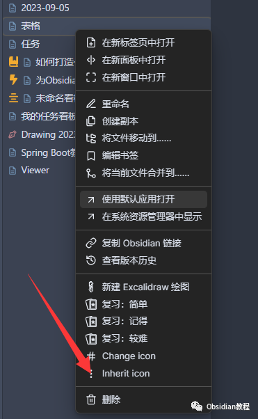

#### **设定图标自动应用规则**

  
1.进入Iconize的设置页面，滚动到“自定义规则”部分。2.点击“添加规则”按钮，然后在弹出的窗口中设定你的规则和对应的图标。你可以通过正则表达式或简单的字符串比较来设定规则。3.点击“保存”按钮，现在满足这个规则的文件或文件夹将自动应用指定的图标。

### 

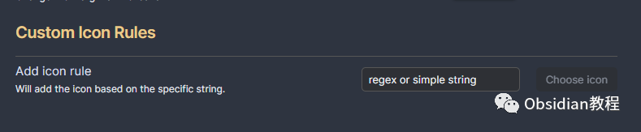

  

5**注意事项与小贴士**   

1.图标同步问题：如果你在使用Obsidian的同步功能时遇到了图标同步问题，你可以尝试将图标包路径更改为.obsidian/icons，并检查你的同步设置，确保图标文件被正确同步到其他设备。  
2.使用Twemoji为文件夹设置emoji图标：Iconize插件还支持使用Twemoji库为你的文件夹设置emoji图标。只需右键点击文件夹，选择“更改图标”，然后按照提示打开你的操作系统特定的emoji对话框，选择你喜欢的emoji并应用。

###  6**结语**   

现在你应该掌握了如何使用Iconize插件来为你的Obsidian知识库添加独特的个性化元素。  
每个图标都是你知识组织的细微体现，也是你对知识管理美好追求的象征。现在就开始你的图标定制之旅，让你的Obsidian变得与众不同，为你的知识管理带来无限可能！  
  
  
1**扫码购买****《 Obsidian实战教程》****从入门到精通， 链接您的每一个思维瞬间。****  
**  
往 期精彩[1.Obsidian插件:Sliding Panes使Obsidian用户界面焕然一新](http://mp.weixin.qq.com/s?__biz=MzkyMDUyMDM2Mg==&mid=2247484039&idx=1&sn=6e5179d2ab14e910b51cf6f0620e66a6&chksm=c190d142f6e75854221bbb18c231f9e1fdcccf00f0e6f50c366fecdaeea56ab99fad0006c87b&scene=21#wechat_redirect)  
[2.Obsidian插件:用QuickAdd插件快速打造你的Obsidian知识宝库](http://mp.weixin.qq.com/s?__biz=MzkyMDUyMDM2Mg==&mid=2247484028&idx=1&sn=e4785ef095bf1ea63d156b71273a689e&chksm=c190d1b9f6e758afc5d4db1839579512a70d4e22864e3b2eabf1069178649bc02b1edf2d1849&scene=21#wechat_redirect)  
[3.Obsidian插件:Style Settings调整某个特定主题的部分样式](http://mp.weixin.qq.com/s?__biz=MzkyMDUyMDM2Mg==&mid=2247484016&idx=1&sn=8d2293151cd2f31784f5cc32b99f039e&chksm=c190d1b5f6e758a3b10880a0c9332c22675882eae00d865b1d3ede3eb97cea390e6444c80080&scene=21#wechat_redirect)  

点分享

点点赞

点在看
