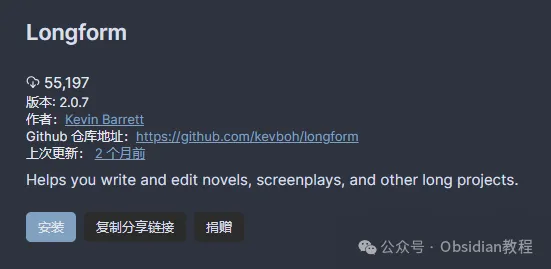
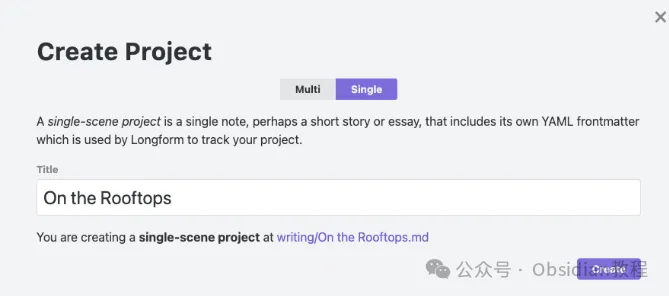
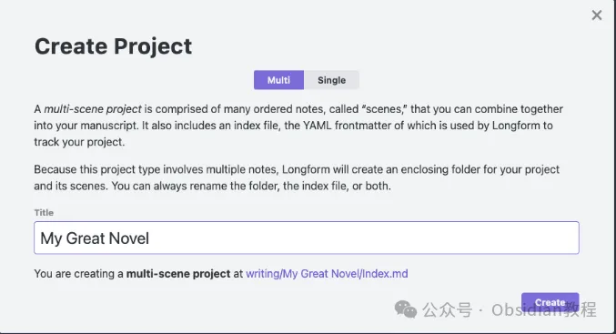

# Obsidian插件Longform：专为长篇创作设计的写作助手

嗨，大家好，我是何老师。

  

今天要给大家介绍的是Obsidian中的一个非常实用的写作插件——Longform。

  

如果你是一个喜欢写小说、剧本或者其他长篇作品的创作者，那么这个插件可以说是为你量身定制的。对于那些以Obsidian为创作平台的作者们来说，Longform插件提供了一个更加系统化的创作环境，它不仅能够帮助你组织复杂的故事结构，还能高效管理你的写作流程，让创作变得更加条理清晰。

  

## **Longform的主要功能：专注于长篇写作的创作工具  
  
**

Longform插件的设计目标非常明确，就是为大型项目提供一个集成管理和创作的平台。在使用Longform的过程中，你会发现它为每个项目都提供了一个专门的侧边栏，可以用来管理场景列表、显示项目进度，并且支持多种写作模式和自定义工作流。

  

无论是写小说、剧本，还是学术论文，你都可以轻松地用Longform来规划和组织这些内容，让你的思路井井有条。  
  

### **1\. 场景管理与重排序  
  
**

Longform允许你将整个长篇作品分解成一个个独立的“场景”（Scenarios）或者“章节”，然后通过拖放的方式进行排列和嵌套。这种灵活的结构管理让你可以根据故事的节奏自由调整章节顺序，而不会影响到整体内容的连贯性。

  

更棒的是，每个场景都可以单独设置字数目标和进度，这样你能够时刻掌握自己在哪个部分还有未完成的内容。  
  

### **2\. 写作目标与字数统计  
  
**

长篇创作最重要的就是目标感，而Longform非常贴心地为每个项目设置了专门的写作目标管理功能。你可以为整篇作品、每个场景、甚至每天的写作时间设定具体的字数目标，并且插件会在侧边栏中显示实时进度。

  

这种方式让你能够保持创作的专注度，从而更好地把握整体进展。同时，插件还能自动统计每个项目的字数，帮助你了解项目规模，以便更好地规划和调整内容。  
  

### **3\. 项目索引与草稿管理  
  
**

Longform为每个项目创建了专属的“索引文件”，它相当于你的整个手稿的“总目录”。通过索引文件，你能够一目了然地看到所有场景的排列顺序、各场景的字数以及写作状态。  
  
每个项目还支持创建多个草稿版本，这就像在同一标题下有多个不同的文档，方便你对比不同的写作思路或者修订前后的变化。这种多版本管理的功能在小说创作、剧本修改或是论文撰写时特别有用。  
  

## **安装与配置：快速上手Longform  
  
**

### **1\. 在线安装**  
  

Longform插件可以通过Obsidian社区插件浏览器直接安装。只需要在“社区插件”页面中搜索“Longform”并点击安装，然后在插件列表中启用即可。这种方式适合大多数网络通畅的用户。  
  

### **2\. 离线安装**  
  

对于那些网络不太稳定的用户，你可以选择离线安装的方式。找到Longform插件的离线安装包，然后手动将插件文件复制到Obsidian的插件目录中。安装完成后，在插件设置中启用Longform，并进行简单的配置，就可以开始使用了。  
  

  
  

### **很多同学无法直接在线安装obsidian插件，这里我已经把obsidian所有热门插件下载好了**  
只需要关注下方公众号，后台回复：**插件** 即可获取

## **如何开始使用Longform进行创作  
  
**

Longform的使用方式非常灵活，但要最大化地利用其功能，你需要按照以下步骤进行设置和组织：  
  

### **1\. 创建长篇项目**  
  

  * 在Obsidian的库中创建一个新的文件夹，并右击选择“创建Longform项目”。

  * 在弹出的窗口中，选择“多场景项目类型”，并为你的长篇作品输入一个合适的标题。

  * 创建完成后，Longform会自动生成一个索引文件和项目结构，你可以在其中自由添加和重排序场景。  
  

### **2\. 编写短篇故事**  
  

如果你只是想写一个短篇故事，Longform同样能够胜任。在创建项目时，只需选择“单场景项目类型”。这样，Longform会自动创建一个只有一个场景的项目，适合用来写作较短的文本或文章。  
  

  
  

### **3\. 调整项目结构**  
  

在开始写作之前，你可以通过Longform的侧边栏为每个场景设置标题、标签和写作目标。你可以随时通过拖动场景来调整它们的顺序，并通过缩进/取消缩进来管理场景的嵌套结构。  
  
  

## **  
高效编译与手稿输出  
  
**

Longform的另一个亮点在于它的编译功能。你可以通过“编译”选项将多个场景整合成一个完整的手稿，并自定义编译选项，例如是否包含某些章节、是否按照特定格式输出等。

  

这种基于工作流的编译工具非常适合用来生成最终的手稿、打印稿或者提交的PDF格式文件。即使你只是写一个简短的项目，也能利用编译功能轻松生成可供分享和审阅的文档。  
  

## **场景样式与自定义工作流  
  
**

Longform允许用户通过添加特定的CSS片段来自定义写作环境，使每个场景或项目都有独特的样式。这种设置可以让你在不同的写作模式下获得更好的视觉体验，比如用特定颜色标记某些场景，或者为每个章节添加特定的装饰符号等。

  

此外，你还可以利用Longform的“预代码块”和“后代码块”功能，在每个场景的开头或结尾自动插入一些自定义内容，比如引言、注释或总结段落，提升写作的效率和组织性。  
  

## **使用Longform时的小贴士  
  
**

  1. **定期备份索引文件：** Longform的项目索引文件是整个项目的核心，虽然它通常不会改变原笔记的内容，但为了防止意外情况，建议定期备份。  
  

  2. **自定义模版：** Longform支持多种模版，可以根据你的写作风格创建不同的场景或项目模版，这样在创建新场景时，就不需要重复输入相同的格式了。  
  

  3. **利用写作目标保持专注：** 合理设定每日写作目标，并且定时查看自己的进度，这样能够帮助你在创作长篇作品时保持专注，避免中途丢失动力。  
  

## **结语  
  
**

Longform插件通过精心设计的项目管理和创作工具，让Obsidian变得更加适合长篇创作。无论是小说、剧本，还是任何需要精心组织的大型文档项目，它都能够为你提供高效的管理和编写支持。  
  
如果你还在为如何在Obsidian中管理复杂的长篇创作而烦恼，那么不妨试试Longform插件，它或许能成为你创作路上的得力助手。

  

# **Obsidian交流社群来了**

[**我们搞了一个专门分享Obsidian的交流社群：****玩转效率笔记****社群的主要内容包括使用技巧、模板主题和插件等，** 帮助更多人提升效率，实现自我管理的目标。](http://mp.weixin.qq.com/s?__biz=MzkyMDUyMDM2Mg==&mid=2247485997&idx=1&sn=9a528871be62e4c74a1df3807b28f2bd&chksm=c190d9e8f6e750fe9df7a333b666fdd8561fdeb928d1df1f367d2374742efa34727a3f91cbc0&scene=21#wechat_redirect)

  
如果你对Obsidian有热情，这个社群绝对不容错过！
