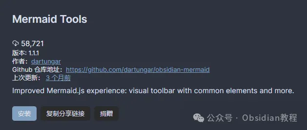
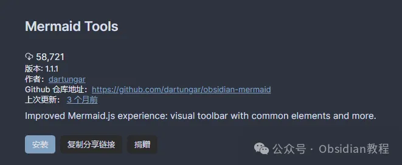
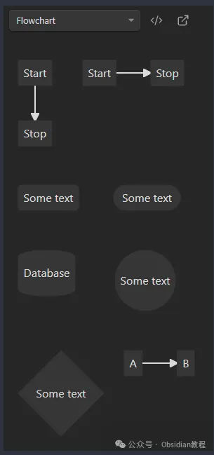
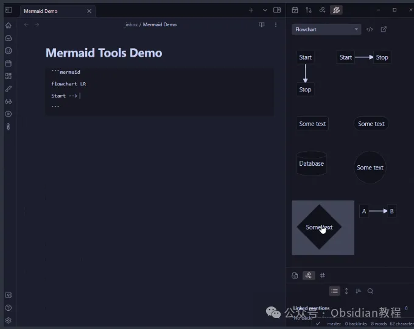
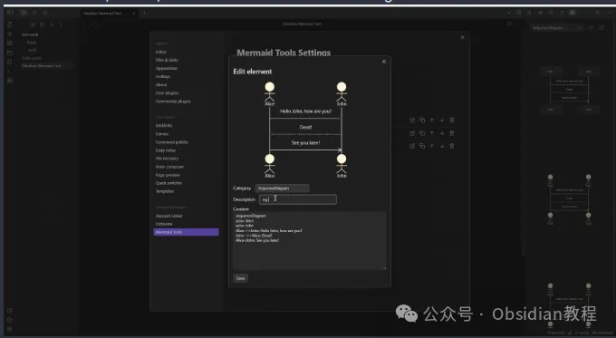

# Obsidian插件Mermaid Tools：图表创作的高效助手

嗨，大家好，我是何老师。  
今天我们来聊聊Obsidian的插件——Mermaid Tools。  
很多做知识管理的小伙伴应该都听说过Mermaid这个名字，这货可是一个生成图表的神器，能帮你用简单的文本描述生成各种复杂的流程图、时序图、甘特图等等，简直是笔记中的“图表小能手”。  
而今天我们要讲的这个“Mermaid Tools”插件，则是在Obsidian上为Mermaid图表添加了一个图形化操作界面，让你不用每次都盯着代码看，把图表元素一个个手动敲出来。这种操作方式对于那些不熟悉Mermaid语法的新手来说，简直就是一个救星。  
  

## **Mermaid.js：用文本创造图表的魔法  
  
**

首先，我们来简单了解一下Mermaid这个工具。Mermaid.js是一个开源的图表生成库，它允许用户用纯文本描述来创建各种图表。  
举个例子：如果你写一段简单的Mermaid代码，比如“Start --> Stop”，它就能自动渲染出一个从“开始”到“停止”的流程图。对于那些希望能通过代码快速生成可视化图形的技术人员、程序员来说，Mermaid是个非常好用的工具。  
  
  
而在Obsidian这款本地笔记软件中，Mermaid被内置作为一种默认支持的图表语言，你只需要在笔记中插入mermaid代码块，就能使用Mermaid语法来创建各种图表，无需额外配置或安装插件。  
这点对于Obsidian用户来说无疑是个巨大优势，因为你可以直接在笔记中集成图表，而不需要切换到第三方工具进行制作。  
  

## **Mermaid Tools：让图表创作变得简单  
  
**

尽管Mermaid内置在Obsidian中，但Mermaid Tools插件让这件事变得更加轻松。想象一下，当你需要绘制复杂的流程图或时序图时，你得记住大量的Mermaid语法，这对于很多人来说就像在做语法考试。  
而这个插件则提供了一个图形化的工具栏，你只需要点击工具栏中的图表元素，它就会把相应的代码片段自动填充到你的笔记中，你只要调整一下文本描述，就能轻松生成复杂的图表。  

### **插件安装指南  
  
**

想要安装Mermaid Tools插件也很简单，分为两种方式：  
  

  1. 在线安装：在Obsidian的“社区插件”中，搜索“Mermaid Tools”并点击安装，然后启用插件即可使用。  
  

  2. 离线安装：如果你处于网络不太方便的情况下，也可以手动下载安装插件。通过关注相关公众号获取离线安装包，解压后放入Obsidian插件目录，重新启动Obsidian后，在设置中启用即可。  
  

### **很多同学无法直接在线安装obsidian插件，这里我已经把obsidian所有热门插件下载好了**  
只需要关注下方公众号，后台回复：**插件** 即可获取  
  
无论哪种安装方式，一旦成功配置，Mermaid Tools就能为你提供强大的图表创作功能了。

### **  
Mermaid Tools的亮点：快捷操作栏  
  
**

Mermaid Tools插件的最大亮点在于它的快捷操作栏。你只需要点击插件图标，或使用命令“Mermaid: Open Toolbar View”，就能打开这个包含常见Mermaid元素的工具栏。无论是流程图、时序图还是甘特图，所有的元素一目了然。你只需要点击需要的图形元素，就能自动把它添加到你的笔记中，省去了手动输入代码的麻烦。  
  
更方便的是，插件还允许你自定义工具栏中的图形元素。你可以在设置页面中新增、删除、编辑和重新排序这些图形模板。这种自定义功能能帮你根据自己的需求去调整图表元素，让你的工具栏更加符合个人的使用习惯。  
  

### **  
实用演示：入门的最佳选择  
  
**

为了帮助用户更好地理解和使用Mermaid工具插件，插件自带了一个小演示功能。点击工具栏中的“演示”按钮，你就能看到一个完整的演示图表，它展示了如何使用工具栏创建不同类型的图表。这对于初学者来说简直太贴心了。即便你对Mermaid语法一窍不通，也可以通过这个演示了解如何一步步创建出自己的图表。  
  

### **  
优势与应用场景  
  
**

Mermaid Tools的最大优势在于它降低了学习曲线，提升了效率。对于那些想要通过Obsidian管理复杂信息和知识体系的人来说，能快速生成各种可视化图表是个很有吸引力的功能。比如，在设计产品架构时，你可以用Mermaid来生成流程图；在项目管理时，利用甘特图来展示任务进度；在记录研究成果时，用时序图来整理实验数据的变化过程。  
  
  
除此之外，Mermaid Tools插件对团队协作也有很大的帮助。它让你能够用清晰的图表展示笔记内容，方便团队成员快速理解项目的进展情况，而不必一行一行地去阅读文字描述。  
  

### **插件开发者的承诺与未来  
  
**

Mermaid Tools的开发者团队也在不断改进插件功能，最近的更新增加了图形管理和自定义的能力。这意味着，未来你可以期待更多的图表元素、更加灵活的布局方式，以及更人性化的交互体验。对于那些需要频繁使用图表的人来说，这无疑是个好消息。  
  
总之，Mermaid Tools插件为Obsidian用户提供了一个非常高效的图表创作工具，它极大地提升了Mermaid图表的使用体验。即便你是Mermaid的新手，这个插件也能帮助你快速上手。在未来，随着插件功能的不断完善，Mermaid Tools有望成为Obsidian图表创作中的核心工具之一。  
  

### **使用感受  
  
**

何老师作为一个重度Obsidian用户，试用过Mermaid Tools之后，感觉真是省了不少事。以前我需要手动写每个节点的代码，调试各种连线和布局，现在只需点几下工具栏，所有的基础图表都能快速生成，而且还能在工具栏里添加我常用的图形模板，简直就是“偷懒神器”。  
总的来说，这个插件特别适合那些需要频繁制作图表的人，强烈推荐！希望未来能看到它支持更多样化的图表类型和更强大的交互功能，让Obsidian的可视化能力更上一层楼。

# **Obsidian交流社群来了**

[**我们搞了一个专门分享Obsidian的交流社群：****玩转效率笔记****社群的主要内容包括使用技巧、模板主题和插件等，** 帮助更多人提升效率，实现自我管理的目标。](http://mp.weixin.qq.com/s?__biz=MzkyMDUyMDM2Mg==&mid=2247485997&idx=1&sn=9a528871be62e4c74a1df3807b28f2bd&chksm=c190d9e8f6e750fe9df7a333b666fdd8561fdeb928d1df1f367d2374742efa34727a3f91cbc0&scene=21#wechat_redirect)

  
如果你对Obsidian有热情，这个社群绝对不容错过！
