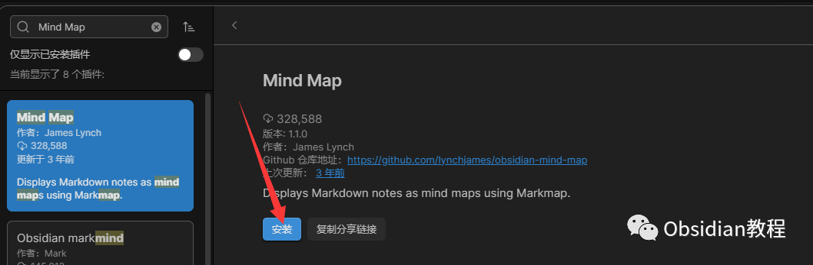
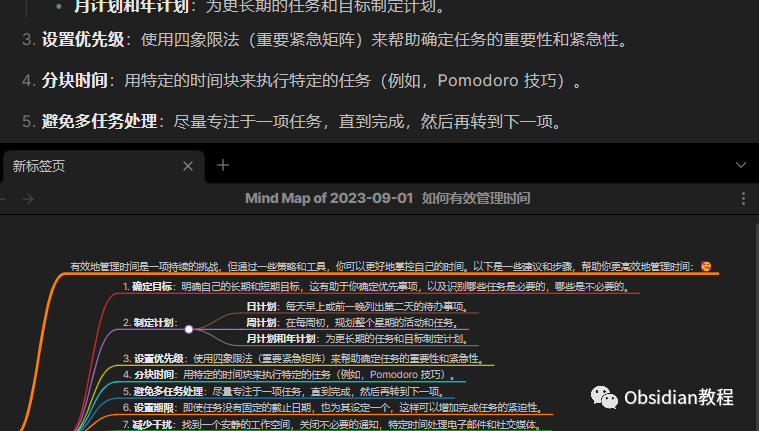
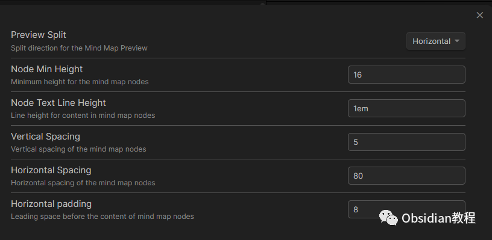

# Obsidian插件:Mind Map - 将你的笔记转化为思维导图

### 点击下方公众号，回复关键字：**Obsidian** ，获取Obsidian资料合集。

  
Mind Map（思维导图）插件是为那些喜欢使用Obsidian应用的用户提供的一个强大工具，它可以将传统的文本笔记转化为动态的、可视化的思维导图。  

### **核心特点：**

  

  * **可视化内容：** 插件能够将Markdown格式的笔记转化为图形化的思维导图，使你的内容、思维和结构变得更加直观。
  * **动态互动：** 在思维导图中，你可以轻松地拖动、放大、缩小或点击节点以展开和折叠其子节点，为用户提供了一种互动式的方式来浏览内容。
  * **Markdown支持：** 该插件能够识别并正确呈现Markdown格式，这意味着标题、子标题、列表和链接都会被转化为思维导图的不同节点和子节点。
  * **笔记间链接：** 在Obsidian中，用户可以在笔记之间创建链接。在Mind Map插件中，这些链接被可视化为节点之间的连接，从而使得不同笔记之间的关系一目了然。
  * **自定义外观：** 用户可以根据自己的喜好来调整思维导图的外观，包括节点颜色、线条样式、字体大小等。

###   

### **为何使用Mind Map插件：**

**  
**

  * **结构化思考：** 思维导图提供了一个清晰、直观的方式来组织和呈现信息，有助于用户捕捉和理解复杂的思维和概念。
  * **灵活的笔记方法：** 与传统的线性笔记方法不同，思维导图提供了一个更加灵活的方式来捕捉、组织和链接信息。
  * **强化Obsidian功能：** 对于已经在使用Obsidian的用户，该插件进一步强化了应用的功能，使其成为一个多功能的笔记和思维导图工具。

  
总而言之，Mind Map插件为Obsidian用户提供了一个简单而强大的工具，不仅可以帮助他们更好地组织和理解自己的笔记，而且还提供了一个全新的、图形化的方式来查看和探索内容。

###  1**安装Mind Map插件**

  * 打开Obsidian。
  * 在左侧边栏中点击“设置”（通常是一个齿轮图标）。
  * 在设置界面的左侧选择“插件”。
  * 选择“社区插件”选项卡。
  * 在搜索框中输入“Mind Map”。
  * 找到“Mind Map”插件并点击“安装”。
  * 安装完成后，点击“启用”来激活插件。

###  2**创建思维导图**

  * 打开一个已有的笔记或创建一个新的笔记。
  * 在笔记中使用标准的Markdown格式创建内容。例如，你可以使用井号（#）来创建标题，以及其他常规的Markdown语法。
  * 保存笔记。
  * 点击笔记界面右上角的选项菜单（通常是三个点）。
  * 从下拉菜单中选择“显示为思维导图”，如果没有就去快捷键内设置一个快捷键，按快捷键就可以转化为思维导图。
  * 你的笔记将立即转化为一个可视化的思维导图。

  

###   

### **操作和浏览思维导图**

**  
**

  * 缩放：你可以使用鼠标滚轮或触控板手势进行缩放。
  * 拖动：单击并拖动思维导图以查看不同的部分。
  * 点击节点：点击导图上的任何节点可以展开或折叠其子节点。

###   

### **自定义思维导图**

**  
**

  * 打开Obsidian设置，然后导航到“插件”区域。
  * 在已启用的插件列表中找到“Mind Map”并点击其选项。
  * 在此处，你可以更改各种设置，如节点颜色、线条样式、字体大小等，以自定义思维导图的外观。

###   

### **保存和共享思维导图**

**  
**虽然Obsidian默认不提供导出思维导图的功能，但你可以使用屏幕截图工具来捕获导图的图像，然后与他人共享。

###   

### **将其他笔记链接到导图**

###   

### 在你的笔记中，你可以使用标准的Obsidian链接语法（例如[[Note Name]]）来链接其他笔记。这些链接在思维导图中会被表示为链接节点，提供一个直观的方式查看笔记之间的关系。

###  3**总结**   

Obsidian的Mind Map插件为用户提供了一个强大的工具，可以将传统的文本笔记转化为动态的、可视化的思维导图。  
这不仅使得内容组织更为直观，而且也为链接和理解信息提供了新的维度。  
  
  
1点击下方公众号，回复关键字：**Obsidian** ，获取Obsidian资料合集。
