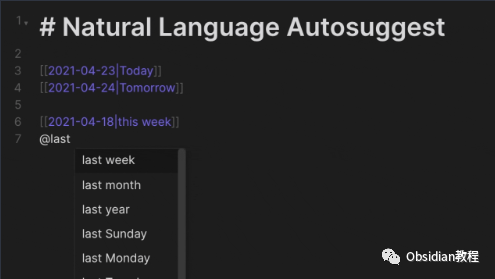
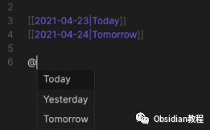
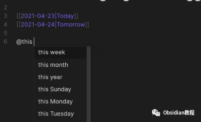
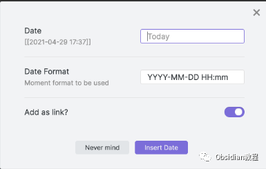
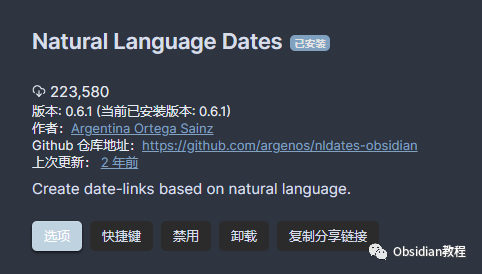
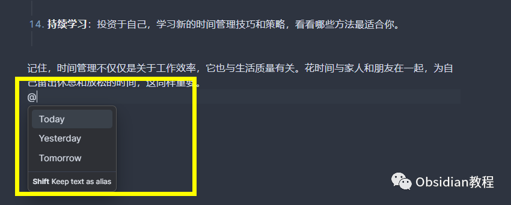
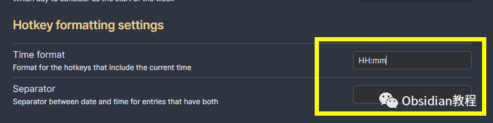

# Obsidian插件:Natural Language Dates 让日期输入不再繁琐：

### 点击下方公众号，回复关键字：**Obsidian** ，获取Obsidian资料合集。

  

在日常的笔记整理和管理中，日期的记录和引用是不可避免的一环。尤其是在使用Obsidian这样强大的笔记应用时，一个可以实现自然语言日期输入的插件将极大地提升我们的效率。

  

这里要介绍的，就是“Natural Language Dates”插件，它以自然语言为桥梁，让日期输入变得前所未有的简单和直观。

  

1**插件的主要功能与特点**

###   

### **1\. 日期自动建议 (Date Autosuggest):**

  

这个功能允许我们在编辑器视图中直接以自然语言的方式输入日期。

  

举个例子，我们只需输入“@today”并按下Enter键，它就会自动扩展为当前的日期。

  

如果想保留输入的文本作为别名，只需同时按下Shift键即可

  

例如“@today”会变成“[[202112-27|today]]”。

  

这种自动提示功能，极大的简化了日期输入的操作，让我们能更加专注于笔记的内容。

  

  

### **2\. 自定义 nldates Obsidian URI:**

  

通过这个功能，我们可以利用Obsidian的URI直接打开特定的日常笔记。

  

比如，我们可以通过obsidian://nldates?day=<date here>这样的格式，快速打开对应日期的笔记。当然，空格字符需要适当地进行编码。

  

### **3\. 日期选择器 (Date Picker):**

  

这是一个非常实用的功能，它为我们提供了一个日期选择器菜单，让我们能快速准确地选择特定的日期，避免了手动输入的误差。

  

### **4\. 命令和热键 (Commands and Hotkeys):**

  

插件还为Obsidian添加了一些与日期有关的命令，我们可以为这些命令设置自定义的热键，以便快速执行。例如，我们可以设置一个热键来快速插入当前的日期和时间。

  

### **5\. 丰富的配置选项:**

  

全局开关、触发短语和插入链接的选项，使得我们可以根据个人的喜好和需求来定制这个插件的行为。

2**下载与安装**

  

要使用这个插件，我们首先需要在Obsidian中安装它。安装过程非常简单直接：

### **  
**

### **1.在线安装**（需要科学上网） ：****

  
1.在Obsidian的设置中，找到“第三方插件”选项，点击“社区插件”2.在搜索框中输入“Natural Language Dates”，找到并安装它。3.安装完成后，激活该插件，在成功安装插件后，我们需要对其进行简单的配置，以符合我们的需求。  

**2.离线安装：****  
****因为网络原因很多同学无法直接在线安装obsidian插件，这里我已经把obsidian所有热门插件下载好了**  
只需要关注下方公众号，后台回复：**插件** 即可获取

3**使用方法与示例**

  

这款插件的使用非常直观，基本不需要过多的学习成本。

  

下面是一些常见的使用示例：

  

**日期自动建议:**

  

在任何笔记中，只需输入“@”符号，然后跟上自然语言的日期表述，比如“today”，“tomorrow”，“next Monday”等，插件就会自动识别并替换为标准的日期格式。

**命令与热键:**

  

我们可以设置热键来快速执行插件提供的命令，比如插入当前日期和时间。这样，在需要记录时刻的时候，只需一个快捷操作，就能得到精确的时间记录。

  

**日期选择器:**

  

当我们需要精确指定某个日期时，可以打开日期选择器来选择。这避免了手动输入的麻烦和可能的错误。

  

4**注意事项**

  

**错误处理:**

  

如果插件无法识别输入的日期，它不会创建链接。所以，在使用自然语言输入时，需要确保输入的表述是清晰、准确的。

  

**解析范围:**

  

在使用命令解析自然语言日期时，只应选中日期部分，而不是整个句子。比如，在“Do this thing by tomorrow”这句话中，只应选中“tomorrow”。

  

通过以上的介绍，相信大家已经对“Natural Language Dates”插件有了清晰的了解。它以简单、直观的方式，极大地简化了日期输入和管理的过程，是Obsidian用户的必备插件之一。

  

在实际的使用中，你会发现它带来的便利是无法用言语表述的。所以，如果你还没尝试过这款插件，赶快安装一试吧！

  
  
  
1**扫码购买****《 Obsidian实战教程》****从入门到精通， 链接您的每一个思维瞬间。****  
**  
往 期精彩[1.Obsidian插件:Annotator赋予用户在Obsidian环境中直接打开、阅读和注释PDF与EPUB文件的能力](http://mp.weixin.qq.com/s?__biz=MzkyMDUyMDM2Mg==&mid=2247484119&idx=1&sn=b1491121e681ce684988d100cf588dd0&chksm=c190d112f6e758048455acc822832f8db8750e60becfe3020bfdda9fba175a1e7a00f159a1d5&scene=21#wechat_redirect)  
[2.Obsidian插件: Recent Files追踪最近打开过的文件](http://mp.weixin.qq.com/s?__biz=MzkyMDUyMDM2Mg==&mid=2247484118&idx=1&sn=005a8e8df6fdedc65652ee1539bc2a0e&chksm=c190d113f6e758050ec859a87dcd29facc1dd509ba896fcf3bc5971af04f033334727222ded6&scene=21#wechat_redirect)  
[3.Obsidian插件:Remotely Save为Obsidian设计的非官方同步插件](http://mp.weixin.qq.com/s?__biz=MzkyMDUyMDM2Mg==&mid=2247484117&idx=1&sn=591d2150d0297403d12d8f78f79c0a4a&chksm=c190d110f6e758065927e3c3018d60b6d364cd205d2a85e7eda856bb4cb9fdc7839617f93870&scene=21#wechat_redirect)  

点分享

点点赞

点在看
