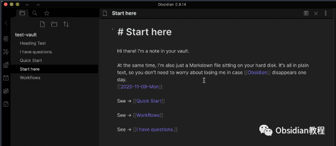
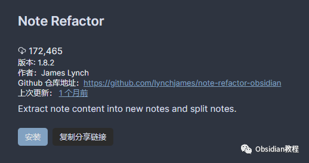
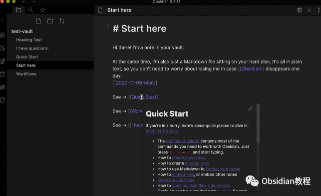
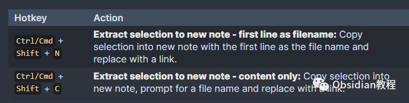
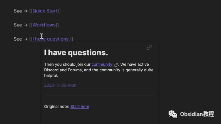
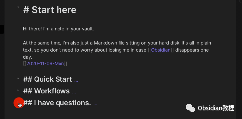
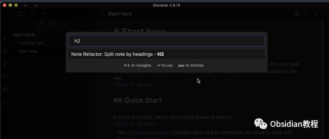

# Obsidian插件:Note Refactor 在 Obsidian 中轻松地提取选定部分的笔记到新的笔记中。

点击下方公众号，回复关键字：**Obsidian** ，获取Obsidian资料合集。

  
在数字笔记的世界中，Obsidian 凭借其独特的链接功能和高度自定义的特点吸引了无数爱好者。而在众多插件中，Note Refactor 插件更是为 Obsidian 增色不少，让我们能轻松地将选定的文本提取到新的笔记中。  

现在就让我们一起来探索这个神奇插件的魅力吧！  

## 1安装与配置

要使用这个插件，我们首先需要在Obsidian中安装它。安装过程非常简单直接：

### **  
**

### **1.在线安装**（需要科学上网） ：****

  
1.在Obsidian的设置中，找到“第三方插件”选项，点击“社区插件”2.在搜索框中输入“Note Refactor”，找到并安装它。3.安装完成后，激活该插件，在成功安装插件后，我们需要对其进行简单的配置，以符合我们的需求。  

**2.离线安装：****  
****因为网络原因很多同学无法直接在线安装obsidian插件，这里我已经把obsidian所有热门插件下载好了**  
只需要关注下方公众号，后台回复：**插件** 即可获取

### 

现在，你已经准备好开始你的重构之旅了！  

## 2轻松提取

想象一下，你正在整理你的笔记，突然发现某段文字应该单独成篇，以便更好地组织你的思路。这时，Note Refactor 就派上用场了。  

### **提取到新笔记**

  
选中你想提取的文字，按下 Ctrl/Cmd + Shift + N。就这样！选定的文字已经被移动到一个新的笔记中，而原笔记则留下了一个指向新笔记的链接。而且，新笔记的标题就是被提取文字的第一行，多么聪明的设计！  

如果你想为新笔记自定义标题，只需按 Ctrl/Cmd + Shift + C，然后输入你想要的标题，一切尽在掌控！

### 

  

3自定义你的提取

Note Refactor 允许你通过一些简单的设置来定制提取过程。你可以选择新笔记的保存位置，甚至可以为新笔记设置一个文件名前缀，让你的笔记组织得井井有条。  

而且，你还可以设置一个模板，定制链接的格式或新笔记的初始内容。这为你的重构过程提供了无限可能！

## 

4分割大杂烩

除了提取，Note Refactor 还能帮助你按标题分割笔记。这对于整理长篇杂志或将大纲转换为单独笔记特别有用。  

选择 Split note by headings 命令，你的笔记将按标题被切分成多个新笔记，每个标题都成为一个新笔记的开始。这样，你可以更好地组织和定位你的内容，无需在长篇杂志中不停地滚动查找。

  
现在，你已经掌握了 Note Refactor 的基本使用方法，是时候在你的 Obsidian 笔记库中大展身手了！随着时间的推移，你将发现，无论是在学习还是工作中，Note Refactor 都能为你的笔记整理带来前所未有的便利。  
记住，Obsidian 的插件生态丰富多彩，除了 Note Refactor，还有很多其他有趣和有用的插件等你去探索。每个插件都有其独特的功能和应用场景，探索和尝试它们，你会发现 Obsidian 的无限可能！  
  
  
1**扫码购买****《 Obsidian实战教程》****从入门到精通， 链接您的每一个思维瞬间。****  
**  
往 期精彩1.[Obsidian插件: Pandoc 一个强大的文档导出工具](http://mp.weixin.qq.com/s?__biz=MzkyMDUyMDM2Mg==&mid=2247484337&idx=1&sn=0a7344f1a0d9d40e8a559f3ea2058f79&chksm=c190d074f6e759624befeebc9935cb831090a20adb10cdaaefb586df7d2e3ba65ce93339b699&scene=21#wechat_redirect)  
[2.Obsidian插件:DB Folder 为 Obsidian 用户提供类似 Notion 数据库功能](http://mp.weixin.qq.com/s?__biz=MzkyMDUyMDM2Mg==&mid=2247484336&idx=1&sn=d9f1c2f9592ec2a7b3ad655f31f441c8&chksm=c190d075f6e7596362d43485a56a8e0ee66441928475223879a5d7245127fa57070ea586cdd6&scene=21#wechat_redirect)  
[3.Obsidian插件:Advanced URI 通过打开一些 URIs 来控制 Obsidian 不同功能的能力。](http://mp.weixin.qq.com/s?__biz=MzkyMDUyMDM2Mg==&mid=2247484335&idx=1&sn=4d0656f9dff7276bd13c4d2eff3701b3&chksm=c190d06af6e7597cc7cd2bf93b265ba4cf78a7b8a310ac6e615e48cb342121516fd253c2b41e&scene=21#wechat_redirect)  

点分享

点点赞

点在看
