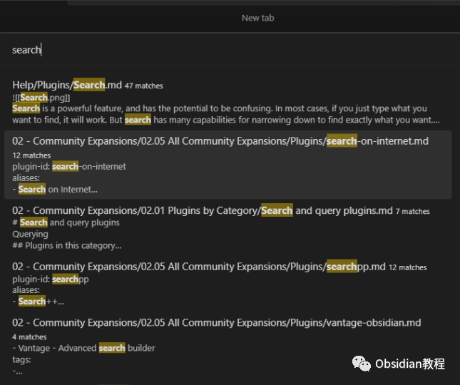
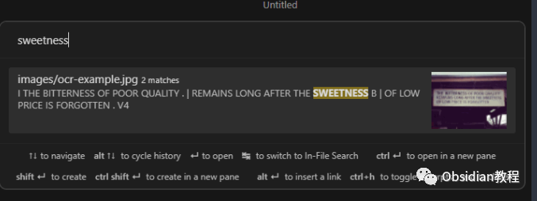

# Obsidian插件:Omnisearch 一款强大的搜索引擎

### 点击下方公众号，回复关键字：**Obsidian** ，获取Obsidian资料合集。

  
Obsidian 的 Omnisearch 插件是一款强大的搜索引擎，它能够通过智能加权算法即时显示最相关的搜索结果，为用户提供了快速、准确的文件查找和处理能力。本教程将介绍 Omnisearch 插件的功能、安装和使用方法。  

## 1**插件介绍**   

Omnisearch 插件是一款高效的搜索引擎插件，其目标是使用户能够立即定位到所需的文件。它类似于一个强化版的快速切换器，能够帮助用户更快地找到笔记、PDF 文件和图像。  
它使用 MiniSearch 库作为其核心搜索引擎，并通过智能加权算法确保搜索结果的相关性。  

## 2**功能说明**   

### **快速文件查找**

**  
**

  * 即时搜索：输入搜索关键字后，Omnisearch 将立即显示最相关的搜索结果。

  

  * 多种文件类型支持：支持搜索笔记、PDF 文件和图像，确保用户能够快速找到所需的文件和内容。

  
  

  * 文件索引：通过 Text Extractor 进行图像和 PDF 文件的索引，确保所有内容都能够被准确地搜索到。
  * 自动文档评分：使用 BM25 算法对文档进行评分，以确保搜索结果的相关性。
  * 关键字优先：完全基于键盘的操作，无需使用鼠标，提高搜索和处理文件的效率。

###   

### **智能搜索选项**

**  
**

  * 快速切换：用户可以在库搜索和文件搜索之间快速切换，以快速浏览单个笔记中的多个结果。
  * 表达式和排除项：支持使用引号中的表达式和 - 排除项来精确搜索。
  * 文件类型过滤：通过输入 '.jpg' 或 '.md' 来过滤特定类型的文件。
  * 直接插入链接：用户可以直接从搜索结果中插入一个 [[link]] 到当前编辑的笔记中。
  * Vim 导航键支持：支持使用 Vim 导航键进行搜索结果的浏览和选择。

###   

### **其他特性**

**  
**

  * 容错能力：对输入的拼写错误具有一定的容错能力，确保用户能够找到所需的文件。
  * 多语言支持：支持中文、日文、韩文等多种语言的搜索，但需要安装额外的插件。

## 

3下载与安装

要使用这个插件，我们首先需要在Obsidian中安装它。安装过程非常简单直接：

### **  
**

### **1.在线安装**（需要科学上网） ：****

  
1.在Obsidian的设置中，找到“第三方插件”选项，点击“社区插件”2.在搜索框中输入“Omnisearch”，找到并安装它。3.安装完成后，激活该插件，在成功安装插件后，我们需要对其进行简单的配置，以符合我们的需求。  

**2.离线安装：****  
****因为网络原因很多同学无法直接在线安装obsidian插件，这里我已经把obsidian所有热门插件下载好了**  
只需要关注下方公众号，后台回复：**插件** 即可获取

## 4结语

Omnisearch 插件为 Obsidian 用户提供了一个高效、准确的搜索工具，使用户能够快速定位到所需的文件和内容。通过本教程，用户应该能够了解如何安装和使用 Omnisearch 插件来提高 Obsidian 的使用效率和便利性。  
  
  
1**扫码购买****《 Obsidian实战教程》****从入门到精通， 链接您的每一个思维瞬间。****  
**  
往 期精彩1.[Obsidian插件:Ozan's Image in Editor Plugin在编辑器视图下直接查看和处理多种文件和内容](http://mp.weixin.qq.com/s?__biz=MzkyMDUyMDM2Mg==&mid=2247484258&idx=1&sn=2e9d410c6cc3d5aa643cde31ee9e9a9f&chksm=c190d0a7f6e759b1d4f7939ec44329e5b00bc61a92b5f49311f1f8defe5ad2f78454d796e077&scene=21#wechat_redirect)  
[2.Obsidian插件:Natural Language Dates 让日期输入不再繁琐：](http://mp.weixin.qq.com/s?__biz=MzkyMDUyMDM2Mg==&mid=2247484241&idx=1&sn=cd9c0ea5a7b897c18c222f654d064077&chksm=c190d094f6e75982890d8ae7e1d4faffda92de5a6bfd2e43a276f27ff1bbafb5b1d593be52ee&scene=21#wechat_redirect)  
[3.Obsidian插件：Homepage为你的Obsidian打造独特的入口](http://mp.weixin.qq.com/s?__biz=MzkyMDUyMDM2Mg==&mid=2247484240&idx=1&sn=e015a53b6569f3b0c63cd00041e5cc3c&chksm=c190d095f6e7598308e766ecdb800ebfc39db9c849e849ec71616a65c569bd28972d45d0714f&scene=21#wechat_redirect)  

点分享

点点赞

点在看
