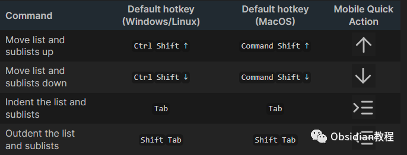
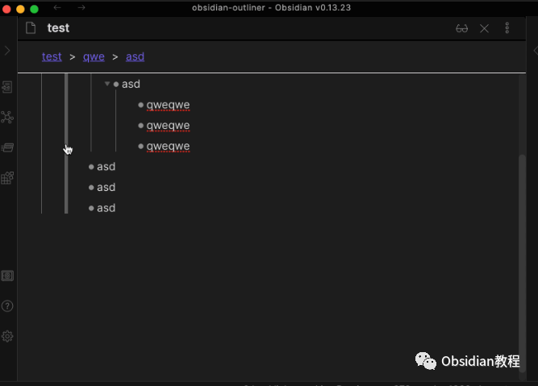
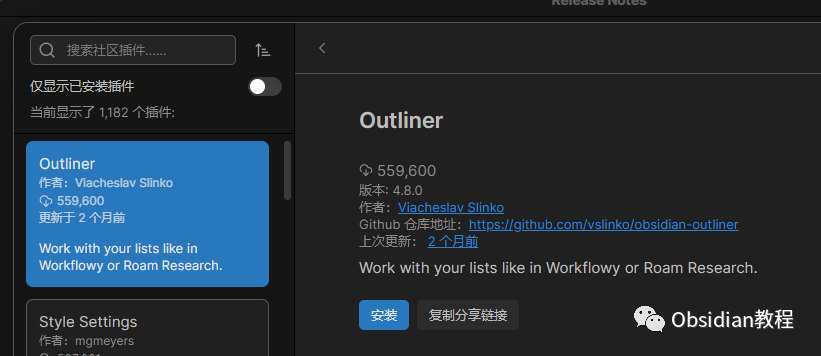
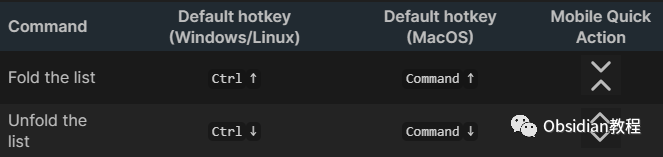

# Obsidian插件:Outliner一个用于改进Obsidian中列表的插件

### 点击下方公众号，回复关键字：**Obsidian** ，获取Obsidian资料合集。

  
当我们想要在Obsidian中更加高效地管理我们的知识和笔记时，插件就显得尤为重要。其中，Outliner插件就是一款非常受欢迎的辅助工具，可以帮助我们更好地组织和操作列表。  
下面就由我来为大家详细介绍这款插件。  
  
  

#### 1**插件简介**

Outliner是一个用于改进Obsidian中列表的插件。它为列表添加了大纲功能，使得你可以轻松地创建、重组和管理结构化的内容。  

#### **2\. 主要功能**

**  
**

  * 改进列表样式：启用此功能后，你的列表将看起来更加整洁和美观。需要注意的是，此样式仅兼容Obsidian的内置主题。
  * 移动列表：你可以轻松地将带有子项的列表移动到你想要的位置，而不会破坏其结构。
  * 绘制垂直缩进线：为你的列表添加清晰的垂直缩进线，增强视觉效果。同样，这一功能仅支持Obsidian内置主题。
  * 光标定位：避免光标移动到项目符号的位置，这对于文本的移动、删除和选择都非常有用。
  * 增强Enter键功能：使Enter键的行为与其他大纲工具保持一致，提供了更多的文本操作选项。
  * 折叠和展开列表：快速地对你的列表进行折叠或展开操作。
  * 增强CtrlA或CmdA行为：一键选择当前列表项，或者双击选择整个列表。
  * 拖放功能：轻松地通过拖放来重组你的列表。
  * 调试模式：提供开发者工具来帮助你捕捉和分析可能出现的问题。

  

#### 2 如何安装

**在线安装 （需要科学上网）：**  
**  
**

  * 在Obsidian内安装：
  * 打开“设置”>“第三方插件”。
  * 确保“安全模式”是关闭的。
  * 点击“浏览社区插件”。
  * 搜索“Outliner”。
  * 点击“安装”。
  * 安装完成后，关闭社区插件窗口并激活新安装的插件。

**离线安装：****  
****因为网络原因很多同学无法直接在线安装obsidian插件，这里我已经把obsidian所有热门插件下载好了****  
****  
****本文插件获取方式**  
关注下方公众号，后台回复：**插件** 获取3如何使用

创建一个深度结构化的列表，然后按照上述提供的热键来移动和操作这些项。  

总的来说，Outliner插件为Obsidian的用户提供了一个强大且直观的工具，帮助他们更好地组织和管理他们的内容。无论你是一个资深的Obsidian用户，还是一个新手，这款插件都值得你尝试。  
  
  
1**扫码购买****《 Obsidian实战教程》****从入门到精通， 链接您的每一个思维瞬间。****  
**  
往 期精彩[1.Obsidian插件:Templater 一个为 Obsidian 用户设计的插件](http://mp.weixin.qq.com/s?__biz=MzkyMDUyMDM2Mg==&mid=2247483964&idx=1&sn=c157b7b458c9256f9585925b7fe94b14&chksm=c190d1f9f6e758ef33b886d915251e1c12d1f072cc663f17cb3b6771ed53726d2bd56482de4b&scene=21#wechat_redirect)  
[2.Obsidian插件:Advanced Slides为你的知识网络增加动态幻灯片功能](http://mp.weixin.qq.com/s?__biz=MzkyMDUyMDM2Mg==&mid=2247483950&idx=1&sn=92edb3fe9c4331d6c007fe7d2ac4549e&chksm=c190d1ebf6e758fdff7da2afc5e82aff39e07de8fcb879e163c4c211f3d393e84f3bce551c49&scene=21#wechat_redirect)  
[3.Obsidian插件:Tasks从零散笔记到完美任务管理](http://mp.weixin.qq.com/s?__biz=MzkyMDUyMDM2Mg==&mid=2247483938&idx=1&sn=6603deda8ad8a2aa37784514fc945f3d&chksm=c190d1e7f6e758f144409e0aa7cc19df581f1cd2a5894d3f67c6b6b789c922acf752f83b5b45&scene=21#wechat_redirect)  

点分享

点点赞

点在看
