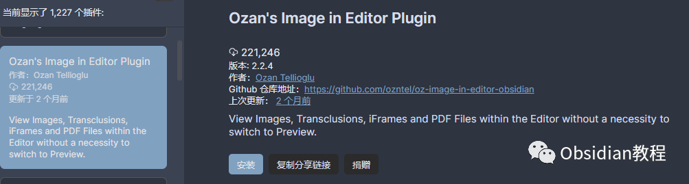
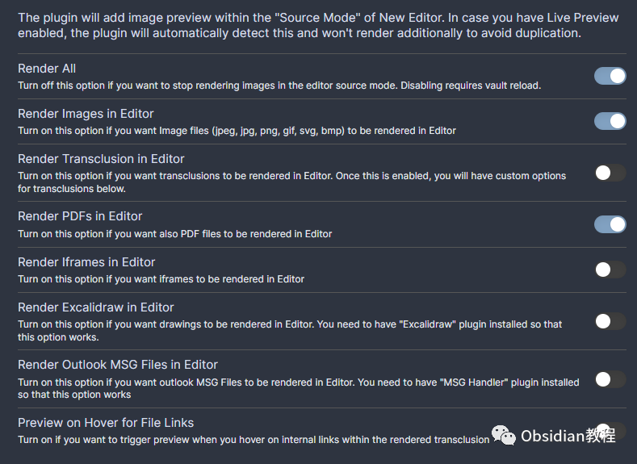
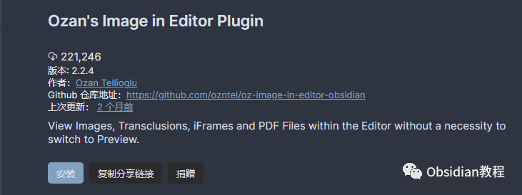

# Obsidian插件:Ozan's Image in Editor Plugin在编辑器视图下直接查看和处理多种文件和内容

### 点击下方公众号，回复关键字：**Obsidian** ，获取Obsidian资料合集。

Obsidian 的 "Ozan's Image in Editor Plugin" 是一个强大的插件，它为 Obsidian 用户提供了直接在编辑器视图下查看和处理图像、iFrames、PDF 文件、Excalidraw 绘图和 transclusions 的能力，无需切换到预览模式。

  

这个插件对于想要在笔记制作过程中实时查看和处理多媒体元素的用户来说非常有用。以下是该插件的详细使用教程。  

  

## 1**插件介绍**   
Ozan's Image in Editor Plugin 允许用户在编辑器视图下直接查看和处理多种文件和内容，包括图像、iFrames、PDF 文件、Excalidraw 绘图和 transclusions。

它支持 Markdown 和 Wikilinks 格式，并提供了多种图像和内容的查看和处理选项。通过这个插件，用户可以在编辑过程中实时查看和处理笔记中的多媒体元素，大大提高了笔记制作的效率和方便性。

##  2**功能说明**   

### **图像查看和处理**

###   

### 图像查看：通过在编辑器中输入特定的格式代码，用户可以直接在编辑器视图下查看图像，而无需切换到预览模式。

  

  * ### 格式1: 

  * ### 格式2: ![[IMAGE_PATH_OR_NAME]]

  * ### 样例:  或 ![[myimage.png]]

  
图像大小调整：用户可以通过在格式代码中添加 ALT_TEXT 选项来调整图像的显示大小，以确保图像不会在屏幕上占用太多空间。  

  * 格式: ![(ALT_TEXT)][IMAGE_PATH_OR_NAME] 或 ![[IMAGE_PATH_OR_NAME|ALT_TEXT]]
  * 样例: ![(#small)][myimage.png] 或 ![[myimage.png|#small]]  

  
图像颜色反转：类似于 Minimal 主题，用户可以通过在 alt-text 中添加 #invert 选项来查看反色模式的图像。  

  * 格式: ![[image.png|#invert]] 或 ![(#invert)][image.png]
  * 样例: ![[myImage.png|#invert]] 或 ![(#invert)][myImage.png]

###   

### **PDF 文件查看**

  
PDF 查看：用户可以在编辑器模式下查看本地或网络上的 PDF 文件，并通过特定的格式代码从指定的页面号开始查看 PDF 文件。  

  * 格式:  或 ![[myfile.pdf#page=12]]
  * 样例:  或 ![[document.pdf#page=5]]

###   

### **iFrame 内容查看**

  
iFrame 查看：用户可以在设置中打开 iFrame 选项以在编辑器中渲染 iFrames，用于显示嵌入的网页或视频内容。样例:

  *   *   *   *   *   *   *   *   *   * 

    
    
    <iframe    width="560"    height="315"    src="https://www.youtube.com/embed/L9fJM2jCPlU"    title="YouTube video player"    frameborder="0"    allow="accelerometer; autoplay; clipboard-write; encrypted-media; gyroscope; picture-in-picture; web-share"    allowfullscreen</iframe><iframe width="550" height="315" src="https://ozan.pl" />

###   

### **Excalidraw 绘图查看**

  
Excalidraw 查看：通过与 Zsolt 的合作，现在用户可以在编辑器中查看 Excalidraw 绘图。这对于想要在笔记中嵌入和查看 Excalidraw 绘图的用户来说非常有用。  
**格式**

  *   *   *   * 

    
    
    ![[drawing.excalidraw|ALT_TEXT]]![[drawing|ALT-TEXT]]!(ALT_TEXT)[drawing.excalidraw]!(ALT-TEXT)[drawing]

  

  * 渲染选项开关：用户可以在插件设置中打开或关闭 Excalidraw 绘图的渲染选项。

  

### **Transclusions 渲染**

**  
**文件Transclusion：用户可以使用特定的格式代码在编辑器中渲染文件 transclusions，这对于想要在笔记中嵌入和查看其他文件内容的用户来说非常有用。  

  * 格式: ![[myFile]]
  * 样例: ![[document.md]]

  
块Transclusion：用户可以使用特定的格式代码在编辑器中渲染块 transclusions，这对于想要在笔记中嵌入和查看特定块内容的用户来说非常有用。  

  * 格式: ![[myFile#^blockID]]
  * 样例: ![[document.md#^123456]]

  
标题Transclusion：用户可以使用特定的格式代码在编辑器中渲染标题 transclusions，这对于想要在笔记中嵌入和查看特定标题内容的用户来说非常有用。

  * 格式: ![[myFile#Header]]
  * 样例: ![[document.md#Introduction]]

  
渲染功能开启：要使用此功能，用户需要在插件设置中启用渲染选项。

## 

3下载与安装

### 

要使用这个插件，我们首先需要在Obsidian中安装它。安装过程非常简单直接：

### **  
**

### **1.在线安装**（需要科学上网） ：****

  
1.在Obsidian的设置中，找到“第三方插件”选项，点击“社区插件”2.在搜索框中输入“Ozan's Image in Editor Plugin”，找到并安装它。3.安装完成后，激活该插件，在成功安装插件后，我们需要对其进行简单的配置，以符合我们的需求。  

**2.离线安装：****  
****因为网络原因很多同学无法直接在线安装obsidian插件，这里我已经把obsidian所有热门插件下载好了**  
只需要关注下方公众号，后台回复：**插件** 即可获取

### 

##   

## 

通过 "Ozan's Image in Editor Plugin" 插件，Obsidian 用户可以在编辑过程中实时查看和处理多种文件和内容，大大提高了笔记制作的效率和方便性。

  

同时，该插件也提供了多种格式和选项，使用户可以根据自己的需求灵活地查看和处理多媒体元素。

  
  
  
1**扫码购买****《 Obsidian实战教程》****从入门到精通， 链接您的每一个思维瞬间。****  
**  
往 期精彩[1.](http://mp.weixin.qq.com/s?__biz=MzkyMDUyMDM2Mg==&mid=2247484119&idx=1&sn=b1491121e681ce684988d100cf588dd0&chksm=c190d112f6e758048455acc822832f8db8750e60becfe3020bfdda9fba175a1e7a00f159a1d5&scene=21#wechat_redirect)[Obsidian插件:Natural Language Dates 让日期输入不再繁琐：](http://mp.weixin.qq.com/s?__biz=MzkyMDUyMDM2Mg==&mid=2247484241&idx=1&sn=cd9c0ea5a7b897c18c222f654d064077&chksm=c190d094f6e75982890d8ae7e1d4faffda92de5a6bfd2e43a276f27ff1bbafb5b1d593be52ee&scene=21#wechat_redirect)2.[Obsidian插件：Homepage为你的Obsidian打造独特的入口](http://mp.weixin.qq.com/s?__biz=MzkyMDUyMDM2Mg==&mid=2247484240&idx=1&sn=e015a53b6569f3b0c63cd00041e5cc3c&chksm=c190d095f6e7598308e766ecdb800ebfc39db9c849e849ec71616a65c569bd28972d45d0714f&scene=21#wechat_redirect)3.[Obsidian Linter插件：打造统一、美观的笔记环境](http://mp.weixin.qq.com/s?__biz=MzkyMDUyMDM2Mg==&mid=2247484239&idx=1&sn=3f3b082a7ca008817ce97a5d52a7b520&chksm=c190d08af6e7599c360c805f530851222c5cdf7a6a2b15ec2469a208bdd3a3cd47b3e2652ee9&scene=21#wechat_redirect)

点分享

点点赞

点在看
