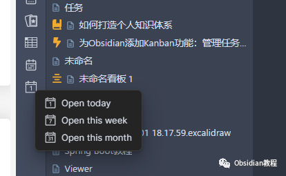
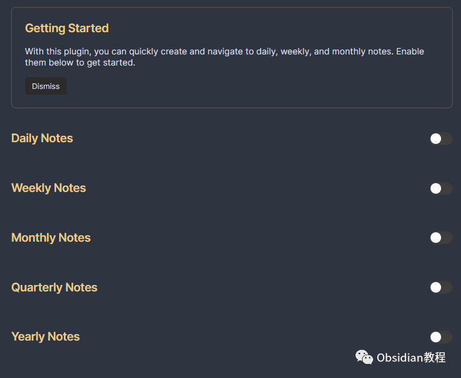
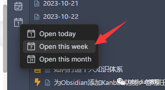
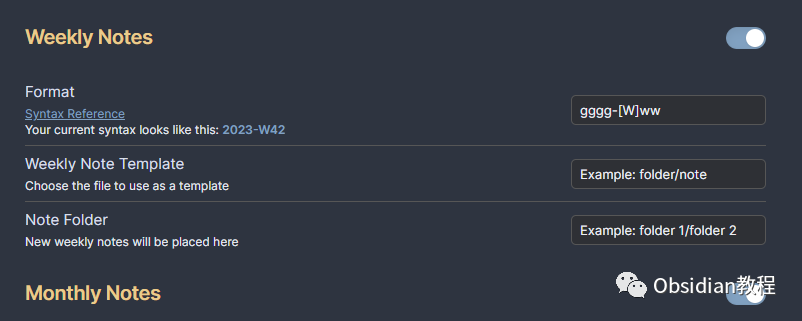
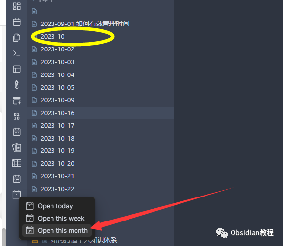
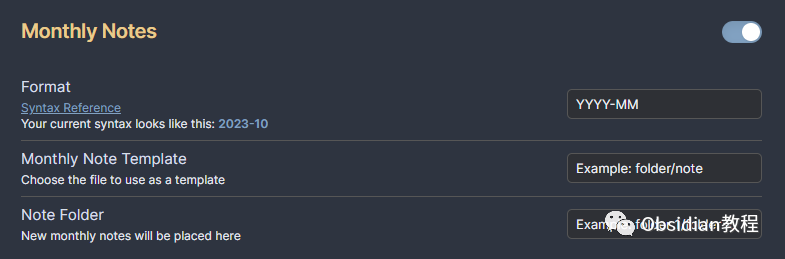
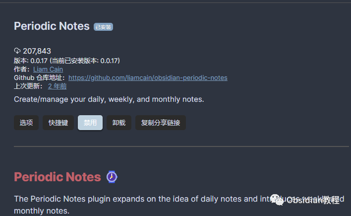

# Obsidian插件:Periodic Notes允许用户创建和管理日常、周和月的笔记

Obsidian 的 Periodic Notes 插件是基于日常笔记的理念，引入了周记和月记功能的插件。通过这个插件，用户可以更方便地管理和创建周期性的笔记，以帮助保持良好的组织和时间管理。

  

## 1**插件介绍**

Periodic Notes 插件允许用户创建和管理日常、周和月的笔记。它提供了一种简单和高效的方式来保持日常的记录和计划，同时保持 Obsidian 库的组织和结构。  

## 2**功能说明**

### **周记功能**

**  
**

  * 打开周记：打开当前周的周记。如果不存在，它将自动为您创建一个。
  * 下一个周记：导航到时间线上的下一个周记。跳过没有周记文件的周。
  * 上一个周记：导航到时间线上的上一个周记。跳过没有周记文件的周。
  * 日历插件集成：如果您启用了来自日历插件的“周数”，则日历将自动使用您的周记设置来创建无缝的体验。

####   

####   

#### **周记设置**

**  
**

  * 文件夹：您的周记进入的文件夹。它可以与您的日记相同或不同。默认情况下，它们放置在您的保险库根目录中。
  * 模板：为周记配置模板。周记的模板标签与日记略有不同。
  * 格式：周记文件名的日期格式。默认为 gggg-[W]ww。如果您在周格式中使用 DD，这将指向一周的第一天（根据您的设置，可能是星期日或星期一）。

###   

### **月记功能**

**  
**

  * 打开月记：打开当前月的月记。如果不存在，它将自动为您创建一个。
  * 下一个月记：导航到时间线上的下一个月记。跳过没有月记文件的月份。
  * 上一个月记：导航到时间线上的上一个月记。跳过没有月记文件的月份。

####   

#### 

####   

#### **月记设置**

**  
**

  * 文件夹：您的月记进入的文件夹。它可以与您的日记相同或不同。默认情况下，它们放置在您的保险库根目录中。
  * 模板：为月记配置模板。月记的模板标签与日记略有不同。
  * 格式：月记文件名的日期格式。默认为 YYYY-MM。如果您在周格式中使用 DD，这将指向一周的第一天（根据您的设置，可能是星期日或星期一）。

####   

#### **如何在文件夹路径中使用变量？**

  
如果您希望新的日记显示在文件夹 Journal/2021/ 中，例如，您可以在“格式”字段中包含文件夹。

####   

#### **为什么周记的标题与周数不符？**

  
根据您所在的地区和使用的操作系统，您可能已经采用了 ISO 周（一年的第一周从第一个星期四开始）或年周（一年的第一周从第一天开始）。Obsidian Periodic Notes 默认使用年周（ww），但您可以通过使用（WW）来改为 ISO 周。

## 

3下载与安装

### 

要使用这个插件，我们首先需要在Obsidian中安装它。安装过程非常简单直接：

### **  
**

### **1.在线安装**（需要科学上网） ：****

  
1.在Obsidian的设置中，找到“第三方插件”选项，点击“社区插件”2.在搜索框中输入“Periodic Notes”，找到并安装它。3.安装完成后，激活该插件，在成功安装插件后，我们需要对其进行简单的配置，以符合我们的需求。

**2.离线安装：****  
****因为网络原因很多同学无法直接在线安装obsidian插件，这里我已经把obsidian所有热门插件下载好了**  
只需要关注下方公众号，后台回复：**插件** 即可获取

### 

通过 "Periodic Notes" 插件，Obsidian 用户可以方便地创建和管理周期性的笔记，同时保持良好的时间管理和库组织。此插件提供了一种简单而有效的方式来保持日常记录和计划的组织。  
  
  
1**扫码购买****《 Obsidian实战教程》****从入门到精通， 链接您的每一个思维瞬间。****  
**

点分享

点点赞

点在看
