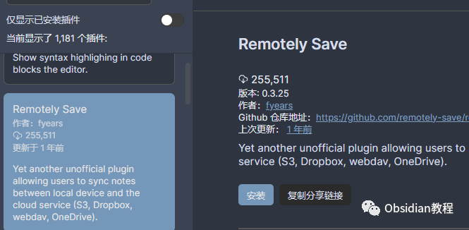
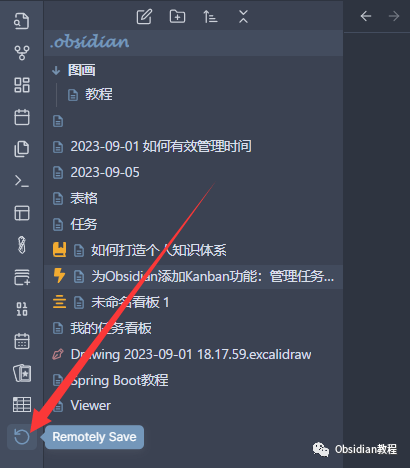
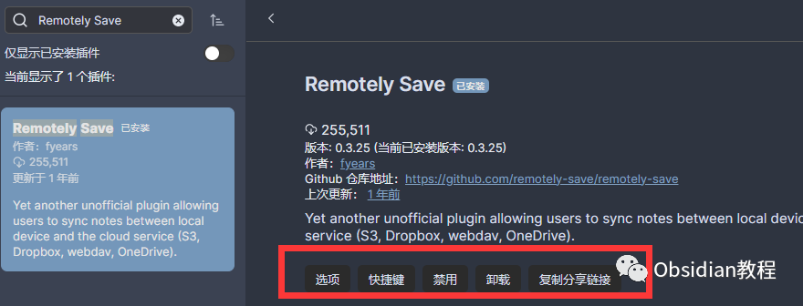

# Obsidian插件:Remotely Save为Obsidian设计的非官方同步插件

  
Obsidian 是一款强大的知识管理工具，而它的魅力在于不断拓展的插件生态。今天，我们来探讨一下 Remotely Save 这个插件，它为 Obsidian 用户提供了一个非官方的同步解决方案。  
  
我们将从 Remotely Save 插件的介绍开始，然后详细讲解它的功能，下载与安装步骤，以及在使用过程中需要注意的事项。  
  

### 1**插件介绍**

Remotely Save 插件是一个为Obsidian设计的非官方同步插件，它允许用户将他们的 Vault 同步到云端。  
支持的**云服务包括Amazon S3, Dropbox, OneDrive和WebDav** 。它甚至支持**端到端加密** ，保证了你的数据在传输过程中的安全。

###  2**功能概述**   

#### **云端同步:**

  
插件可以将你的 Vault 数据同步到不同的云存储服务上，包括 Amazon S3 或 S3-compatible、Dropbox、OneDrive for personal和Webdav。这意味着你可以随时随地访问和更新你的数据。  

#### **跨设备同步:**

  
借助云服务作为"broker"，Vault 可以在移动设备和桌面设备之间同步，支持Obsidian Mobile。  

#### **端到端加密:**

  
如果用户指定密码，插件会在发送到云端前使用 openssl 格式对文件进行加密，确保数据安全。  

#### **定时自动同步:**

  
用户可以安排定时自动同步，也可以通过侧边栏或命令面板手动触发同步，甚至可以绑定热键来快速同步。  

###  3**下载与安装**   

### **在线安装**（需要科学上网） ：****

  

  * 打开Obsidian，点击左下角的设置图标，进入“设置”页面。
  * 在左侧菜单中找到“第三方插件”并点击，再点击右侧的“浏览”按钮。
  * 在弹出的插件市场中搜索“Remotely Save”，找到Remotely Save插件并点击“安装”。
  * 安装完成后，回到“第三方插件”页面，找到Remotely Save插件，并将其旁边的开关打开，启用插件。

  
  
**2.离线安装：****  
****因为网络原因很多同学无法直接在线安装obsidian插件，这里我已经把obsidian所有热门插件下载好了**  
只需要关注下方公众号，后台回复：**插件** 即可获取  

### 4**配置与使用**   

根据你选择的云服务，需要在插件设置中输入相应的信息。例如，对于 Amazon S3，你需要准备好服务信息：endpoint, region, access key id, secret access key 和 bucket name。  
在配置好所有必要的信息后，你可以通过点击侧边栏的“圆形箭头”图标来触发同步操作。在同步期间，图标会变成“两个半圆形箭头”。  
  

### 5**注意事项**   

使用 Remotely Save 插件前，务必备份你的 Vault 数据。由于这是一个非官方插件，可能会存在一些未知的风险。  
插件在同步过程中并不提供冲突解决方案，所有的文件和文件夹都是根据它们的本地和远程的“最后修改时间”进行比较，较新的“最后修改时间”的文件会覆盖旧的文件。  
此外，由于插件可能会产生云服务费用，请始终注意费用和定价。具体来说，所有的操作，包括但不限于下载、上传、列出所有文件、调用任何API、存储大小，都可能会产生费用。

###  6**结束语**   

Remotely Save 插件为 Obsidian 用户提供了一个实用的同步解决方案，尽管它可能不如官方的同步服务那样完美，但它的多云服务支持和端到端加密功能确实值得我们尝试。  
  
  
1**扫码购买****《 Obsidian实战教程》****从入门到精通， 链接您的每一个思维瞬间。****  
**  
往 期精彩1.[Obsidian插件:Editor Syntax Highlight为代码块提供语法高亮](http://mp.weixin.qq.com/s?__biz=MzkyMDUyMDM2Mg==&mid=2247484073&idx=1&sn=8074d9fcfe4d0f07afe1a8522658d712&chksm=c190d16cf6e7587ad52c092ae247db443d8210ad066cf8d82407fad9a3171fd2d1c1ea187f91&scene=21#wechat_redirect)  
[2.Obsidian插件:Iconize让你的知识库焕发新生](http://mp.weixin.qq.com/s?__biz=MzkyMDUyMDM2Mg==&mid=2247484062&idx=1&sn=2328ba9b58e7e5ef792c47c98e64d9be&chksm=c190d15bf6e7584dff17010e5dbaa69e4efe28f25a4c73c1ba67826de2a16c135854e60fd5b4&scene=21#wechat_redirect)  
[3.Obsidian插件:Sliding Panes使Obsidian用户界面焕然一新](http://mp.weixin.qq.com/s?__biz=MzkyMDUyMDM2Mg==&mid=2247484039&idx=1&sn=6e5179d2ab14e910b51cf6f0620e66a6&chksm=c190d142f6e75854221bbb18c231f9e1fdcccf00f0e6f50c366fecdaeea56ab99fad0006c87b&scene=21#wechat_redirect)  

点分享

点点赞

点在看
