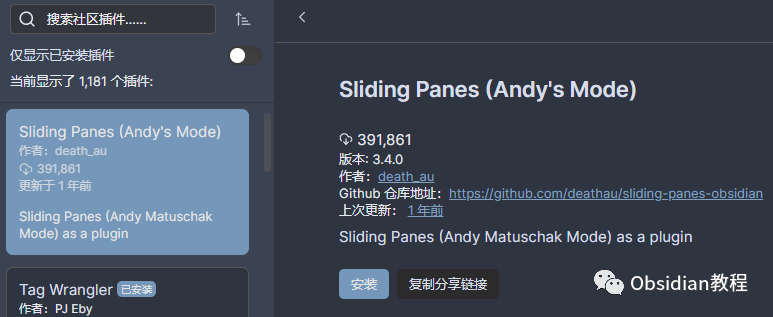

# Obsidian插件:Sliding Panes使Obsidian用户界面焕然一新

### 点击下方公众号，回复关键字：**Obsidian** ，获取Obsidian资料合集。

  
Obsidian已成为数字笔记爱好者的热门选择，其灵活、强大的功能吸引了大批创作者的目光。而今天，我们将一同探索一款能使Obsidian用户界面焕然一新的神奇插件——Sliding Panes。  
Sliding Panes插件的灵感来自Andy Matuschak的笔记界面设计。  
在传统的笔记应用中，每打开一个新笔记，旧的笔记就会被挤到一旁，让人感觉杂乱无章。而Sliding Panes插件，则巧妙地将每个笔记页设计成独立的、可滑动的面板，让整个笔记界面井然有序，逻辑清晰。

###  1**功能一览**

  * 面板滑动：插件使每个笔记变成一个独立的面板，你可以轻松地在它们之间滑动，就像在书架上翻阅书籍一样自然。

  
  

  * 旋转标题：每个面板的标题被旋转90度，堆叠在左侧，就像一本本立在书架上的书，这不仅极大节省了空间，而且使笔记间的切换变得妙不可言。
  * 定制宽度：你可以轻松调整每个面板的宽度，无论是宽屏显示还是狭窄窗口，总有一款适合你。
  * 自由切换：可以随意打开或关闭Sliding Panes模式，不再受固定布局的约束，享受自由的创作空间。

###  2**下载与安装**

Sliding Panes的安装非常直接，只需几个简单的步骤，即可享受全新的笔记体验：

###   

### **在线安装**（需要科学上网） ：****

****  
****

  * 打开Obsidian，进入Settings（设置）。
  * 选择Third-party plugin（第三方插件），确保Safe mode（安全模式）已关闭。
  * 点击Browse community plugins（浏览社区插件），在搜索框中输入Sliding Panes，找到它并点击Install（安装）。
  * 安装完成后，关闭社区插件窗口，返回第三方插件页面，找到Sliding Panes插件并激活它，轻松开启全新的笔记界面！

  

**2.离线安装：****  
****因为网络原因很多同学无法直接在线安装obsidian插件，这里我已经把obsidian所有热门插件下载好了**  
只需要关注下方公众号，后台回复：**插件** 即可获取

###   

### **注意事项**

**  
**

  * 兼容性：Sliding Panes插件只支持Obsidian v0.9.7及以上版本。
  * 安全：尽管Sliding Panes开源且透明，但第三方插件始终存在一定的安全风险。在安装和使用过程中，请保持警惕。
  * 性能：如果一次性加载过多的文档，可能会影响Obsidian的运行效率。建议根据自身电脑性能，适量加载文档。

  

### 3结语

Sliding Panes插件为Obsidian注入了新的活力，它以独特的设计理念，改变了传统的笔记布局，使得笔记的管理和查找变得轻而易举。无论你是Obsidian的老用户，还是刚刚开始探索数字笔记的新手，Sliding Panes都值得一试。安装了Sliding Panes插件后，每次打开Obsidian，都会有不一样的新发现和惊喜等着你！  
当你在滑动这些面板时，仿佛每个面板都是思想的种子，在滋长、在碰撞，最终汇集成为丰富多彩的知识图谱。现在，就让我们带着对知识的热爱和好奇，携手Sliding Panes，踏上Obsidian的探索之旅吧！  
  
  
1**扫码购买****《 Obsidian实战教程》****从入门到精通， 链接您的每一个思维瞬间。****  
**  
往 期精彩1.[Obsidian插件:用QuickAdd插件快速打造你的Obsidian知识宝库](http://mp.weixin.qq.com/s?__biz=MzkyMDUyMDM2Mg==&mid=2247484028&idx=1&sn=e4785ef095bf1ea63d156b71273a689e&chksm=c190d1b9f6e758afc5d4db1839579512a70d4e22864e3b2eabf1069178649bc02b1edf2d1849&scene=21#wechat_redirect)  
[2.Obsidian插件:Style Settings调整某个特定主题的部分样式](http://mp.weixin.qq.com/s?__biz=MzkyMDUyMDM2Mg==&mid=2247484016&idx=1&sn=8d2293151cd2f31784f5cc32b99f039e&chksm=c190d1b5f6e758a3b10880a0c9332c22675882eae00d865b1d3ede3eb97cea390e6444c80080&scene=21#wechat_redirect)  
[3.Obsidian插件:Admonition在笔记中插入引人注目的提示框、警告框和其他信息块。](http://mp.weixin.qq.com/s?__biz=MzkyMDUyMDM2Mg==&mid=2247484015&idx=1&sn=3729a11c0f65f4dbd3a9b16e8b012970&chksm=c190d1aaf6e758bc24923b28b032d2cd01cd7d59dfa3ba8be9a2ed10ff42046e7f5db0f19532&scene=21#wechat_redirect)  

点分享

点点赞

点在看
